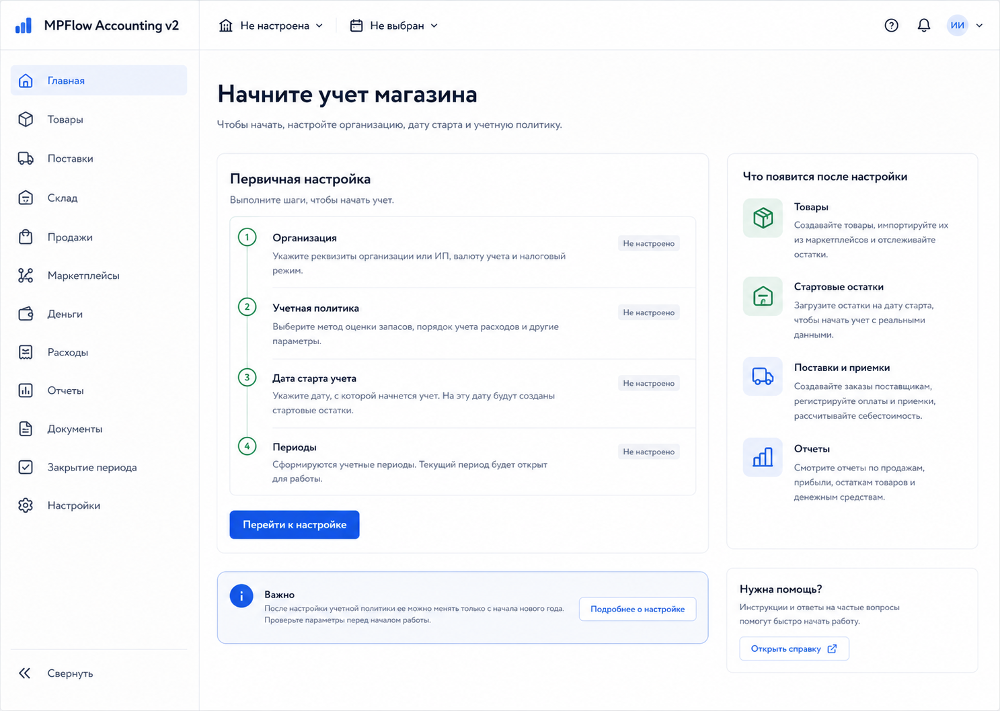

# Шаг 1. App Shell И Локальный Каркас

## Цель

Создать новый локальный проект `MPFlow` и техническую основу, на которой будут реализованы все следующие шаги.

Шаг также должен дать пользователю нормальную дефолтную главную страницу до первичной настройки: не технический health screen, а понятный вход в мастер настройки.

## Пользовательский результат

Пользователь может открыть локальное приложение, увидеть рабочую навигацию будущего сервиса и понять следующий продуктовый шаг: настроить учетную базу.

## Frontend

Реализовать React-приложение. Vite используется только как frontend dev server/build tool. Backend остается на Hono.

Навигация слева:

- Главная
- Товары
- Поставки
- Склад
- Продажи
- Маркетплейсы
- Деньги
- Расходы
- Отчеты
- Документы
- Закрытие периода
- Настройки

Topbar:

- название сервиса `MPFlow`;
- текущий раздел;
- placeholder организации, пока организация не создана;
- placeholder периода, пока периоды не созданы.

После шага 2 placeholder периода становится period selector, например `Июнь 2026`. Это рабочий учетный период интерфейса:

- задает default period filters in lists/reports;
- задает default accounting date in new document forms;
- показывает open/closed status context;
- не меняет дату начала учета;
- не закрывает и не переоткрывает период;
- не является календарем для произвольного выбора даты.

Для каждого маршрута создать нейтральный empty state без технических статусов backend/db.

Главная страница до настройки:

- заголовок `Начните учет магазина`;
- короткое объяснение, что сначала нужно настроить организацию, правила учета и дату старта;
- чеклист первичной настройки;
- кнопка `Перейти к настройке`;
- боковая панель `Что появится после настройки`: товары, стартовые остатки, поставки, отчеты.

Route для настройки:

- `/setup` должен существовать уже в шаге 1 как заглушка;
- до реализации шага 2 route показывает нейтральное сообщение `Мастер первичной настройки будет доступен на следующем шаге`;
- после реализации шага 2 эта же ссылка открывает настоящий мастер первичной настройки.

Не показывать пользователю отдельный экран `Backend OK` или `PostgreSQL OK`. Health endpoint нужен разработчику, не пользователю.

## Backend

Реализовать Hono backend.

Endpoints:

- `GET /api/health`
- `GET /api/meta/navigation`

`GET /api/health` возвращает:

```json
{
  "ok": true,
  "data": {
    "service": "MPFlow",
    "database": "ok"
  }
}
```

`GET /api/meta/navigation` возвращает список разделов для frontend shell.

Общие backend-правила:

- все ответы в формате `{ ok: true, data }` или `{ ok: false, error }`;
- единый обработчик ошибок;
- Zod для валидации входа/выхода API;
- CORS для локального Vite.

## БД

Создать локальную PostgreSQL базу через Docker Compose.

Таблица:

### `schema_migrations`

- `version text primary key`
- `name text not null`
- `applied_at timestamptz not null default now()`

## Учетные правила

На этом шаге учетных правил нет.

## Ошибки пользователя

Пользовательских ошибок на этом шаге нет.

Технические ошибки:

- если backend недоступен, frontend показывает нейтральное сообщение в topbar;
- если API возвращает ошибку, frontend показывает toast или inline error без stack trace.

## Тесты

Unit:

- response helper формирует `{ ok: true, data }`;
- error helper формирует `{ ok: false, error }`.

Integration:

- `GET /api/health` возвращает `200`;
- `GET /api/meta/navigation` содержит все разделы меню.

## Definition of Done

- Создан проект `MPFlow`.
- `npm run dev` запускает frontend и backend.
- Docker Compose поднимает PostgreSQL.
- Миграции создают `schema_migrations`.
- Меню отображает все будущие разделы.
- Все разделы открываются без 404.
- Главная до настройки показывает понятный пользовательский следующий шаг, а не технические health-статусы.
- Старый проект `accounting` не импортируется.

## Рендеры



### `renders/01-home-before-setup.png`

User scenario:

- пользователь впервые открывает локальный `MPFlow`;
- организация еще не создана;
- экран объясняет следующий продуктовый шаг: настроить учетную базу.

Route:

- `/`

Layout:

- слева основной sidebar со всеми будущими разделами;
- topbar показывает `MPFlow`, организацию `Не настроена`, период `Не выбран`;
- основная область содержит заголовок, карточку первичной настройки и боковой информационный блок.

Visible content:

- заголовок `Начните учет магазина`;
- карточка `Первичная настройка` с чеклистом: Организация, Правила учета, Дата старта, Периоды;
- блок `Что появится после настройки`: Товары, Стартовые остатки, Поставки, Отчеты;
- остальные разделы приложения доступны в меню, но открываются как empty states.

Controls and click behavior:

- `Перейти к настройке`: navigate to `/setup`;
- на шаге 1 `/setup` является заглушкой с сообщением, что мастер будет реализован на шаге 2;
- после реализации шага 2 эта же кнопка открывает настоящий мастер первичной настройки;
- пункты sidebar меняют route и показывают empty state соответствующего раздела.

States:

- loading navigation: skeleton menu;
- backend unavailable: нейтральное inline-сообщение в topbar без слов `Backend OK`, `PostgreSQL OK`, stack trace или developer diagnostics;
- configured organization после будущего шага 2: главная должна заменить onboarding-card на обычный dashboard-empty state, но это не входит в шаг 1.

Backend and database effects:

- кнопка `Перейти к настройке` в шаге 1 ничего не пишет в БД;
- `GET /api/meta/navigation` используется для меню;
- `GET /api/health` используется только технически и не должен визуализироваться как пользовательский блок.

Must not include:

- технические health cards;
- `Backend OK`, `PostgreSQL OK`, `Docker OK`;
- второй sidebar;
- декоративный hero;
- кнопки создания товаров, поставок или документов до реализации соответствующих шагов.
