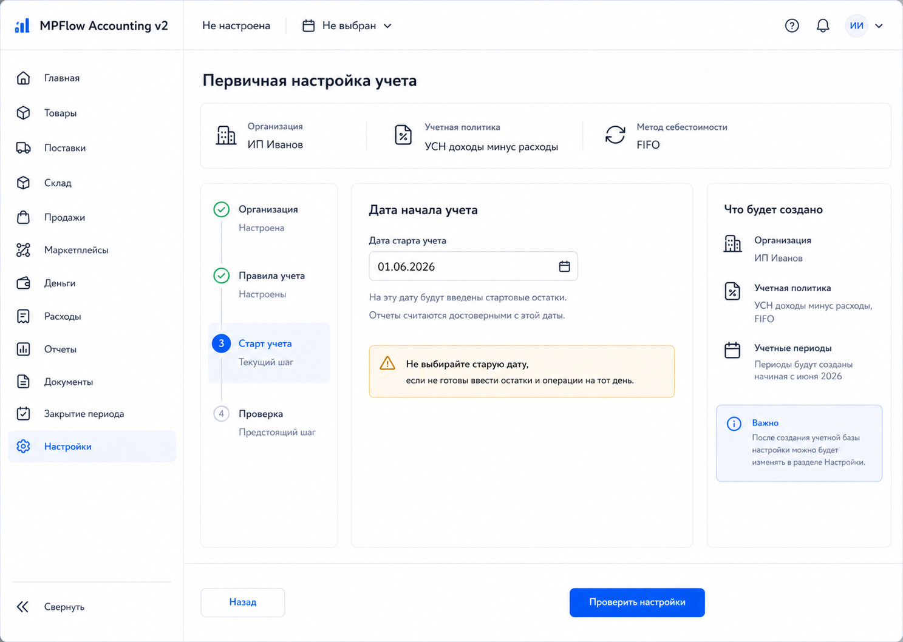
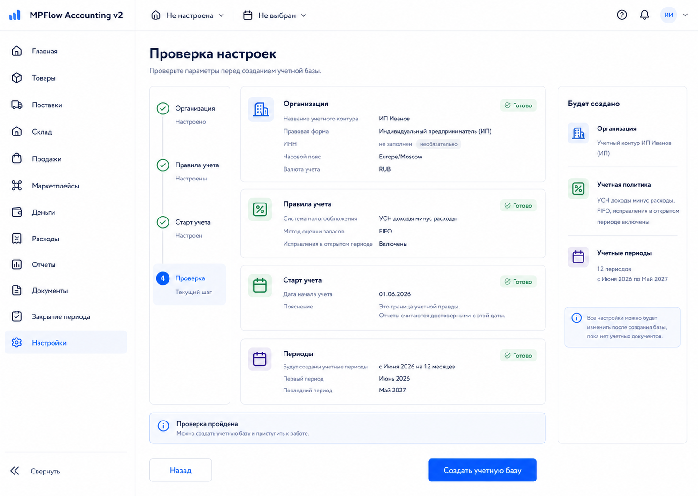
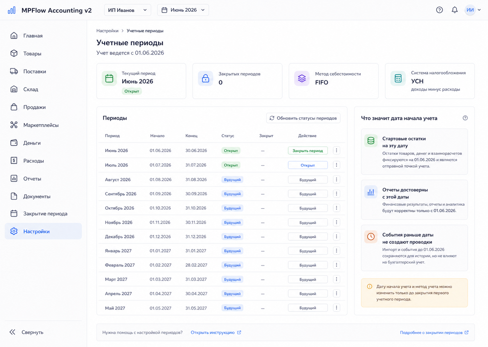
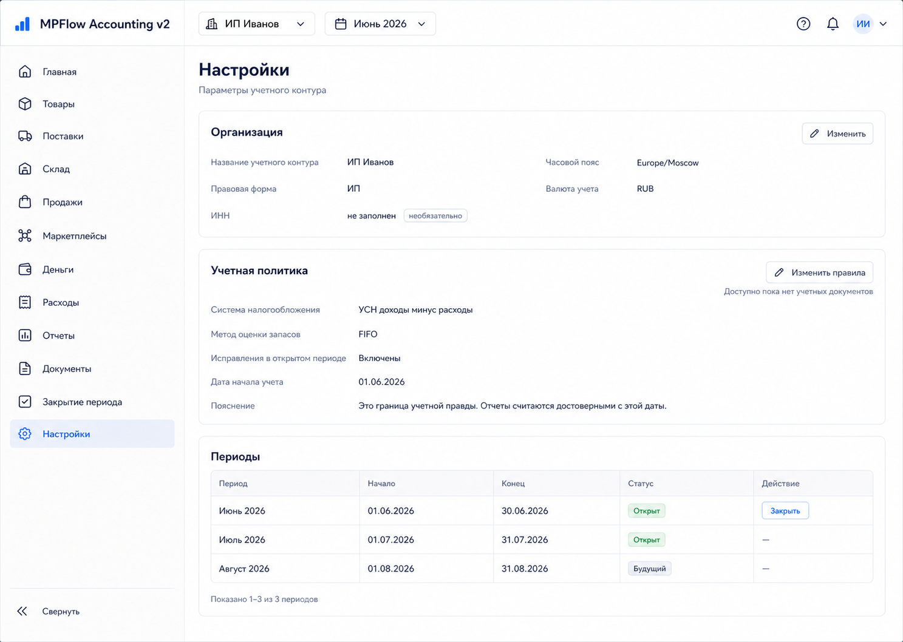

# Шаг 2. Организация, Учетная Политика, Периоды

## Цель

Дать пользователю возможность настроить учетную базу: как называется учетный контур, с какой даты система становится источником учетной правды, какая налоговая модель используется для будущих регистров и какие месячные периоды доступны.

## Пользовательский результат

Пользователь проходит мастер первичной настройки и после этого видит список учетных периодов. Система понимает дату старта учета и не позволит обычным документам проводить операции до этой даты.

Дата старта учета не означает дату регистрации ИП или дату фактического начала бизнеса. Это дата, с которой `MPFlow` становится источником правды. Если пользователь выбирает старую дату, он принимает обязанность ввести остатки на ту дату и операции после нее, иначе отчеты за промежуток будут неполными.

## Frontend

### Экран `Первичная настройка`

Экран открывается из дефолтной главной страницы шага 1 и позже доступен из `Настройки`.

Форма-мастер:

- шаг 1: организация;
- шаг 2: правила учета;
- шаг 3: старт учета;
- шаг 4: проверка и создание периодов.

Progress wizard показывает только навигацию. Активная форма содержит фактические поля. Summary справа повторяет значения только как финальное подтверждение перед созданием учетной базы.

Поля организации:

- название учетного контура, обязательно;
- правовая форма: `ИП`, default;
- ИНН, необязательно для управленческого учета до появления налоговых экспортов;
- часовой пояс;
- валюта учета: `RUB`, read-only.

Поля учетной политики:

- система налогообложения: `УСН доходы минус расходы`;
- метод себестоимости: `FIFO`, read-only для первых шагов;
- разрешить исправления в открытом периоде: yes;
- комментарий к учетной политике.

Дата старта учета:

- date picker;
- пояснение: стартовые остатки будут созданы на эту дату, отчеты будут считаться достоверными с этой даты.
- если дата старше текущего месяца, показать сильное предупреждение: пользователю придется ввести остатки и все операции после выбранной даты, иначе отчеты будут неполными.

Шаг проверки:

- показывает readonly summary организации, правил учета, даты старта и будущих периодов;
- кнопка `Назад` возвращает на предыдущий шаг без сохранения в БД;
- кнопка `Создать учетную базу` вызывает `PUT /api/setup`;
- после успеха пользователь попадает в `Настройки`.

### Экран `Настройки -> Периоды`

Таблица:

- месяц;
- дата начала;
- дата окончания;
- статус: открыт/закрыт;
- дата закрытия;
- действие: закрыть/переоткрыть.

### Экран `Настройки` после первичной настройки

После завершения мастера пользователь попадает не обратно в wizard, а в обычный раздел настроек.

Второй sidebar внутри настроек запрещен. Основной sidebar уже отвечает за навигацию по продукту, а вложенный sidebar будет дублировать структуру и утяжелять экран.

Экран настроек после первичной настройки состоит из секций на одной странице и не должен превращаться в навигационный hub или панель быстрых действий.

- карточку организации;
- карточку учетной политики;
- карточку текущего периода и компактную таблицу ближайших периодов.

Локальные действия находятся только там, где пользователь меняет данные текущего шага:

- в `Организация`: `Изменить`;
- в `Учетная политика`: `Изменить`, если еще нет учетных документов;
- в `Периоды`: `Закрыть` или `Переоткрыть` только в строке конкретного периода;
- в `Старт учета`: отдельной карточки нет, дата старта отображается внутри учетной политики как часть правил учета.

Не добавлять на этот экран карточки `План счетов`, `Склады и состояния`, `Денежные счета`, `Импорт/экспорт`, общий блок `Быстрые действия` или кнопки перехода в будущие разделы. Эти разделы появятся в своих шагах и не должны дублироваться в overview настроек.

Поле даты старта учета в обычных настройках read-only после появления первых учетных документов. До появления учетных документов его можно изменить только через явное действие `Изменить дату старта` с предупреждением о пересоздании периодов.

## Backend

Модули:

- `setup`
- `organization`
- `periods`

Endpoints:

- `GET /api/setup`
- `PUT /api/setup`
- `GET /api/organization`
- `PATCH /api/organization`
- `GET /api/periods`
- `POST /api/periods/:id/close`
- `POST /api/periods/:id/reopen`

Validation:

- ИНН необязателен; если заполнен, ИНН ИП должен содержать 12 цифр;
- дата старта учета обязательна;
- дата старта учета не может быть позже текущей даты больше чем на один год;
- дата старта учета старше текущего месяца разрешена, но требует явного поля `confirmHistoricalStart=true`;
- нельзя создать вторую организацию в v1;
- нельзя создать вторую активную учетную политику.

`PUT /api/setup` request:

- `organizationName`;
- `legalForm`;
- `inn?`;
- `timezone`;
- `taxSystem`;
- `costMethod`;
- `allowOpenPeriodEdits`;
- `accountingStartDate`;
- `confirmHistoricalStart`.

`PUT /api/setup` success:

- creates organization;
- creates accounting policy;
- creates at least 12 monthly accounting periods from the start date;
- returns created organization, policy, periods, and next route `/settings`.

## БД

### `organization`

- `id uuid primary key`
- `name text not null`
- `legal_form text not null check (legal_form in ('ip'))`
- `inn text`
- `base_currency text not null default 'RUB'`
- `timezone text not null default 'Europe/Moscow'`
- `created_at timestamptz not null default now()`
- `updated_at timestamptz not null default now()`

Indexes:

- unique `inn where inn is not null`

### `accounting_policy`

- `id uuid primary key`
- `organization_id uuid not null references organization(id)`
- `tax_system text not null check (tax_system in ('usn_income_expense'))`
- `cost_method text not null check (cost_method in ('fifo'))`
- `accounting_start_date date not null`
- `allow_open_period_edits boolean not null default true`
- `comment text`
- `created_at timestamptz not null default now()`

Indexes:

- unique `organization_id`

### `accounting_period`

- `id uuid primary key`
- `organization_id uuid not null references organization(id)`
- `period_month date not null`
- `start_date date not null`
- `end_date date not null`
- `status text not null check (status in ('open', 'closed'))`
- `closed_at timestamptz`
- `closed_by text`

Indexes:

- unique `(organization_id, period_month)`
- index `(organization_id, status)`

## Учетные правила

Дата старта учета становится нижней границей обычных проводок:

- `document.accounting_date < accounting_policy.accounting_start_date` запрещен;
- исключение будет возможно позже только для специальных backfill/system operations;
- первый период начинается с даты старта учета;
- последующие периоды создаются помесячно.

## Ошибки пользователя

- Некорректный ИНН, если он заполнен: inline error у поля.
- Не выбрана дата старта: блокировать переход к проверке.
- Выбрана старая дата: показать warning и требовать подтверждение `Я понимаю, что отчеты между этой датой и сегодняшним днем будут неполными без ввода истории`.
- Попытка закрыть период с будущими незакрытыми проверками: пока показывать предупреждение, жесткая проверка появится позже.
- Попытка изменить дату старта после создания учетных документов: запрещать и показывать причину.
- Кнопка `Закрыть период`: до шага 26 открывает простое confirmation modal and changes status to `closed`; after step 26 it must navigate to the full period-closing checklist.
- Кнопка `Переоткрыть`: открывает confirmation modal; доступна только для закрытого периода.

## Тесты

Unit:

- валидация ИНН только если поле заполнено;
- генерация периодов от даты старта учета;
- warning для старой даты.

Integration:

- `PUT /api/setup` создает организацию, политику, периоды;
- повторный `PUT /api/setup` отклоняется или обновляет только разрешенные поля;
- закрытие периода меняет статус на `closed`.

Scenario:

- пользователь создает учетный контур без ИНН, выбирает дату старта учета, видит открытые периоды.

## Definition of Done

- Мастер настройки работает от начала до конца.
- После завершения мастер переводит пользователя в `Настройки -> Обзор`, а не оставляет в wizard.
- В БД созданы `organization`, `accounting_policy`, `accounting_period`.
- Дата старта учета сохранена и доступна backend-сервисам.
- Экран периодов показывает минимум 12 месяцев от даты старта.
- Закрытие и переоткрытие периода работают.
- `## Рендеры` описывает route, layout, кнопки, API, состояния и DB effects для каждого render-а.

## Рендеры

### `renders/01-setup-wizard.png`

User scenario:

- пользователь перешел с дефолтной главной на `/setup`;
- первые шаги wizard-а уже заполнены;
- активный шаг просит выбрать дату старта учета.

Route:

- `/setup`

Layout:

- основной sidebar приложения слева;
- topbar показывает `Не настроена` и `Не выбран`;
- внутри контента слева вертикальный progress wizard;
- в центре активная форма шага;
- справа readonly summary того, что будет создано.

Visible content:

- progress steps: Организация, Правила учета, Старт учета, Проверка;
- summary ранее введенных значений: ИП Иванов, УСН доходы минус расходы, FIFO;
- поле `Дата старта учета`;
- пояснение, что стартовые остатки и достоверные отчеты начинаются с этой даты;
- warning, если дата старше текущего месяца.

Controls and click behavior:

- `Назад`: возвращает на предыдущий wizard step без API-запроса;
- `Проверить настройки`: валидирует текущий step локально; если ошибок нет, переводит на финальный step проверки;
- изменение даты старта пересчитывает preview будущих периодов;
- если дата старше текущего месяца, `Проверить настройки` требует checkbox-подтверждение historical start.

States:

- missing date: inline error под date picker;
- old date without confirmation: warning + disabled next action;
- valid state: primary button enabled;
- loading не нужен до `PUT /api/setup`, потому что на этом экране нет записи в БД.

Backend and database effects:

- этот экран сам ничего не пишет в БД;
- итоговая запись происходит только на финальном render-е `04-setup-review.png`.

Must not include:

- дубль даты старта в progress step;
- второй sidebar настроек;
- quick actions panel;
- technical health statuses.

### `renders/04-setup-review.png`

User scenario:

- пользователь дошел до финального шага wizard-а;
- он проверяет итоговые параметры перед созданием учетной базы.

Route:

- `/setup/review` or wizard state `review` inside `/setup`.

Layout:

- основной sidebar слева;
- progress wizard слева внутри контента;
- центральная область с readonly summary по секциям;
- справа компактная карточка `Будет создано`.

Visible content:

- Организация: название учетного контура, правовая форма, optional ИНН, timezone;
- Правила учета: УСН доходы минус расходы, FIFO, исправления в открытом периоде;
- Старт учета: дата старта и warning status;
- Периоды: сколько периодов будет создано и с какого месяца;
- summary: organization, accounting policy, 12 periods.

Controls and click behavior:

- `Назад`: возвращает на step `Старт учета`;
- `Создать учетную базу`: вызывает `PUT /api/setup`;
- при успехе navigate to `/settings`;
- при ошибке `setup_already_exists` показать inline error и кнопку `Открыть настройки`;
- при ошибке validation показать ошибки у соответствующих секций.

States:

- loading: button text `Создаем...`, все поля readonly;
- success: redirect to `/settings`;
- error: error banner above summary.

Backend and database effects:

- creates one row in `organization`;
- creates one row in `accounting_policy`;
- creates monthly rows in `accounting_period`;
- does not create products, documents, journal entries, or inventory.

Must not include:

- edit forms на финальном шаге;
- technical health statuses;
- unrelated links to products or purchases before setup success.

### `renders/02-accounting-periods.png`

User scenario:

- организация уже настроена;
- пользователь открыл `Настройки -> Периоды`, чтобы увидеть созданные месяцы и закрыть/переоткрыть период.

Route:

- `/settings/periods`

Layout:

- основной sidebar слева;
- topbar с организацией и текущим периодом;
- KPI карточки по текущему периоду, закрытым периодам, FIFO и налоговому режиму;
- таблица периодов;
- поясняющая панель о дате старта учета.

Visible content:

- текущий период;
- таблица с колонками: Период, Начало, Конец, Статус, Закрыт, Действие;
- пояснение, что дата старта задает границу учетной правды.

Controls and click behavior:

- `Закрыть период`: open confirmation modal; on confirm calls `POST /api/periods/:id/close`; on success row status becomes `closed`;
- `Переоткрыть`: open confirmation modal; on confirm calls `POST /api/periods/:id/reopen`; on success row status becomes `open`;
- period row click may open details drawer with dates and status, read-only in step 2.

States:

- no periods: show setup-required empty state;
- close loading: disable action button for that row;
- close error: inline row error;
- future period: action disabled with tooltip `Период еще не начался`.

Backend and database effects:

- close updates `accounting_period.status`, `closed_at`, `closed_by`;
- reopen clears `closed_at` and sets `status=open`;
- no journal or document records are created.

Must not include:

- full period closing checklist;
- marketplace/data reconciliation checks;
- technical health cards.

### `renders/03-settings-overview-after-setup.png`

User scenario:

- пользователь завершил wizard и попал в обычные настройки;
- экран должен показать текущие параметры учетного контура без повторного wizard-а.

Route:

- `/settings`

Layout:

- один основной sidebar приложения;
- topbar с организацией и текущим периодом;
- content area with three full-width settings sections;
- no secondary settings sidebar and no global quick-actions panel.

Visible content:

- секция `Организация`: название, legal form, optional ИНН, timezone;
- секция `Учетная политика`: tax system, FIFO, open-period edits, accounting start date;
- секция `Периоды`: current period, nearest periods, closed period count, compact table of periods.

Controls and click behavior:

- `Изменить` in Organization: opens organization edit modal; calls `PATCH /api/organization` on save;
- `Изменить правила учета`: enabled only while no accounting documents exist; calls policy update endpoint if allowed; otherwise disabled with explanation;
- `Закрыть период` in period row: opens confirmation modal and calls `POST /api/periods/:id/close`;
- `Переоткрыть` in period row: opens confirmation modal and calls `POST /api/periods/:id/reopen`.

States:

- after first setup: all sections visible;
- no INN: show `Не заполнен` without warning;
- policy locked after documents: edit action disabled;
- period closed/open status shown as badge.

Backend and database effects:

- opening this screen calls `GET /api/organization`, `GET /api/setup`, and `GET /api/periods`;
- organization edits update `organization`;
- policy edits update `accounting_policy` only before accounting documents exist.

Must not include:

- secondary settings sidebar;
- separate quick actions panel;
- navigation hub cards for plan of accounts, warehouses, cash accounts, import/export;
- shortcut buttons to future sections;
- standalone `Старт учета` card duplicating policy;
- technical health statuses;
- deployment or local runtime information.
