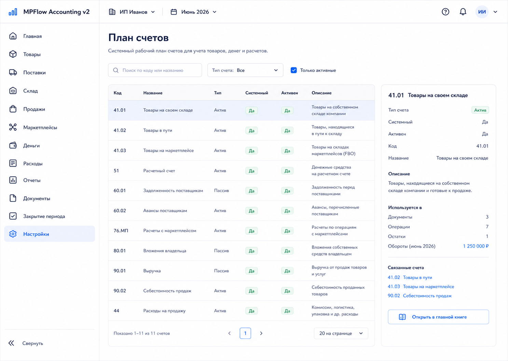
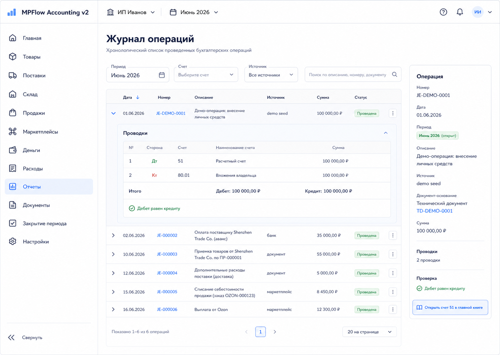
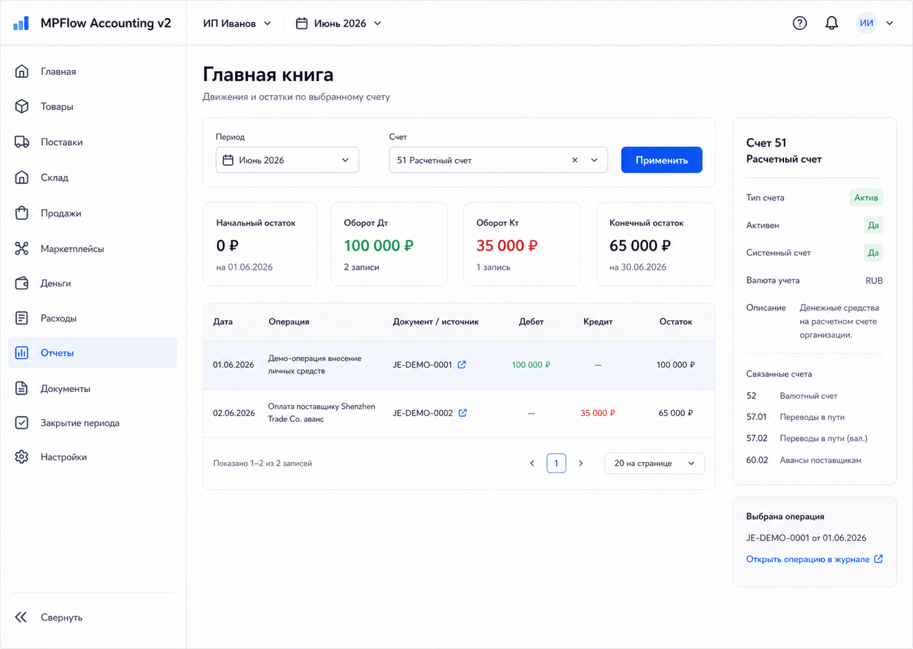

# Шаг 3. Бухгалтерское Ядро: Счета, Журнал, Главная Книга

## Цель

Создать минимальное ядро двойной записи: рабочий план счетов, журнал операций и главную книгу.

## Пользовательский результат

Пользователь может открыть план счетов, увидеть журнал операций и раскрыть движения по конкретному счету. На этом шаге учетные экраны read-only: пользователь еще не создает проводки вручную. Для проверки интерфейса и отчетов локальный seed может создать демо-операции с `source_type='demo_seed'`.

## Frontend

### Экран `Настройки -> План счетов`

Read-only экран. В шаге 3 нельзя создавать, редактировать или удалять счета через UI.

Таблица:

- код;
- название;
- тип: актив, пассив, капитал, доход, расход;
- активен;
- системный;
- описание.

Actions:

- row click selects account and opens details panel;
- `Открыть в главной книге` navigates to `/reports/ledger?account=<accountId>`.

### Экран `Отчеты -> Журнал операций`

Таблица:

- дата;
- номер операции;
- описание;
- сумма;
- статус;
- источник.

Раскрытие строки:

- дебетовые строки;
- кредитовые строки;
- сумма дебета;
- сумма кредита.

Actions:

- changing filters calls `GET /api/accounting/journal`;
- row click expands/collapses journal lines;
- account link in expanded row navigates to ledger filtered by that account.

### Экран `Отчеты -> Главная книга`

Фильтры:

- период;
- счет;
- только счета с оборотами.

Таблица:

- дата;
- операция;
- дебет;
- кредит;
- оборот;
- остаток.

Actions:

- `Применить` calls `GET /api/accounting/ledger?accountId=&from=&to=`;
- row click opens corresponding journal entry detail or expands source preview;
- no write actions on this screen.

## Backend

Модули:

- `accounting-core`
- `chart-accounts`
- `journal`
- `ledger`

Endpoints:

- `GET /api/accounting/accounts`
- `GET /api/accounting/accounts/:id`
- `GET /api/accounting/journal`
- `GET /api/accounting/journal/:id`
- `GET /api/accounting/ledger?accountId=&from=&to=`

Internal services:

- `postJournalEntry(input)`
- `listJournalEntries(filter)`
- `getLedger(accountId, from, to)`

Validation:

- journal entry must have at least two lines;
- total debit equals total credit;
- every account must be active;
- amount must be positive;
- entry date must belong to an open period.

Display mapping:

- `asset` -> `Актив`;
- `liability` -> `Пассив`;
- `equity` -> `Капитал`;
- `income` -> `Доход`;
- `expense` -> `Расход`.

## БД

### `chart_account`

- `id uuid primary key`
- `organization_id uuid not null references organization(id)`
- `code text not null`
- `name text not null`
- `account_type text not null check (account_type in ('asset','liability','equity','income','expense'))`
- `is_system boolean not null default false`
- `is_active boolean not null default true`
- `description text`

Indexes:

- unique `(organization_id, code)`

### `journal_entry`

- `id uuid primary key`
- `organization_id uuid not null references organization(id)`
- `entry_number text not null`
- `accounting_date date not null`
- `description text not null`
- `source_type text not null`
- `source_id uuid`
- `status text not null check (status in ('posted','reversed'))`
- `reversal_of_entry_id uuid references journal_entry(id)`
- `reversed_at timestamptz`
- `reversed_by text`
- `created_at timestamptz not null default now()`

Indexes:

- unique `(organization_id, entry_number)`
- index `(organization_id, accounting_date)`
- index `(organization_id, source_type, source_id)`
- index `(organization_id, reversal_of_entry_id)`

### `journal_line`

- `id uuid primary key`
- `journal_entry_id uuid not null references journal_entry(id) on delete cascade`
- `account_id uuid not null references chart_account(id)`
- `side text not null check (side in ('debit','credit'))`
- `amount_rub numeric(18,2) not null check (amount_rub > 0)`
- `memo text`
- `line_no int not null`

Indexes:

- index `(journal_entry_id)`
- index `(account_id)`

## Учетные правила

Seed рабочего плана счетов должен сразу покрывать весь roadmap, даже если часть счетов начнет использоваться только в шагах 11+. Это защищает последующие шаги от обратных миграций posting rules.

- `41.01 Товары на своем складе`
- `41.02 Товары в пути`
- `41.03 Товары на точках продаж`
- `50 Касса`
- `51 Расчетный счет`
- `62 Дебиторская задолженность`
- `60.01 Задолженность поставщикам`
- `60.02 Авансы поставщикам`
- `76.02 Претензии поставщикам`
- `76.ТП Расчеты с точками продаж`
- `80.01 Вложения владельца`
- `80.02 Изъятия владельца`
- `84 Накопленный результат управленческого учета`
- `90.01 Выручка`
- `90.02 Себестоимость продаж`
- `91.01 Прочие доходы`
- `91.02 Прочие расходы`
- `94 Недостачи и потери`
- `26 Общехозяйственные расходы`
- `44 Расходы на продажу`

Do not seed `76.МП`; use `76.ТП Расчеты с точками продаж` because channels are not limited to marketplaces.

Invariant:

```text
sum(debit.amount_rub) = sum(credit.amount_rub)
```

Reversal invariant:

- reversal entry must reference the original entry through `reversal_of_entry_id`;
- reversal lines mirror original lines with debit/credit sides swapped;
- original entry is not deleted;
- original entry may be marked `reversed`, while the reversal entry remains `posted`.

## Ошибки пользователя

Пока пользователь не создает проводки вручную. Ошибки отображаются только при просмотре:

- счет не найден;
- период не выбран;
- нет операций за период.

## Тесты

Unit:

- balanced journal entry accepted;
- unbalanced journal entry rejected;
- inactive account rejected.

Integration:

- seed creates chart of accounts;
- optional demo seed creates balanced entries with `source_type='demo_seed'`;
- journal list returns saved entry;
- ledger returns account movements.

Scenario:

- test entry `Дт 51 / Кт 80.01` appears in journal and ledger.

## Definition of Done

- План счетов создан seed-ом.
- Журнал операций отображает проведенные операции.
- Главная книга показывает движения по счету.
- Backend запрещает несбалансированную операцию.
- Все суммы в journal entry сходятся.
- В UI нет кнопок создания/редактирования счетов или проводок.
- В рендерах и реализованном UI нет `Backend OK` / `PostgreSQL OK`.

## Рендеры



### `renders/01-chart-of-accounts.png`

User scenario:

- пользователь уже настроил организацию и открывает системный план счетов;
- он проверяет, какие счета будут использовать будущие документы.

Route:

- `/settings/chart-accounts`

Layout:

- основной sidebar приложения;
- topbar with organization and period only;
- content header, filters, accounts table, selected account details panel.

Visible content:

- фильтры: search by code/name, account type, active only;
- table columns: Код, Название, Тип, Системный, Активен, Описание;
- system accounts from seed;
- details panel for selected account `41.01`.

Controls and click behavior:

- search input filters rows client-side or calls `GET /api/accounting/accounts?search=`;
- account type filter calls/list-filters accounts;
- row click updates details panel without writing to DB;
- `Открыть в главной книге` navigates to `/reports/ledger?accountId=<selectedAccountId>`.

States:

- loading: table skeleton;
- no accounts: blocking empty state `План счетов не создан, запустите seed/миграции`;
- selected account absent: details panel asks to select a row;
- no write actions in step 3.

Backend and database effects:

- read-only `GET /api/accounting/accounts`;
- no `POST`, `PATCH`, or `DELETE` from this screen in step 3.

Must not include:

- button `Создать счет`;
- edit/delete account actions;
- technical health badges;
- hidden developer/test actions.



### `renders/02-journal.png`

User scenario:

- пользователь открывает журнал, чтобы увидеть хронологию проведенных операций;
- в шаге 3 операции приходят только из локального demo seed или внутренних тестов.

Route:

- `/reports/journal`

Layout:

- основной sidebar;
- topbar with organization and period;
- filter row;
- journal table;
- expanded row with debit/credit lines;
- selected operation details panel.

Visible content:

- filters: period, source, account, search;
- table columns: Дата, Номер, Описание, Источник, Сумма, Статус;
- expanded journal entry with debit line and credit line;
- debit total, credit total, green check `Дебет равен кредиту`.

Controls and click behavior:

- changing period/source/account/search calls `GET /api/accounting/journal` with filters;
- row click toggles expanded state;
- account link in expanded row navigates to `/reports/ledger?accountId=<accountId>`;
- journal entry details link opens `/reports/journal/<entryId>` or a read-only drawer.

States:

- no operations: empty state `Операций пока нет`;
- loading: table skeleton;
- unbalanced entry should never render as normal; if backend returns corrupted data, show error badge `Операция несбалансирована` for diagnostics;
- no create/edit/reverse actions in step 3 UI.

Backend and database effects:

- read-only `GET /api/accounting/journal`;
- demo entries, if present, are created by seed outside the UI;
- row expand does not write to DB.

Must not include:

- button `Создать операцию`;
- import/write actions;
- technical health badges;
- manual debit/credit editor.



### `renders/03-ledger.png`

User scenario:

- пользователь выбирает счет и период, чтобы увидеть обороты и остаток по счету.

Route:

- `/reports/ledger`

Layout:

- основной sidebar;
- topbar with organization and period;
- filter row with period and account;
- KPI row;
- movements table;
- selected account details panel.

Visible content:

- filters: period, account, button `Применить`;
- KPI: начальный остаток, оборот Дт, оборот Кт, конечный остаток;
- table columns: Дата, Операция, Документ/источник, Дебет, Кредит, Остаток;
- account details panel for `51 Расчетный счет`.

Controls and click behavior:

- changing filters locally updates form state;
- `Применить` calls `GET /api/accounting/ledger?accountId=&from=&to=`;
- row click selects movement and enables link to the journal entry;
- `Открыть операцию в журнале` navigates to `/reports/journal/<entryId>`.

States:

- no account selected: prompt to choose an account;
- selected account with no movements: show zero KPI and empty movement table;
- loading: KPI/table skeleton;
- API error: inline banner above table.

Backend and database effects:

- read-only `GET /api/accounting/ledger`;
- no journal entries are created, changed, or reversed from this screen.

Must not include:

- technical health badges;
- write actions such as create entry/reverse entry;
- cash account management controls;
- decorative hero or marketing copy.
