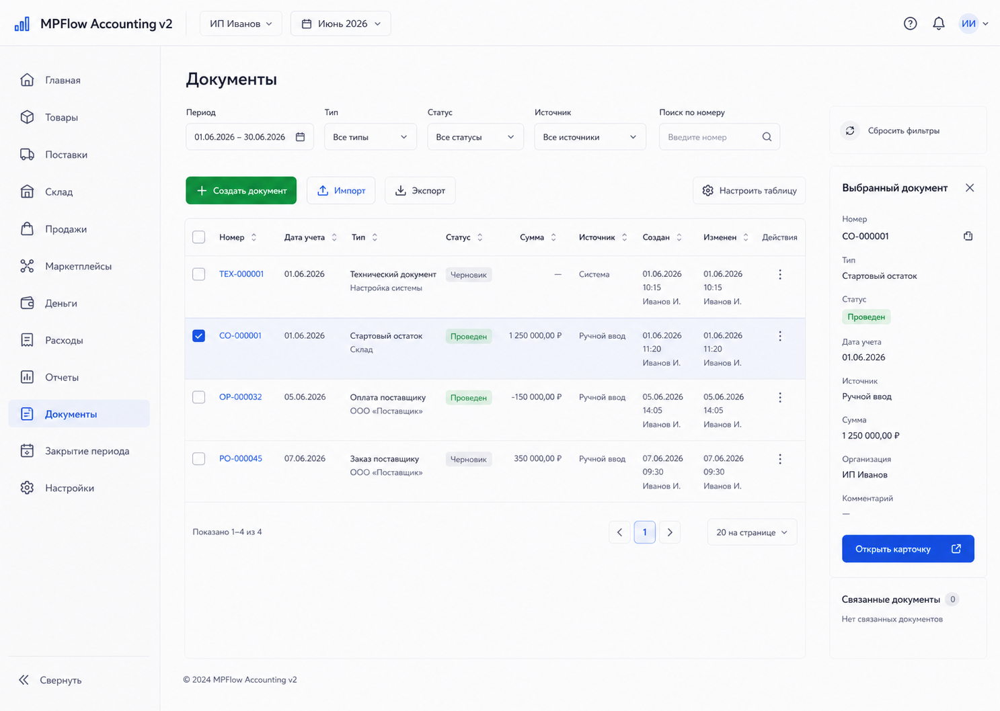
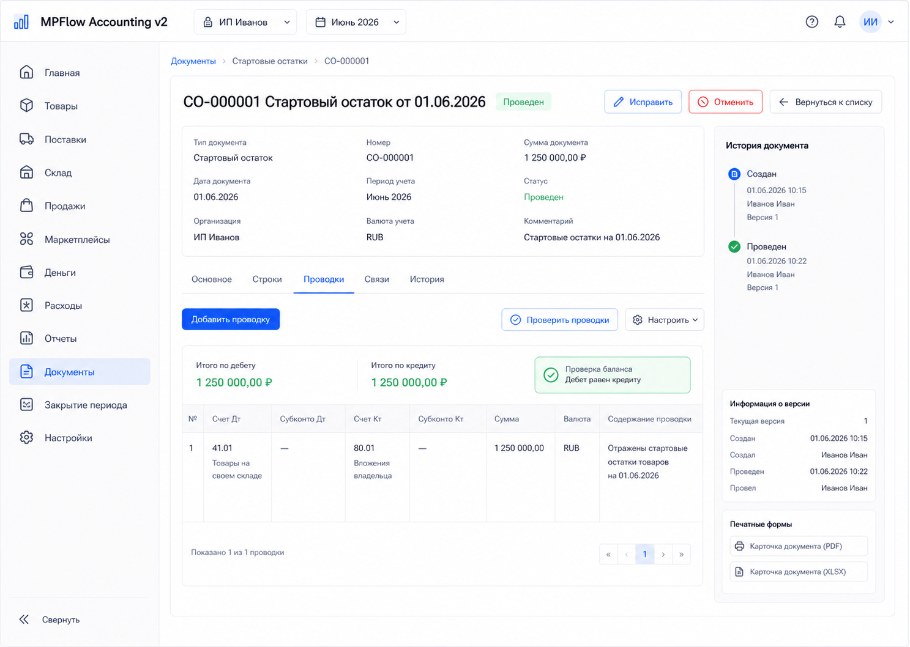

# Шаг 4. Документное Ядро

## Цель

Создать единый слой первичных учетных документов. Это тот слой, через который будущие поставки, оплаты, приемки, стартовые остатки, продажи, возвраты и расходы будут попадать в журнал операций и главную книгу.

В терминах OpenStax это часть `source document -> journal -> ledger`: пользователь работает с понятным бизнес-документом, backend проводит его по правилам, журнал и главная книга становятся следствием, а не ручной таблицей для правок.

## Пользовательский результат

Пользователь видит единый реестр документов и карточку документа с вкладками `Основное`, `Строки`, `Проводки`, `Связи`, `История`.

На шаге 4 пользователь может создать только простой документ типа `Учетная заметка` для проверки жизненного цикла. Он не влияет на деньги, товары и проводки. Все реальные бизнес-документы появятся в следующих шагах и будут использовать тот же document core.

## Frontend

### Раздел `Документы`

Route: `/documents`.

Назначение экрана: найти документ, понять его статус, открыть карточку, увидеть связь документа с проводками и будущими бизнес-сущностями.

Структура:

- основной sidebar приложения;
- topbar с организацией и текущим периодом;
- заголовок `Документы`;
- строка фильтров;
- таблица документов;
- preview выбранного документа справа.

Фильтры:

- период;
- тип документа;
- статус;
- источник;
- поиск по номеру, поставщику, комментарию или исходному номеру;
- checkbox `Только с проводками`.

Таблица:

- checkbox строки для будущих массовых операций, без массовых действий в шаге 4;
- `Номер`;
- `Дата учета`;
- `Тип`;
- `Статус`;
- `Сумма`;
- `Источник`;
- `Проводки`;
- `Связи`;
- `Изменен`.

Статусы:

- `Черновик`;
- `Проведен`;
- `Отменен`;
- `Исправлен`.

Действия:

- `Создать документ`: открывает modal создания учетной заметки;
- `Открыть`: переход на `/documents/:id`;
- row click: выделяет строку и обновляет preview справа;
- `Провести` в preview доступно только для черновика;
- `Отменить` в preview доступно только для проведенного документа в открытом периоде;
- `Вернуть в список` из карточки документа возвращает на `/documents` с сохраненными фильтрами.

Empty states:

- если документов нет: текст `Документы появятся после стартовых остатков, заказов, оплат и приемок`; кнопка `Создать учетную заметку` доступна для проверки document core;
- если фильтр ничего не нашел: показать `По выбранным фильтрам документов нет` и кнопку `Сбросить фильтры`.

### Modal `Создать учетную заметку`

Поля:

- дата учета;
- номер, optional, если пустой - backend выдает следующий номер;
- комментарий;
- одна или несколько строк с описанием, без количества и суммы.

Кнопки:

- `Отмена`: закрывает modal без API-запроса;
- `Сохранить черновик`: вызывает `POST /api/documents`;
- `Сохранить и провести`: вызывает `POST /api/documents`, затем `POST /api/documents/:id/post`.

Ограничение: в этом modal нельзя выбрать дебет/кредит и нельзя вводить суммы. Это не ручной журнал.

### Карточка документа

Route: `/documents/:id`.

Структура:

- header: тип, номер, статус, дата учета, период;
- справа status panel с ключевыми событиями;
- вкладки: `Основное`, `Строки`, `Проводки`, `Связи`, `История`;
- локальные действия в header.

Вкладка `Основное`:

- тип документа;
- номер;
- статус;
- дата учета;
- период;
- источник;
- комментарий;
- сумма, если применимо;
- кто создал и кто изменил.

Вкладка `Строки`:

- line number;
- line type;
- описание;
- количество;
- сумма;
- payload preview для технических деталей, свернутый по умолчанию.

Вкладка `Проводки`:

- если проводок нет: показать `Этот тип документа не создает проводок`;
- если проводки есть: список связанных `journal_entry`, строки дебета и кредита, итог дебет/кредит и ссылка `Открыть в журнале`.

Вкладка `Связи`:

- исходные документы;
- созданные документы;
- тип связи: `основание`, `оплата`, `приемка`, `исправление`, `отмена`.

Вкладка `История`:

- audit timeline;
- версии документа;
- кто и когда изменил;
- причина изменения;
- ссылка `Сравнить с текущей версией` для будущего diff drawer.

Действия:

- `Редактировать`: доступно только для черновика and changes the draft source fields directly;
- `Исправить`: доступно для проведенного документа; in an open period it opens a versioned correction flow with required reason and impact preview, and in a closed period it redirects to the correction/storno workflow from step 23;
- `Провести`: вызывает `POST /api/documents/:id/post`;
- `Открыть проводку`: переходит в `/reports/journal/:entryId`;
- `Открыть связанный документ`: переходит в `/documents/:id`.

Disabled states:

- если период закрыт, `Редактировать` и `Отменить` disabled с объяснением `Период закрыт. Исправление будет доступно через корректировочный документ`;
- если документ отменен, `Провести` disabled;
- если тип документа проводится только через доменный модуль, ручное проведение из document card disabled с объяснением.

## Backend

Модули:

- `documents`;
- `document-history`;
- `audit`;
- `posting-orchestrator`.

Endpoints:

- `GET /api/documents`;
- `POST /api/documents`;
- `GET /api/documents/:id`;
- `PATCH /api/documents/:id`;
- `POST /api/documents/:id/post`;
- `GET /api/documents/:id/history`;
- `GET /api/documents/:id/links`.

Commands/services:

- `createDocument(input)`;
- `updateDraftDocument(input)`;
- `postDocument(documentId)`;
- `cancelPostedDocument(documentId, reason)`;
- `createDocumentVersion(documentId, snapshot, reason)`;
- `writeAuditEvent(input)`;
- `resolveAccountingPeriod(accountingDate)`;
- `assertPeriodOpen(periodId)`;
- `runPostingRule(documentId)`.

Validation:

- organization must exist;
- document type required;
- accounting date required;
- accounting date must be `>= accounting_policy.accounting_start_date`;
- accounting date must belong to an existing accounting period;
- direct edit is blocked in closed period;
- draft document may be edited freely;
- posted document in open period cannot be patched as a silent update; it can only be changed through a correction flow with `change_reason`, version snapshot and audit event;
- cancelled document cannot be posted again; later correction/reversal workflows create new linked documents instead of resurrecting cancelled ones;
- document number must be unique inside organization;
- document lines must have stable `line_no`.

API response shape follows the global rule:

```json
{ "ok": true, "data": { "...": "..." } }
```

or

```json
{ "ok": false, "error": { "code": "period_closed", "message": "..." } }
```

Posting behavior:

- `accounting_note` can be posted without journal entries;
- business document types must register a document type and posting rule before they can be posted;
- posting must be idempotent: repeated `POST /post` for already posted document returns current posted state, not duplicate journal entries;
- if a posted document with journal entries is cancelled, original journal entries are not physically deleted; cancellation creates reversal entries or marks the document for reversal according to the document type rule;
- all journal entries created by a document use `journal_entry.source_type='document'` and `journal_entry.source_id=document.id`.

## БД

### `document_type_registry`

This table prevents future document workflows from inventing magic strings.

- `code text primary key`;
- `module_code text not null`;
- `display_name text not null`;
- `is_posting boolean not null default true`;
- `posting_rule_code text`;
- `allows_draft boolean not null default true`;
- `allows_reversal boolean not null default true`;
- `is_active boolean not null default true`;
- `created_at timestamptz not null default now()`.

Initial codes:

- `accounting_note`;
- `opening_balance`;
- `owner_contribution`;
- `supplier_payment`;
- `purchase_order`;
- `goods_receipt`;

Later steps add their document types by migration before implementing the workflow:

- `procurement_cost`;
- `shortage_resolution`;
- `stock_transfer`;
- `sale`;
- `sales_return`;
- `channel_finance_event`;
- `payout`;
- `operating_expense`;
- `owner_withdrawal`;
- `stocktake`;
- `stock_adjustment`;
- `correction`;
- `reversal`;
- `period_closing`.

### `document`

- `id uuid primary key`;
- `organization_id uuid not null references organization(id)`;
- `document_type text not null references document_type_registry(code)`;
- `document_number text not null`;
- `status text not null check (status in ('draft','posted','cancelled','corrected'))`;
- `accounting_date date not null`;
- `period_id uuid not null references accounting_period(id)`;
- `total_amount_rub numeric(18,2)`;
- `comment text`;
- `source_type text not null default 'manual'`;
- `source_id uuid`;
- `posted_at timestamptz`;
- `posted_by_user_id uuid`;
- `posted_by_agent_token_id uuid`;
- `posted_by_label text`;
- `cancelled_at timestamptz`;
- `cancelled_by_user_id uuid`;
- `cancelled_by_agent_token_id uuid`;
- `cancelled_by_label text`;
- `created_by_user_id uuid`;
- `created_by_agent_token_id uuid`;
- `created_by_label text not null default 'system'`;
- `version_no int not null default 1`;
- `created_at timestamptz not null default now()`;
- `updated_at timestamptz not null default now()`.

Indexes:

- unique `(organization_id, document_number)`;
- index `(organization_id, accounting_date)`;
- index `(organization_id, document_type, status)`;
- index `(organization_id, period_id, status)`;
- index `(organization_id, source_type, source_id)`.

### `document_line`

- `id uuid primary key`;
- `document_id uuid not null references document(id) on delete cascade`;
- `line_no int not null`;
- `line_type text not null`;
- `description text`;
- `qty numeric(18,4)`;
- `amount_rub numeric(18,2)`;
- `payload jsonb not null default '{}'::jsonb`;
- `created_at timestamptz not null default now()`.

Indexes:

- unique `(document_id, line_no)`.

### `document_version`

- `id uuid primary key`;
- `document_id uuid not null references document(id)`;
- `version_no int not null`;
- `snapshot jsonb not null`;
- `reason text not null`;
- `created_at timestamptz not null default now()`;
- `created_by_user_id uuid`;
- `created_by_agent_token_id uuid`;
- `created_by_label text not null default 'system'`.

Indexes:

- unique `(document_id, version_no)`.

### `document_link`

- `id uuid primary key`;
- `organization_id uuid not null references organization(id)`;
- `source_document_id uuid not null references document(id)`;
- `target_document_id uuid not null references document(id)`;
- `link_type text not null`;
- `created_at timestamptz not null default now()`.

Indexes:

- unique `(source_document_id, target_document_id, link_type)`;
- index `(organization_id, source_document_id)`;
- index `(organization_id, target_document_id)`.

### `audit_event`

- `id uuid primary key`;
- `organization_id uuid not null references organization(id)`;
- `entity_type text not null`;
- `entity_id uuid not null`;
- `action text not null`;
- `comment text`;
- `actor_user_id uuid`;
- `actor_agent_token_id uuid`;
- `actor_label text not null default 'system'`;
- `severity text not null default 'info' check (severity in ('debug','info','warning','critical'))`;
- `before_json jsonb`;
- `after_json jsonb`;
- `ip_address inet`;
- `created_at timestamptz not null default now()`;
- `payload jsonb not null default '{}'::jsonb`.

Indexes:

- index `(organization_id, entity_type, entity_id, created_at)`.
- index `(organization_id, actor_user_id, created_at)`;
- index `(organization_id, actor_agent_token_id, created_at)`.

Actor FK policy:

- Steps 1-26 may keep `*_user_id` and `*_agent_token_id` nullable because user/agent tables appear in step 27.
- Step 27 adds foreign-key constraints to `user_account` and `agent_token` where practical and starts enforcing permissions.
- Until then `*_label` preserves human-readable local actor evidence such as `system`, `local_user`, or migration name.

## Учетные правила

Документ - не проводка сам по себе. Документ является основанием для проводки.

Инварианты:

- пользовательские бизнес-события должны проходить через `document`;
- posted business document either has a valid journal entry or is explicitly marked as non-posting;
- сумма дебета в связанных journal entries равна сумме кредита;
- journal entries cannot exist without source traceability;
- ledger is computed from posted journal lines, not edited directly;
- closed period blocks direct document edits.

Связь с OpenStax:

- `document` отвечает за source document;
- `journal_entry` отвечает за journal;
- ledger screens отвечают за posting to ledger;
- audit/history отвечают за traceability and internal control.

## Ошибки пользователя

- Дата раньше даты начала учета: inline error у поля даты.
- Дата в закрытом периоде: блокировать проведение/редактирование, объяснить период и статус.
- Пустой номер при ручном вводе: backend может выдать номер автоматически; если пользователь ввел номер, он должен быть уникален.
- Попытка провести отмененный документ: error `cancelled_document_cannot_be_posted`.
- Попытка отменить черновик: предложить удалить черновик или оставить, но не показывать как бухгалтерскую отмену.
- Попытка изменить проведенный документ без причины: modal требует `Причина изменения`.
- Ошибка posting rule: показать business-readable reason, not stack trace.

## Тесты

Unit:

- document status transition rules;
- period resolution by accounting date;
- closed-period guard;
- document numbering;
- version snapshot creation;
- audit event payload.

Integration:

- create draft accounting note;
- post draft accounting note without journal entries;
- update draft;
- correction of posted document in open period creates `document_version`;
- closed period blocks update and cancel;
- cancel posted document writes audit event.

Scenario:

- user opens registry, creates accounting note, posts it, opens card, sees history and no journal entries.

## Definition of Done

- Реестр документов работает с фильтрами и preview.
- Карточка документа показывает header, вкладки, строки, проводки, связи и историю.
- Создание учетной заметки работает как безопасный non-posting сценарий.
- Проведение документа idempotent.
- Версии сохраняются при исправлении posted-документа в открытом периоде.
- Audit events пишутся для create/update/post/cancel.
- Closed period blocks direct edits.
- Спека явно запрещает ручное редактирование journal/ledger из document UI.
- Рендеры и текстовые контракты описывают route, layout, кнопки, API, состояния и DB effects.

## Рендеры



### `renders/01-documents-list.png`

User scenario:

- пользователь уже настроил организацию и открыл `/documents`;
- в системе есть документы из предыдущих/seed-сценариев;
- пользователь выбирает строку и смотрит preview справа.

Route:

- `/documents`

Layout:

- один основной sidebar приложения;
- topbar с организацией `ИП Иванов` и периодом `Июнь 2026`;
- content header `Документы`;
- filter bar above table;
- documents table in the center;
- selected document preview panel on the right.

Visible content:

- filters: period, document type, status, source, search input, checkbox `Только с проводками`;
- table columns: `Номер`, `Дата учета`, `Тип`, `Статус`, `Сумма`, `Источник`, `Проводки`, `Связи`, `Изменен`;
- rows with statuses `Проведен`, `Черновик`, `Отменен`;
- right preview with document number, type, status, accounting date, amount, linked journal entry count, latest audit event.

Controls and click behavior:

- `Создать документ`: opens modal `Создать учетную заметку`;
- changing filters calls `GET /api/documents` with query params;
- clicking a row selects it and updates the right preview without navigation;
- `Открыть` in preview navigates to `/documents/:id`;
- `Провести` in preview calls `POST /api/documents/:id/post` only for draft;
- `Сбросить фильтры` clears filters and reloads `GET /api/documents`.

Validation and error states:

- no documents: empty state explaining that documents will appear from стартовые остатки, поставки, оплаты and приемки;
- no filter results: show `По выбранным фильтрам документов нет`;
- API loading: table skeleton and disabled row actions;
- API error: inline banner above the table with retry action;
- closed period: post/cancel actions disabled with tooltip.

Backend and database effects:

- opening screen calls `GET /api/documents`;
- creating accounting note writes `document`, optional `document_line`, and `audit_event`;
- posting accounting note updates `document.status='posted'`, `posted_at`, actor fields, and writes `audit_event`;
- no `journal_entry` is created for accounting note.

Must not include:

- `Backend OK`, `PostgreSQL OK`, runtime/deploy statuses;
- manual debit/credit editor;
- quick actions to future modules;
- second sidebar inside documents;
- destructive delete action for posted documents.



### `renders/02-document-card.png`

User scenario:

- пользователь открыл проведенный документ `/documents/:id`;
- он проверяет, какие строки, проводки, связи и события истории стоят за документом.

Route:

- `/documents/:id`

Layout:

- основной sidebar;
- topbar with organization and period;
- document header with number, type, status, accounting date;
- tabs under header;
- main tab content;
- right status/audit panel.

Visible content:

- header: `CO-000001 Стартовый остаток от 01.06.2026`, status badge `Проведен`, date, period;
- buttons: `Редактировать`, `Отменить`, `Вернуться в список`;
- tabs: `Основное`, `Строки`, `Проводки`, `Связи`, `История`;
- selected tab `Проводки` shows journal entry number, debit lines, credit lines, debit total, credit total, green balance check;
- right panel shows source document lifecycle: created, posted, linked journal entries, latest audit event.

Controls and click behavior:

- `Редактировать`: if draft, opens edit form; if posted, hidden or disabled with explanation `Проведенный документ исправляется через историю изменений`;
- `Исправить`: if posted in open period, opens correction modal with reason and impact preview; if closed period, opens step 23 correction/storno flow;
- `Открыть в журнале`: navigates to `/reports/journal/:entryId`;
- tab click switches visible tab without writing to DB;
- linked document click navigates to `/documents/:linkedId`;
- `История` tab calls `GET /api/documents/:id/history` if not already loaded.

Validation and error states:

- document not found: full-page not-found state with `Вернуться в документы`;
- journal loading: skeleton inside `Проводки`;
- no journal entries: empty state `Этот документ не создает проводок`;
- cancellation blocked by closed period: modal shows reason and does not call API;
- version conflict: show error `Документ изменился, обновите страницу`.

Backend and database effects:

- opening screen calls `GET /api/documents/:id`, `GET /api/documents/:id/links`, and optionally `GET /api/documents/:id/history`;
- cancellation writes `audit_event`, updates `document.status`, and for posting documents creates reversal entries according to the document posting rule;
- tab navigation itself does not write to DB.

Must not include:

- manual account selection;
- inline editing of journal lines;
- delete posted document action;
- unrelated marketplace/import controls;
- technical health statuses.
