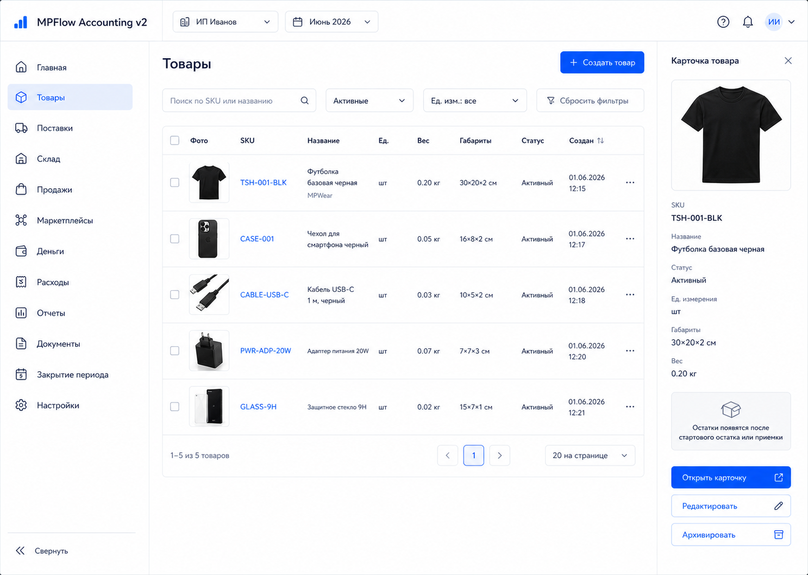
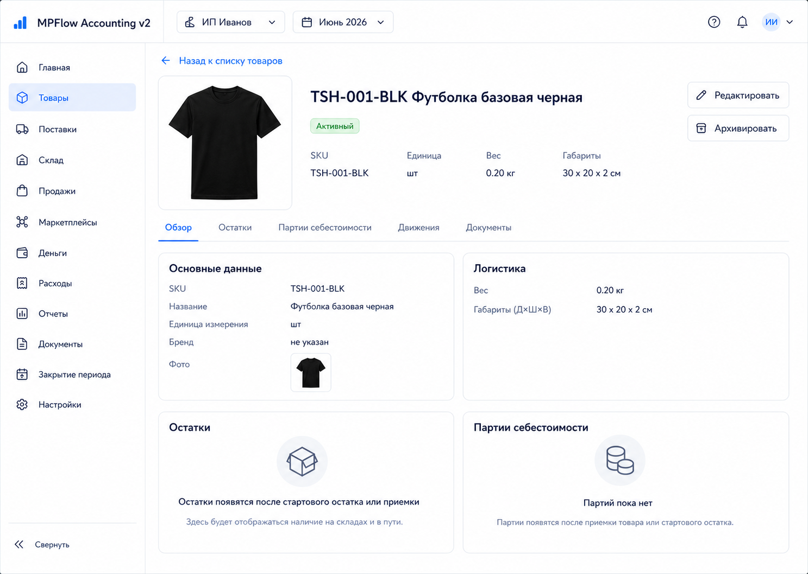
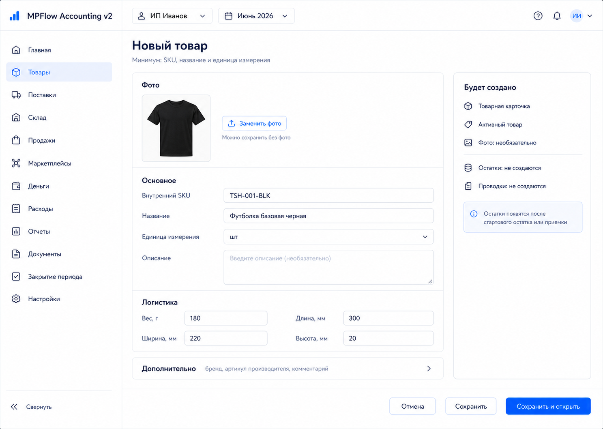

# Шаг 5. Каталог Товаров

## Цель

Создать внутренний каталог товаров. Это справочник учетных единиц, на которые будут ссылаться стартовые остатки, закупки, приемки, FIFO-партии, будущие продажи и связи с маркетплейсами.

Товар сам по себе не является хозяйственной операцией: он не меняет активы, обязательства, капитал, доходы или расходы. Он только дает стабильный идентификатор для документов и складских регистров.

## Пользовательский результат

Пользователь может создать товар, найти его в списке, открыть карточку, отредактировать основные атрибуты и архивировать товар без удаления истории.

Минимально обязательные поля товара: SKU, название и единица измерения. Бренд, фото, описание, вес и габариты не обязательны.

После шага 5 остатки, партии и документы в карточке товара пока пустые. Они появятся в шагах 6-10.

## Frontend

### Раздел `Товары`

Route: `/products`.

Назначение экрана: быстро найти внутренний SKU и понять, можно ли использовать товар в новых документах.

Структура:

- основной sidebar;
- topbar с организацией и периодом;
- header `Товары`;
- primary action `Создать товар`;
- filter bar;
- таблица товаров;
- right preview panel выбранного товара.

Фильтры:

- поиск по SKU и названию;
- статус: `Активные`, `Архивные`, `Все`;
- единица измерения;
- `Бренд` как дополнительный фильтр, показывается только если в каталоге есть товары с заполненным брендом;
- checkbox `Только без остатков` появится после шага 6, но в шаге 5 не нужен.

Таблица:

- `Фото`;
- `SKU`;
- `Название`;
- `Ед. изм.`;
- `Вес`;
- `Габариты`;
- `Статус`;
- `Создан`.

`Бренд` не показывать отдельной колонкой по умолчанию. Если он нужен пользователю, его можно включить через настройки колонок позже. В строке товара можно показывать бренд мелким вторым текстом под названием только если поле заполнено.

Right preview:

- фото товара или placeholder;
- SKU;
- название;
- бренд only if filled;
- статус;
- краткие логистические параметры;
- empty state `Остатки появятся после стартового остатка или приемки`;
- кнопки `Открыть карточку`, `Редактировать`, `Архивировать`.

Действия:

- `Создать товар`: открывает modal или отдельную страницу `/products/new`;
- row click: выделяет товар и обновляет preview;
- `Открыть карточку`: navigate to `/products/:id`;
- `Редактировать`: открывает форму редактирования;
- `Архивировать`: открывает confirmation modal.

### Форма товара

Route: `/products/new` and `/products/:id/edit`, или modal с тем же составом полей.

Поля:

- `Главное фото`, optional URL/upload placeholder;
- `Внутренний SKU`, required;
- `Название`, required;
- `Единица измерения`, required, default `шт`;
- `Описание`, optional;
- `Вес, г`, optional, `>= 0`;
- `Длина, мм`, optional, `>= 0`;
- `Ширина, мм`, optional, `>= 0`;
- `Высота, мм`, optional, `>= 0`;
- `Статус`, read-only на creation, default `Активен`.

Дополнительные поля, свернуты по умолчанию:

- `Бренд`, optional;
- `Артикул производителя`, optional;
- `Комментарий`, optional.

Right summary:

- preview SKU/name;
- preview image or placeholder;
- что будет создано в БД;
- предупреждение `Товар не создает остатки и проводки`.

Кнопки:

- `Отмена`: возвращает к списку без записи;
- `Сохранить`: вызывает `POST /api/products`;
- `Сохранить и открыть`: вызывает `POST /api/products`, затем navigate to `/products/:id`;
- на edit: `Сохранить изменения` вызывает `PATCH /api/products/:id`.

Validation:

- duplicate SKU: inline error у поля SKU;
- пустое название: inline error;
- отрицательные размеры: inline error у конкретного поля;
- некорректный URL фото, если пользователь вставляет ссылку;
- archived product cannot be edited except restore action, not included in step 5.

### Карточка товара

Route: `/products/:id`.

Структура:

- header: SKU, название, статус, бренд;
- крупное фото товара или placeholder;
- quick identity block with unit, dimensions, weight;
- tabs: `Обзор`, `Остатки`, `Партии себестоимости`, `Движения`, `Документы`;
- right panel `Использование товара`.

Вкладка `Обзор`:

- основные данные;
- фото товара;
- логистические параметры;
- empty states for balances and FIFO lots.

Вкладка `Остатки`:

- до шага 6 показывает empty state `Остатки появятся после стартового остатка или приемки`;
- после шага 6 будет читать `GET /api/inventory/balances?productId=`.

Вкладка `Партии себестоимости`:

- до шага 6 показывает empty state `Партий пока нет`;
- после шага 6 будет читать `GET /api/products/:id/lots`.

Вкладка `Документы`:

- показывает связанные документы, если они есть;
- до появления документов показывает empty state.

Actions:

- `Редактировать`: navigate to `/products/:id/edit`;
- `Архивировать`: opens confirmation modal;
- `Вернуть из архива`: будущая action, can be hidden in step 5 unless product archived.

Не добавлять ручные кнопки `Создать остаток` в карточку товара на шаге 5. Стартовый остаток будет отдельным документом шага 6.

## Backend

Модуль:

- `products`.

Endpoints:

- `GET /api/products`;
- `POST /api/products`;
- `GET /api/products/:id`;
- `PATCH /api/products/:id`;
- `POST /api/products/:id/archive`;
- `POST /api/products/:id/restore`.
- `POST /api/products/:id/images`;
- `PATCH /api/products/:id/images/:imageId`;
- `DELETE /api/products/:id/images/:imageId`.

Commands/services:

- `createProduct(input)`;
- `updateProduct(input)`;
- `archiveProduct(productId)`;
- `restoreProduct(productId)`;
- `upsertPrimaryProductImage(productId, input)`;
- `assertProductActive(productId)`.

Validation:

- organization must exist;
- SKU required and trimmed;
- SKU unique inside organization, case-insensitive if PostgreSQL collation allows or via normalized field;
- name required and trimmed;
- unit required;
- weight and dimensions cannot be negative;
- product image is optional;
- if image URL is provided, it must be a valid URL or local uploaded asset reference;
- archived product cannot be used in new documents;
- product cannot be physically deleted if referenced by documents, lots or movements.

API filters:

- `GET /api/products?search=&status=&brand=&unit=`.

## БД

### `product`

- `id uuid primary key`;
- `organization_id uuid not null references organization(id)`;
- `sku text not null`;
- `sku_normalized text not null`;
- `name text not null`;
- `unit text not null default 'шт'`;
- `brand text`;
- `description text`;
- `weight_grams numeric(18,4)`;
- `length_mm int`;
- `width_mm int`;
- `height_mm int`;
- `is_active boolean not null default true`;
- `archived_at timestamptz`;
- `created_at timestamptz not null default now()`;
- `updated_at timestamptz not null default now()`.

Indexes:

- unique `(organization_id, sku_normalized)`;
- index `(organization_id, name)`;
- index `(organization_id, brand)`;
- index `(organization_id, is_active)`.

### `product_image`

- `id uuid primary key`;
- `organization_id uuid not null references organization(id)`;
- `product_id uuid not null references product(id) on delete cascade`;
- `image_url text not null`;
- `alt_text text`;
- `is_primary boolean not null default false`;
- `sort_order int not null default 0`;
- `created_at timestamptz not null default now()`.

Indexes:

- index `(organization_id, product_id)`;
- unique `(product_id) where is_primary = true`.

## Учетные правила

- Product create/update/archive не создает journal entries.
- Product create/update/archive не создает document.
- Product image create/update/delete не создает journal entries and does not affect stock/cost.
- Product is a master-data object used by documents and inventory registers.
- Physical deletion is prohibited after references exist; use archive.
- Archived product remains visible in historical documents, inventory lots and reports.

OpenStax connection:

- это справочник объекта учета, а не transaction;
- операция появится только когда товар будет принят, оплачен, перемещен, продан или списан.

## Ошибки пользователя

- SKU уже существует: `sku_already_exists`.
- SKU пустой: inline error.
- Название пустое: inline error.
- Вес/габариты меньше нуля: inline error.
- Некорректная ссылка на фото: inline error; товар можно сохранить без фото.
- Попытка архивировать товар, который используется в открытом черновике: confirmation warning with list of draft documents.
- Попытка создать документ с archived product later: blocked by `assertProductActive`.

## Тесты

Unit:

- product validation;
- SKU normalization;
- product image validation;
- archived product guard.

Integration:

- create product;
- duplicate SKU rejected;
- patch product fields;
- add/update primary product image;
- archive product;
- archived product hidden by default from list;
- restore product.

Scenario:

- user creates product, finds it in list, opens product card, sees empty balances and FIFO states.

## Definition of Done

- Список товаров работает с фильтрами и preview.
- Форма создания товара работает.
- Форма редактирования товара работает.
- Карточка товара работает.
- SKU уникален внутри организации.
- Архивирование работает без удаления истории.
- Карточка товара не обещает остатки до реализации шага 6.
- Рендеры и текстовые контракты описывают route, layout, кнопки, API, состояния и DB effects.

## Рендеры

### `renders/01-products-list.png`

User scenario:

- пользователь открыл `/products`;
- несколько товаров уже созданы;
- пользователь ищет SKU и выбирает товар в таблице.

Route:

- `/products`

Layout:

- основной sidebar;
- topbar with organization and period;
- content header `Товары`;
- filter row;
- products table;
- selected product preview panel справа.

Visible content:

- filters: search, status, unit; advanced brand filter appears only if brands exist;
- primary button `Создать товар`;
- table columns: photo, SKU, name, unit, weight, dimensions, status, created;
- product cell uses thumbnail plus SKU/name for visual recognition;
- selected product preview with photo, SKU, title, optional brand, dimensions, status, empty balance hint.

Controls and click behavior:

- `Создать товар`: navigates to `/products/new` or opens product form modal;
- changing filters calls `GET /api/products`;
- row click selects product and updates preview;
- `Открыть карточку`: navigates to `/products/:id`;
- `Редактировать`: navigates to `/products/:id/edit`;
- `Архивировать`: opens confirmation modal and calls `POST /api/products/:id/archive` on confirm.

Validation and error states:

- no products: empty state `Создайте первый товар, чтобы вводить остатки и поставки`;
- no filtered results: `По фильтрам ничего не найдено`;
- loading: table skeleton;
- duplicate SKU is not shown here; it is handled in the form.

Backend and database effects:

- opening screen calls `GET /api/products`;
- archive action updates `product.is_active=false`, `archived_at=now()`;
- no journal entries or documents are created from list actions.

Must not include:

- inventory balances as real numbers before step 6 unless they come from implemented API;
- marketplace binding controls before integration steps;
- import buttons or actions from future steps;
- technical health badges such as `Backend OK` or `PostgreSQL OK`;
- manual accounting controls;
- technical health statuses.

### `renders/02-product-card-empty.png`

User scenario:

- пользователь открыл только что созданный товар;
- товар еще не участвовал в стартовых остатках, закупках или приемках.

Route:

- `/products/:id`

Layout:

- основной sidebar;
- topbar with organization and period;
- product header with SKU, name, status;
- tabs under header;
- overview content with empty states;
- right panel with usage information.

Visible content:

- product identity: photo, SKU, name, optional brand, unit;
- logistics: weight and dimensions;
- tabs: `Обзор`, `Остатки`, `Партии себестоимости`, `Движения`, `Документы`;
- empty state in balances: `Остатки появятся после стартового остатка или приемки`;
- empty state in lots: `Партий себестоимости пока нет`.

Controls and click behavior:

- `Редактировать`: navigates to `/products/:id/edit`;
- `Архивировать`: opens confirmation modal;
- tab click switches visible content;
- when user opens future `Остатки` tab after step 6, frontend calls `GET /api/inventory/balances?productId=`;
- when user opens future `Партии себестоимости` tab after step 6/7, frontend calls `GET /api/products/:id/lots`.

Validation and error states:

- product not found: not-found state with `Вернуться к товарам`;
- archived product: yellow status and disabled use-in-new-documents hint;
- loading lots/balances: skeleton inside tab.

Backend and database effects:

- opening screen calls `GET /api/products/:id`;
- viewing card does not write to DB;
- archive action updates only product status and audit/log if implemented.

Must not include:

- button `Создать стартовый остаток` in step 5;
- fake balances or fake FIFO lots;
- marketplace links as if integration exists;
- purchase parameters that are not implemented in step 5;
- technical health statuses.

### `renders/03-product-form.png`

User scenario:

- пользователь нажал `Создать товар` в списке товаров;
- он вводит минимально достаточные данные для будущих остатков и закупок.

Route:

- `/products/new`

Layout:

- основной sidebar;
- topbar with organization and period;
- form page with left/main form and right summary panel;
- no nested sidebar.

Visible content:

- heading `Новый товар`;
- fields: optional main photo, SKU, name, unit, description, weight grams, length/width/height mm;
- collapsed section `Дополнительно` contains optional brand/manufacturer/comment fields;
- right summary `Будет создано`: internal product card, no balances, no journal entries;
- validation area below fields.

Controls and click behavior:

- `Отмена`: navigates back to `/products`;
- `Сохранить`: calls `POST /api/products` and keeps user on edit/card state according to response;
- `Сохранить и открыть`: calls `POST /api/products`, then navigates to `/products/:id`;
- changing SKU triggers optional debounce uniqueness check `GET /api/products?search=<sku>` or server-side validation on save.

Validation and error states:

- empty SKU/name: inline required errors;
- duplicate SKU: inline error under SKU after API returns `sku_already_exists`;
- negative dimensions/weight: inline errors;
- invalid image URL: inline error, but image remains optional;
- save loading: disable submit buttons and show `Сохраняем...`;
- save success: redirect to product card.

Backend and database effects:

- successful save inserts one `product` row;
- if image is provided, successful save also inserts one `product_image` row with `is_primary=true`;
- no `document`, `journal_entry`, `inventory_lot`, or `stock_movement` rows are created.

Must not include:

- marketplace binding controls;
- stock quantity fields;
- cost fields;
- manual debit/credit fields;
- technical health statuses.
