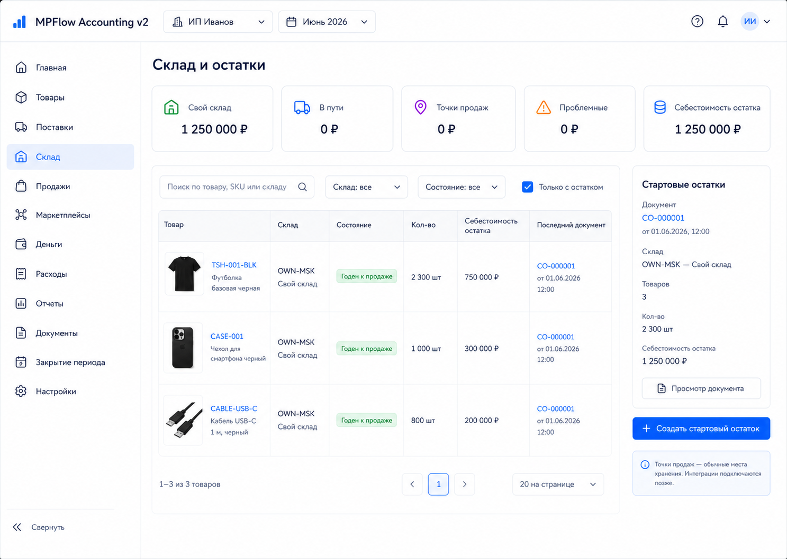
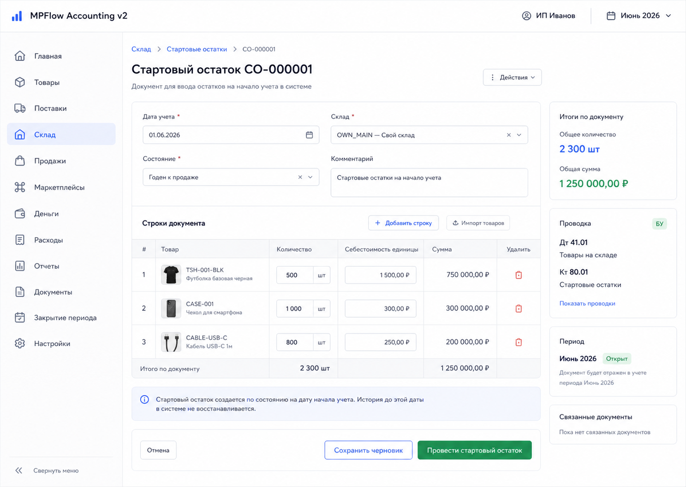
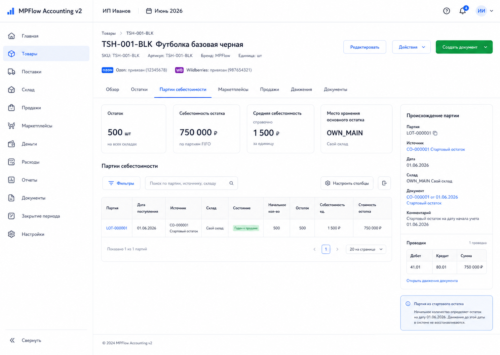

# Шаг 6. Склады, Состояния, Стартовые Остатки

## Цель

Дать пользователю возможность ввести начальные товарные остатки на дату начала учета и создать первые FIFO-партии. Это первый шаг, где справочник товаров превращается в актив на балансе.

В логике OpenStax это не просто "количество на складе": inventory is an asset. Поэтому проведение стартового остатка должно одновременно создать складской регистр, партию себестоимости, документ и сбалансированную проводку.

## Пользовательский результат

Пользователь видит склады и состояния товара, создает документ `Стартовый остаток`, проводит его и после проведения видит:

- товарный остаток на складе;
- FIFO-партию в карточке товара;
- движение склада;
- проводку `Дт 41.* / Кт 80.01`.

Шаг 6 не внедряет маркетплейс-интеграции. Если товар лежит не на своем складе, а на внешней точке продаж, это пока обычное место хранения типа `Точка продаж`. Конкретные Ozon/Wildberries/другие кабинеты появятся позже через плагины и будут привязываться к этим местам хранения.

## Frontend

### Раздел `Склад`

Route: `/inventory`.

Назначение экрана: показать книжный товарный остаток по местам хранения и состояниям.

Структура:

- основной sidebar;
- topbar с организацией и текущим периодом;
- header `Склад`;
- KPI row по складам/состояниям;
- фильтры;
- таблица остатков;
- right panel выбранного остатка.

KPI:

- `Свой склад`;
- `В пути`;
- `Точки продаж`;
- `Проблемные`;
- `Себестоимость остатка`.

Фильтры:

- поиск по SKU/названию;
- склад;
- состояние;
- товар;
- checkbox `Только с остатком`.

Таблица:

- товар: фото, SKU, название;
- SKU;
- склад;
- состояние;
- количество;
- себестоимость остатка;
- средняя себестоимость справочно;
- источник последнего движения;
- дата последнего движения.

Действия:

- `Создать стартовый остаток`: navigate to `/inventory/opening-balances/new`;
- row click: selects balance and updates right panel;
- document link in row: opens source document `/documents/:id`;
- product link: opens `/products/:id`.

Empty state:

- if no balances: show `Остатков пока нет` and primary action `Создать стартовый остаток`;
- if no products exist: show blocking state `Сначала создайте товар` with link to `/products/new`.

### Форма `Стартовый остаток`

Route: `/inventory/opening-balances/new`.

Назначение: задать стоимость и количество товаров, которые уже есть на дату старта учета.

Поля header:

- `Дата учета`, read-only default `accounting_policy.accounting_start_date`;
- `Склад`;
- `Состояние`;
- `Комментарий`.

Строки:

- товар: selector with photo, SKU, name;
- SKU, read-only after product selection;
- количество;
- себестоимость единицы RUB;
- сумма строки RUB;
- remove line.

Right summary:

- количество строк;
- общее количество;
- общая стоимость;
- будущая проводка по счету `41.*`;
- статус периода;
- пояснение, что документ создает актив и увеличивает капитал владельца/opening equity.

Кнопки:

- `Отмена`: returns to `/inventory`;
- `Сохранить черновик`: calls `POST /api/inventory/opening-balances`;
- `Провести стартовый остаток`: creates draft if needed, then calls post command;
- `Добавить строку`: adds an empty line client-side.

Важно: дата стартового остатка в шаге 6 должна быть равна дате начала учета. Обычные оприходования после этой даты будут отдельными документами позже, чтобы не смешивать opening balance и текущие операции.

### Карточка товара -> `Партии себестоимости`

Route: `/products/:id`, tab `Партии себестоимости`.

После проведения стартового остатка пользователь видит:

- source `Стартовый остаток`;
- дата поступления;
- склад;
- состояние;
- начальное количество;
- остаток партии;
- себестоимость единицы;
- стоимость остатка;
- ссылка на документ и проводку.

## Backend

Модули:

- `warehouses`;
- `stock-states`;
- `inventory`;
- `opening-balances`;
- `posting-rules/opening-balance`.

Endpoints:

- `GET /api/warehouses`;
- `POST /api/warehouses`;
- `GET /api/stock-states`;
- `GET /api/inventory/balances`;
- `POST /api/inventory/opening-balances`;
- `GET /api/inventory/opening-balances/:id`;
- `POST /api/inventory/opening-balances/:id/post`;
- `GET /api/products/:id/lots`.

Commands/services:

- `seedDefaultWarehouses(organizationId)`;
- `seedDefaultStockStates(organizationId)`;
- `createOpeningBalance(input)`;
- `postOpeningBalance(documentId)`;
- `createInventoryLot(input)`;
- `createStockMovement(input)`;
- `mapWarehouseToInventoryAccount(warehouseType)`.

Validation:

- accounting date must equal `accounting_policy.accounting_start_date`;
- accounting period must be open;
- warehouse must be active;
- stock state must exist;
- product must be active;
- quantity must be `> 0`;
- unit cost must be `>= 0`;
- duplicate product/warehouse/state in one document is blocked unless user explicitly merges lines;
- posted opening balance cannot be edited in a closed period;
- repeated post is idempotent and does not create duplicate lots.

Posting:

- document type: `opening_balance`;
- posting rule creates one or more journal entries grouped by account mapping;
- lots and stock movements are created only after successful journal posting inside one transaction.

## БД

### `warehouse`

- `id uuid primary key`;
- `organization_id uuid not null references organization(id)`;
- `code text not null`;
- `name text not null`;
- `warehouse_type text not null check (warehouse_type in ('own','transit','sales_point'))`;
- `sales_channel_code text`;
- `external_ref text`;
- `is_active boolean not null default true`;
- `created_at timestamptz not null default now()`;
- `updated_at timestamptz not null default now()`.

Indexes:

- unique `(organization_id, code)`;
- index `(organization_id, warehouse_type)`.

Seed:

- `OWN-MSK` / `Свой склад Москва` / `own`;
- `TRANSIT` / `В пути` / `transit`;
- optional `SALES-POINT` / `Точка продаж` / `sales_point` for manual opening balances outside the own warehouse.

Do not seed Ozon/Wildberries-specific warehouses in step 6. Marketplace plugins later may create concrete sales points and link them to marketplace cabinets.

### `stock_state`

- `id uuid primary key`;
- `organization_id uuid not null references organization(id)`;
- `code text not null`;
- `name text not null`;
- `is_sellable boolean not null default false`;
- `is_problem boolean not null default false`;
- `created_at timestamptz not null default now()`.

Indexes:

- unique `(organization_id, code)`.

Seed:

- `sellable` / `Годен к продаже` / sellable true;
- `damaged` / `Брак` / problem true;
- `lost_pending` / `Потеря требует решения` / problem true;
- `reserved` / `Зарезервирован` / sellable false.

### `inventory_lot`

- `id uuid primary key`;
- `organization_id uuid not null references organization(id)`;
- `product_id uuid not null references product(id)`;
- `warehouse_id uuid not null references warehouse(id)`;
- `stock_state_id uuid not null references stock_state(id)`;
- `source_document_id uuid not null references document(id)`;
- `source_document_line_id uuid references document_line(id)`;
- `received_at date not null`;
- `qty_initial numeric(18,4) not null check (qty_initial > 0)`;
- `qty_remaining numeric(18,4) not null check (qty_remaining >= 0)`;
- `unit_cost_rub numeric(18,6) not null check (unit_cost_rub >= 0)`;
- `total_cost_rub numeric(18,2) not null check (total_cost_rub >= 0)`;
- `created_at timestamptz not null default now()`.

Indexes:

- index `(organization_id, product_id, received_at)`;
- index `(organization_id, warehouse_id, stock_state_id)`;
- index `(organization_id, source_document_id)`.

### `stock_movement`

- `id uuid primary key`;
- `organization_id uuid not null references organization(id)`;
- `product_id uuid not null references product(id)`;
- `warehouse_id uuid not null references warehouse(id)`;
- `stock_state_id uuid not null references stock_state(id)`;
- `document_id uuid not null references document(id)`;
- `document_line_id uuid references document_line(id)`;
- `inventory_lot_id uuid references inventory_lot(id)`;
- `movement_date date not null`;
- `qty_delta numeric(18,4) not null`;
- `amount_rub numeric(18,2) not null`;
- `movement_type text not null`;
- `created_at timestamptz not null default now()`.

Indexes:

- index `(organization_id, product_id, movement_date)`;
- index `(organization_id, document_id)`;
- index `(organization_id, inventory_lot_id)`.

## Учетные правила

Opening balance creates:

- `document` with `document_type='opening_balance'`;
- `document_line` per product line;
- `journal_entry`;
- `journal_line`;
- `inventory_lot`;
- `stock_movement`;
- `audit_event`.

Проводка:

```text
Дт 41.01 Товары на своем складе
Кт 80.01 Вложения владельца
```

or by warehouse type:

- own warehouse -> `41.01`;
- transit warehouse -> `41.02`;
- sales point / external warehouse -> `41.03`.

Why credit owner equity:

- на дату старта учета товар уже принадлежит бизнесу;
- система должна поставить актив на баланс;
- так как до даты старта история покупки не вводится в этом документе, противоположная сторона идет в капитал/вложение владельца.

Invariant:

```text
sum(qty_remaining * unit_cost_rub for open lots by 41 account)
= debit balance of corresponding 41 account from posted journal lines
```

with rounding tolerance for `numeric(18,2)` totals.

## Ошибки пользователя

- Количество `<= 0`: inline error in line.
- Себестоимость `< 0`: inline error in line.
- Дата не равна дате начала учета: blocked with explanation.
- Дата в закрытом периоде: blocked.
- Не выбран склад: form-level error.
- Не выбран товар: line error.
- Повторная строка товар/склад/состояние: show merge suggestion; do not silently duplicate.
- Нет товаров in catalog: redirect hint to create product.
- Posting conflict after refresh: show `Документ изменился, обновите страницу`.

## Тесты

Unit:

- account mapping by warehouse type;
- opening balance validation;
- total cost calculation and rounding;
- duplicate line detection.

Integration:

- seed creates warehouses and stock states;
- opening balance draft creates document and lines only;
- posting creates journal entry, lot, movement, audit event;
- repeated post does not create duplicates;
- date different from accounting start date rejected.

Scenario:

- create product -> post opening balance -> open inventory overview -> open product lots -> check journal `Дт 41.01 / Кт 80.01`.

## Definition of Done

- Склады и состояния созданы seed-ом.
- Складской обзор показывает empty state до остатков и таблицу после проведения.
- Можно создать и провести стартовый остаток.
- После проведения виден остаток на складе.
- В карточке товара видна FIFO-партия из стартового остатка.
- В журнале и главной книге видна проводка.
- Счет `41` сходится с суммой открытых партий.
- Рендеры и текстовые контракты описывают route, layout, кнопки, API, состояния и DB effects.

## Рендеры



### `renders/01-inventory-overview.png`

User scenario:

- пользователь провел стартовый остаток и открыл `/inventory`;
- он проверяет, что товар появился на нужном складе и в нужном состоянии.

Route:

- `/inventory`

Layout:

- основной sidebar;
- topbar with organization and period;
- header `Склад`;
- KPI row;
- filter row;
- inventory balance table;
- selected balance side panel.

Visible content:

- KPI cards: own warehouse, transit, sales points, problem states, total stock cost;
- filters: search, warehouse, stock state, product, only non-zero;
- table columns: product thumbnail, product/SKU/name, warehouse, state, quantity, stock cost, average unit cost, last movement, source document;
- side panel with selected product, lot count, last document, quick links to product and document.

Controls and click behavior:

- `Создать стартовый остаток`: navigates to `/inventory/opening-balances/new`;
- filter changes call `GET /api/inventory/balances`;
- row click updates side panel;
- product link navigates to `/products/:id`;
- document link navigates to `/documents/:id`.

Validation and error states:

- no products: blocking empty state with link to `/products/new`;
- no balances: empty state with primary action `Создать стартовый остаток`;
- loading: KPI and table skeleton;
- API error: inline banner with retry.

Backend and database effects:

- opening screen calls `GET /api/inventory/balances`, `GET /api/warehouses`, `GET /api/stock-states`;
- viewing does not write to DB;
- source documents and lots are read from posted opening balances/receipts.

Must not include:

- observed marketplace stock as if integrated;
- Ozon/Wildberries-specific KPI cards or sync statuses;
- manual edit of quantities inside table;
- technical health statuses;
- quick actions to future sales/loss workflows.



### `renders/02-opening-balance-form.png`

User scenario:

- пользователь настраивает магазин, который уже работал до `accounting_start_date`;
- он вводит фактические остатки и себестоимость на дату старта учета.

Route:

- `/inventory/opening-balances/new`

Layout:

- основной sidebar;
- topbar with organization and period;
- form header;
- main form with document fields and line table;
- right summary panel with future accounting effect.

Visible content:

- date field fixed to accounting start date;
- warehouse selector;
- stock state selector;
- comment textarea;
- line table: product thumbnail, product, SKU, qty, unit cost RUB, line total, remove;
- button `Добавить строку`;
- summary: total qty, total RUB, account mapping, future journal entry `Дт 41.* / Кт 80.01`, period status.

Controls and click behavior:

- `Добавить строку`: adds line client-side;
- product selector searches `GET /api/products?status=active&search=`;
- changing qty/unit cost recalculates line total and summary locally;
- `Сохранить черновик`: calls `POST /api/inventory/opening-balances`;
- `Провести стартовый остаток`: saves draft if needed and calls `POST /api/inventory/opening-balances/:id/post`;
- `Отмена`: returns to `/inventory`.

Validation and error states:

- qty <= 0: line error;
- unit cost < 0: line error;
- missing product/warehouse/state: field error;
- duplicate product/warehouse/state: line warning with merge action;
- closed period: primary post action disabled;
- successful post: navigate to `/inventory` or document card according to backend response.

Backend and database effects:

- draft save creates `document` and `document_line`;
- post creates `journal_entry`, `journal_line`, `inventory_lot`, `stock_movement`, `audit_event`;
- no purchase order, payment, or supplier settlement records are created.

Must not include:

- arbitrary date picker for current operations;
- supplier/payment fields;
- marketplace warehouse import status;
- manual debit/credit editor;
- technical health statuses.



### `renders/03-product-lots-after-opening.png`

User scenario:

- пользователь открыл карточку товара после проведения стартового остатка;
- он проверяет происхождение себестоимости товара.

Route:

- `/products/:id`, tab `Партии себестоимости`

Layout:

- основной sidebar;
- topbar with organization and period;
- product header;
- tabs;
- FIFO lots table;
- right provenance panel.

Visible content:

- product identity: SKU, name, status;
- tabs with `Партии себестоимости` selected;
- table columns: lot, received date, source, warehouse, state, initial qty, remaining qty, unit cost, remaining cost;
- source document link `Стартовый остаток`;
- right panel with accounting entry summary and document lifecycle.

Controls and click behavior:

- lot row click updates right panel;
- source document link navigates to `/documents/:id`;
- journal link navigates to `/reports/journal/:entryId`;
- filters by warehouse/state/open lots call `GET /api/products/:id/lots`.

Validation and error states:

- no lots: empty state `Партий пока нет`;
- loading: table skeleton;
- product not found: not-found page;
- archived product: show archived badge but keep lots visible.

Backend and database effects:

- opening tab calls `GET /api/products/:id/lots`;
- viewing does not write to DB;
- data comes from `inventory_lot`, `stock_movement`, `document`, and `journal_entry`.

Must not include:

- editing lot quantities;
- changing cost from product card;
- manual FIFO reorder controls;
- technical health statuses.
