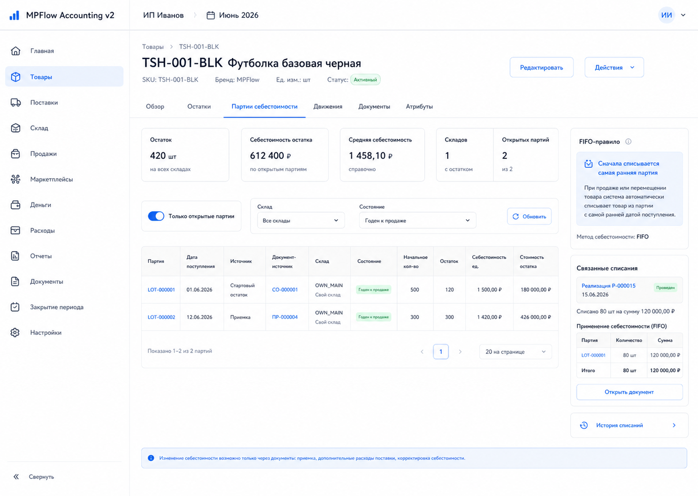
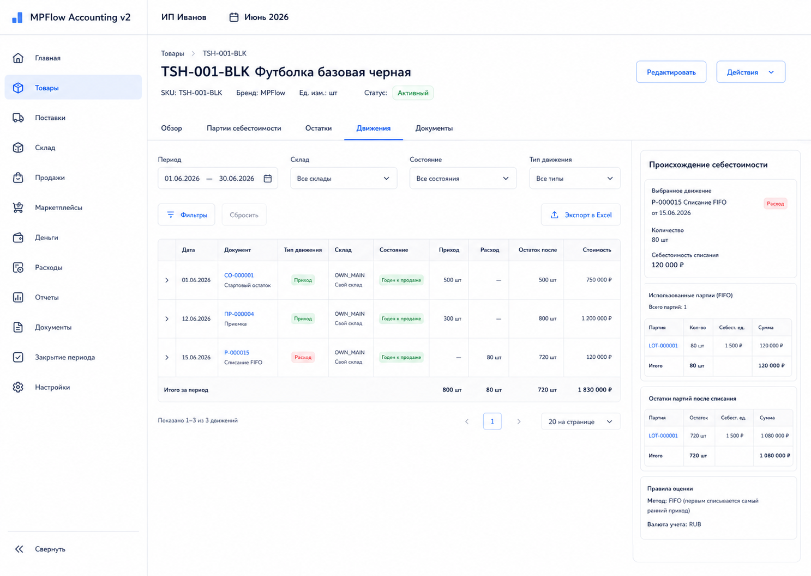

# Шаг 7. FIFO-Регистр Партий

## Цель

Сделать FIFO-регистр самостоятельным учетным механизмом: пользователь должен видеть, из каких партий состоит остаток, откуда взялась себестоимость и какие движения изменили количество.

В OpenStax это cost flow assumption: физически товар может двигаться иначе, но в учете система должна последовательно распределять стоимость между остатком и будущей себестоимостью продаж. В MPFlow на первых шагах фиксируем FIFO и вечный учет запасов.

## Пользовательский результат

Пользователь открывает карточку товара и видит:

- партии FIFO;
- остаток каждой партии;
- источник партии;
- движения по товару;
- объяснение, почему именно эти партии будут списываться первыми в будущих продажах/списаниях.

На шаге 7 UI read-only. Пользователь ничего не потребляет из FIFO руками. Outbound-документы появятся позже, а этот шаг готовит проверяемый регистр.

## Frontend

### Карточка товара -> `Партии себестоимости`

Route: `/products/:id`, tab `Партии себестоимости`.

Назначение: показать очередь FIFO и стоимость текущего остатка.

Структура:

- основной sidebar;
- topbar с организацией и периодом;
- product header;
- tabs;
- filter row;
- lots table;
- right panel `FIFO-очередь`.

Фильтры:

- `Только открытые партии`;
- склад;
- состояние;
- источник: стартовый остаток, приемка, корректировка;
- date range received_at.

Таблица:

- партия;
- дата поступления;
- товар: фото, SKU, название, если таблица используется в общем списке партий;
- источник;
- склад;
- состояние;
- начальное количество;
- остаток;
- себестоимость единицы;
- стоимость остатка;
- FIFO priority.

Right panel:

- selected lot summary;
- source document;
- related journal entry;
- explanation `FIFO: партии с более ранней датой поступления списываются первыми`;
- future usage placeholder: `Списания появятся после продаж, потерь или перемещений`.

Actions:

- row click: selects lot and updates panel;
- source document link: navigate to `/documents/:id`;
- journal link: navigate to `/reports/journal/:entryId`;
- filters call `GET /api/products/:id/lots`.

### Карточка товара -> `Движения`

Route: `/products/:id`, tab `Движения`.

Назначение: показать chronological inventory ledger для конкретного товара.

Фильтры:

- период;
- склад;
- состояние;
- тип движения;
- источник документа.

Таблица:

- дата;
- документ;
- тип движения;
- товар: фото, SKU, название, если движение показывается не только внутри карточки товара;
- склад;
- состояние;
- приход;
- расход;
- сумма;
- остаток после движения, если доступен read model;
- партия.

Actions:

- row click: selects movement;
- document link: opens `/documents/:id`;
- lot link: switches to `Партии себестоимости` and selects lot;
- filters call `GET /api/products/:id/stock-movements`.

## Backend

Модуль:

- `inventory-ledger`.

Internal services:

- `receiveLot(input)`;
- `consumeFifo(input)`;
- `getProductLots(productId, filter)`;
- `getStockMovements(productId, filter)`;
- `getInventoryBalance(filter)`;
- `assertInventoryMatchesLedger41(organizationId)`;
- `rebuildInventoryReadModels(organizationId, fromDate)`.

API:

- `GET /api/products/:id/lots`;
- `GET /api/products/:id/stock-movements`;
- `GET /api/inventory/lots`;
- `GET /api/inventory/reconciliation`.

Validation:

- FIFO consumption cannot exceed available stock;
- consumption order is by `received_at`, then lot creation order;
- lot quantities cannot become negative;
- only posted documents can create lots/movements;
- stock movement must reference document;
- outbound cost application must reference source lot and target document;
- direct user mutation of `inventory_lot.qty_remaining` is forbidden.

Important implementation rule:

- `consumeFifo` does not create journal entries by itself. The caller document owns the journal entry because the business meaning of consumption differs: sale, loss, return, transfer or correction.

## БД

Existing tables from step 6:

- `inventory_lot`;
- `stock_movement`.

### `cost_application`

- `id uuid primary key`;
- `organization_id uuid not null references organization(id)`;
- `source_lot_id uuid not null references inventory_lot(id)`;
- `target_type text not null check (target_type in ('transfer','sale','return','write_off','surplus','cost_adjustment','correction'))`;
- `target_document_id uuid not null references document(id)`;
- `target_document_line_id uuid references document_line(id)`;
- `target_line_type text`;
- `target_line_id uuid`;
- `product_id uuid not null references product(id)`;
- `qty numeric(18,4) not null check (qty > 0)`;
- `unit_cost_rub numeric(18,6) not null check (unit_cost_rub >= 0)`;
- `total_cost_rub numeric(18,2) not null check (total_cost_rub >= 0)`;
- `applied_at timestamptz not null default now()`.

Indexes:

- index `(organization_id, source_lot_id)`;
- index `(organization_id, target_document_id)`;
- index `(organization_id, target_type, target_line_id)`;
- index `(organization_id, product_id)`.

No new document type is required in this step. `cost_application` is the single physical FIFO journal for transfer, sale, return restoration, write-off and correction flows. Later steps may expose typed read models such as sale cost applications, but they must point back to this table instead of creating parallel FIFO ledgers.

## Учетные правила

FIFO order:

```text
oldest received_at first
then oldest inventory_lot.created_at/id
```

When stock is consumed by a future outbound document:

- `inventory_lot.qty_remaining` decreases;
- negative `stock_movement` is created;
- `cost_application` records the exact source lots;
- caller document creates the journal entry.

Inventory read invariant:

```text
inventory_lot.qty_remaining >= 0
sum(stock_movement.qty_delta by product/warehouse/state) = visible stock balance
sum(open lot remaining cost by 41 account) = ledger balance of 41 accounts
```

OpenStax connection:

- FIFO controls which costs stay in ending inventory and which costs later become себестоимость продаж;
- the method must be consistent across periods unless accounting policy changes through explicit future workflow.

## Ошибки пользователя

This step has read-only UI for users.

User-facing errors:

- no lots: show `Партий пока нет`;
- no movements: show `Движений пока нет`;
- selected product not found;
- API error while loading.

Backend/domain errors:

- insufficient stock;
- invalid product/warehouse/state;
- negative or zero quantity;
- attempt to consume from archived/nonexistent product;
- attempt to consume from unposted source document.

## Тесты

Unit:

- FIFO lot selection;
- partial lot consumption;
- multi-lot consumption;
- same-date lots sorted by creation order;
- insufficient stock rejection;
- no negative lot remainder.

Integration:

- consume from two lots with different dates;
- `cost_application` records exact lot usage;
- `stock_movement` and lot remainders reconcile;
- `assertInventoryMatchesLedger41` passes after opening balances.

Scenario:

- opening balance creates two lots; FIFO service consumes from the oldest lot first; product card shows correct remaining quantities and movement history.

## Definition of Done

- FIFO lot list is visible in product card.
- Stock movement list is visible in product card.
- FIFO service is covered by tests.
- Lot quantity cannot become negative.
- Cost applications preserve source lot traceability.
- UI has no manual lot editing or manual cost override controls.
- Reconciliation between open lots, stock movements and account 41 is testable.
- Рендеры и текстовые контракты описывают route, layout, controls, states and DB effects.

## Рендеры



### `renders/01-product-fifo-lots.png`

User scenario:

- пользователь открыл товар с несколькими партиями;
- он хочет понять, какая себестоимость будет списываться первой.

Route:

- `/products/:id`, tab `Партии себестоимости`

Layout:

- основной sidebar;
- topbar with organization and period;
- product header;
- product tabs;
- filter row;
- FIFO lots table;
- right explanatory panel.

Visible content:

- selected tab `Партии себестоимости`;
- filters: open lots only, warehouse, stock state, source, received date;
- table columns: lot number, received date, source document, warehouse, state, initial qty, remaining qty, unit cost, remaining cost, FIFO priority;
- because this render is inside product card, the product photo is already visible in the product header; in generic lot lists the product column must include a thumbnail;
- selected lot panel with source document, journal entry, and FIFO explanation.

Controls and click behavior:

- filters call `GET /api/products/:id/lots`;
- row click selects lot and updates panel;
- source document link navigates to `/documents/:id`;
- journal link navigates to `/reports/journal/:entryId`;
- `Показать закрытые партии` toggles filter to include lots with zero remaining qty.

Validation and error states:

- no lots: empty state `Партий пока нет`;
- no matching lots: `По фильтрам партий нет`;
- loading: table skeleton;
- product not found: not-found state.

Backend and database effects:

- screen is read-only;
- opening calls `GET /api/products/:id/lots`;
- no `POST`, `PATCH`, or direct lot mutation happens from this screen.

Must not include:

- edit lot quantity action;
- manual cost override;
- buttons to sell/write off stock before those workflows exist;
- technical health statuses.



### `renders/02-stock-movements.png`

User scenario:

- пользователь проверяет хронологию поступлений и будущих списаний по товару;
- он хочет связать остаток с первичными документами.

Route:

- `/products/:id`, tab `Движения`

Layout:

- основной sidebar;
- topbar with organization and period;
- product header;
- tabs;
- filter row;
- movements table;
- right selected movement panel.

Visible content:

- selected tab `Движения`;
- filters: period, warehouse, stock state, movement type, source document;
- table columns: date, document, movement type, warehouse, state, приход, расход, amount, balance after movement, lot;
- because this render is inside product card, the product photo is already visible in the product header; in generic movement lists the product column must include a thumbnail;
- side panel: selected movement, source document, source lot, related journal entry.

Controls and click behavior:

- changing filters calls `GET /api/products/:id/stock-movements`;
- document link navigates to `/documents/:id`;
- lot link switches to `Партии себестоимости` tab and selects the lot;
- row click updates selected movement panel.

Validation and error states:

- no movements: empty state `Движений пока нет`;
- loading: table skeleton;
- API error: inline retry banner;
- archived product: movements remain visible, new document use is blocked elsewhere.

Backend and database effects:

- screen is read-only;
- data comes from `stock_movement`, `inventory_lot`, `document`, and journal read models;
- no write actions.

Must not include:

- manual movement creation;
- delete movement action;
- fake marketplace observed stock;
- technical health statuses.
