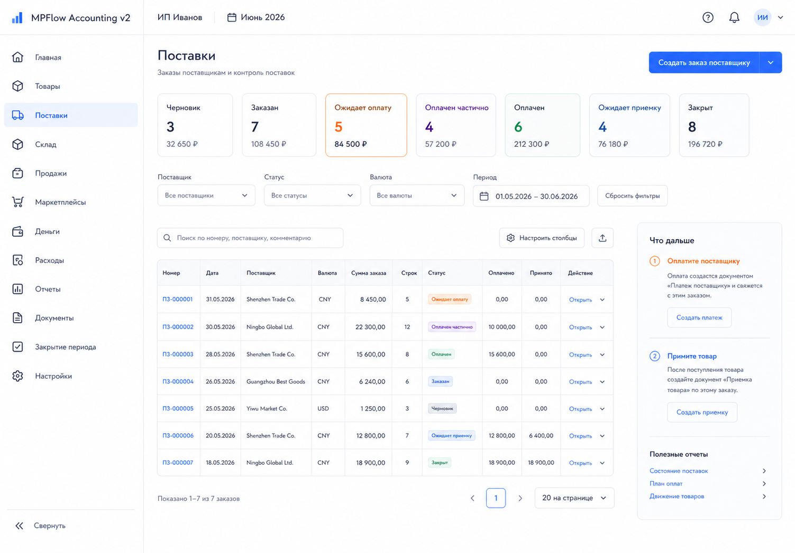
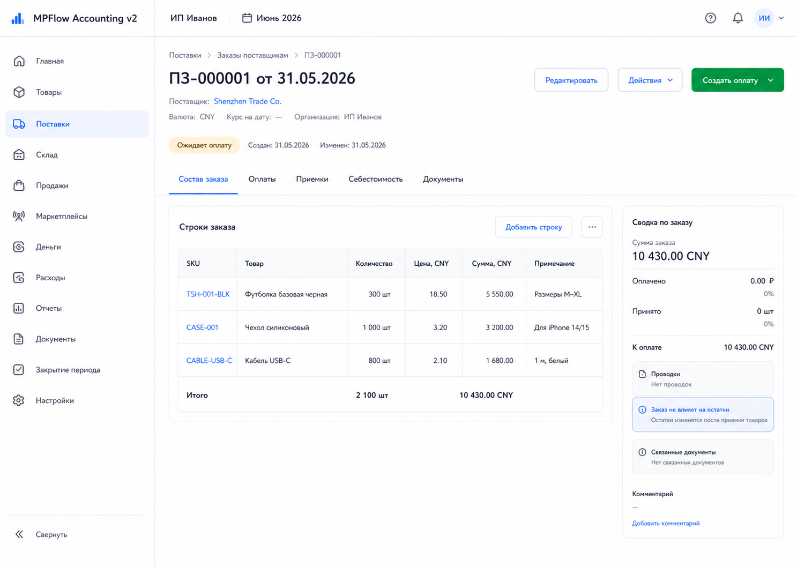
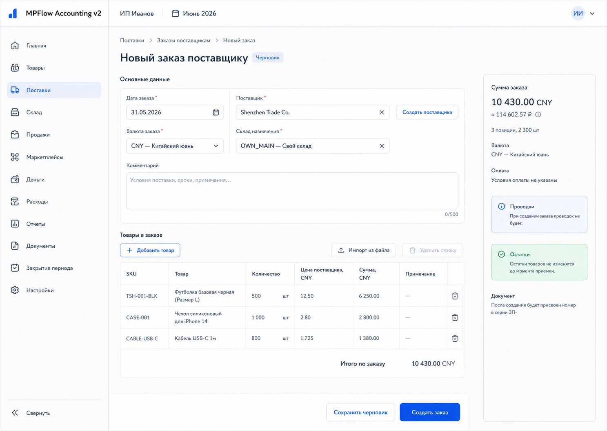

# Шаг 8. Заказ Поставщику

## Цель

Создать рабочий сценарий заказа товара у поставщика без изменения денег, остатков и бухгалтерских проводок.

Заказ поставщику - это source document и основание для будущих оплат и приемок. Экономический актив еще не появился в учете, потому что товар не принят, а деньги могут быть еще не уплачены.

## Пользовательский результат

Пользователь может:

- создать поставщика;
- создать заказ поставщику в RUB, CNY или USD;
- указать склад назначения;
- добавить строки товаров с количеством и ценой поставщика;
- увидеть заказ в pipeline поставок;
- открыть карточку поставки с вкладками `Состав заказа`, `Оплаты`, `Приемки`, `Себестоимость`, `Документы`.

На шаге 8 вкладки оплат и приемок показывают empty state, потому что оплаты появятся в шаге 9, приемки - в шаге 10.

## Frontend

### Раздел `Поставки`

Route: `/procurement/purchase-orders`.

Назначение: видеть все заказы поставщикам и следующий нужный шаг по каждому заказу.

Структура:

- основной sidebar;
- topbar with organization and period;
- header `Поставки`;
- status pipeline row;
- filters;
- purchase orders table;
- right hint panel for selected order.

Pipeline statuses:

- `Черновик`;
- `Заказан`;
- `Ожидает оплату`;
- `Оплачен частично`;
- `Оплачен`;
- `Ожидает приемку`;
- `Закрыт`.

На шаге 8 фактически работают `Черновик` and `Заказан`. Остальные статусы становятся расчетными после шагов 9-10.

Фильтры:

- период заказа;
- поставщик;
- статус;
- валюта;
- поиск по номеру, поставщику, SKU.

Таблица:

- номер;
- дата заказа;
- поставщик;
- валюта;
- сумма заказа;
- количество SKU;
- заказано штук;
- статус;
- оплачено;
- принято;
- следующее действие.

Действия:

- `Новый заказ`: navigates to `/procurement/purchase-orders/new`;
- row click: select order and update right panel;
- order number link: navigate to `/procurement/purchase-orders/:id`;
- `Продолжить черновик`: opens form for draft;
- `Открыть`: opens order card.

### Форма `Новый заказ поставщику`

Route: `/procurement/purchase-orders/new`.

Поля header:

- дата заказа;
- поставщик selector with inline create;
- валюта поставщика: RUB/CNY/USD;
- склад назначения;
- комментарий.

Строки:

- товар: selector with photo, SKU, name;
- SKU read-only after selection;
- количество;
- цена поставщика in selected currency;
- сумма строки in selected currency;
- optional line note.

Right summary:

- сумма заказа в валюте поставщика;
- количество строк/SKU;
- будущий статус;
- reminder `Заказ не создает проводок и не меняет остатки`;
- next steps after save: оплатить or принять later.

Кнопки:

- `Сохранить черновик`: `POST /api/procurement/purchase-orders` with status draft;
- `Создать заказ`: creates and posts order document via `POST`, then `POST /api/procurement/purchase-orders/:id/post`;
- `Отмена`: return to list;
- `Добавить строку`: add client-side row.

### Карточка поставки

Route: `/procurement/purchase-orders/:id`.

Header:

- номер заказа;
- поставщик;
- статус;
- валюта;
- сумма;
- склад назначения;
- date;
- actions.

Tabs:

- `Состав заказа`;
- `Оплаты`;
- `Приемки`;
- `Логистика`, optional informational tab;
- `Себестоимость`;
- `Документы`.

Tab `Состав заказа`:

- order lines;
- totals;
- status;
- document link;
- no journal entries.

Tab `Оплаты` in step 8:

- empty state `Оплаты появятся после шага 9`;
- no fake numbers.

Tab `Приемки` in step 8:

- empty state `Приемки появятся после шага 10`.

Tab `Логистика`:

- optional informational tab;
- may store expected dispatch date, tracking number, expected arrival date and comment if the user wants operational tracking;
- must not be required for payment, receipt, costing or transfer workflows;
- must not create journal entries, stock movements, settlement entries or FIFO lots;
- if the user skips shipment tracking entirely, the next required accounting action can still be receipt.

Tab `Себестоимость` in step 8:

- preliminary view only: supplier currency weights;
- explanation that RUB cost will be distributed at receipt/payment stage;
- no FIFO lots yet.

Actions:

- `Редактировать`: enabled for draft; for posted order allowed only while no payments/receipts exist, with version history;
- `Исправить`: shown when a posted order already has dependent payments or receipts; opens the step 23 correction flow or points the user to payment/receipt/shortage documents depending on what actually changed;
- `Создать заказ`: post draft order;
- `Отменить заказ`: allowed if no payments/receipts;
- after step 9, `Оплатить` appears in payment tab, not as global quick action.
- `Добавить заметку по логистике`: optional non-accounting action in `Логистика`; it saves operational metadata only and is never a required step.

## Backend

Модули:

- `counterparties`;
- `procurement`;
- `purchase-orders`.

Endpoints:

- `GET /api/counterparties`;
- `POST /api/counterparties`;
- `GET /api/procurement/purchase-orders`;
- `POST /api/procurement/purchase-orders`;
- `GET /api/procurement/purchase-orders/:id`;
- `PATCH /api/procurement/purchase-orders/:id`;
- `POST /api/procurement/purchase-orders/:id/post`;
- `POST /api/procurement/purchase-orders/:id/cancel`.

Commands/services:

- `createCounterparty(input)`;
- `createPurchaseOrder(input)`;
- `updatePurchaseOrderDraft(input)`;
- `postPurchaseOrder(id)`;
- `cancelPurchaseOrder(id)`;
- `calculatePurchaseOrderTotals(lines)`;
- `assertPurchaseOrderEditable(id)`;

Validation:

- supplier required;
- supplier must be active and type `supplier`;
- currency required and supported: `RUB`, `CNY`, `USD`;
- destination warehouse required and active;
- lines cannot be empty;
- qty `> 0`;
- supplier unit price `>= 0`;
- product active;
- no duplicate product lines unless `line_note` differs and user confirms split;
- cannot directly edit posted order after payments or receipts exist;
- if user bought/received fewer units than requested, do not tell them to rewrite the original ordered quantity after receipt; the system must direct them to actual receipt quantities and the shortage workflow;
- order date must be in an open period if the document is posted.

Posting behavior:

- creates/updates `document` with `document_type='purchase_order'`;
- sets purchase order status to `ordered`;
- writes audit event;
- does not create `journal_entry`;
- does not create `inventory_lot`;
- does not create `stock_movement`;
- does not create `payment` or `settlement_entry`.

## БД

### `counterparty`

- `id uuid primary key`;
- `organization_id uuid not null references organization(id)`;
- `name text not null`;
- `counterparty_type text not null check (counterparty_type in ('supplier','logistics','marketplace','owner','other'))`;
- `inn text`;
- `country text`;
- `is_active boolean not null default true`;
- `created_at timestamptz not null default now()`;
- `updated_at timestamptz not null default now()`.

Indexes:

- index `(organization_id, counterparty_type)`;
- index `(organization_id, name)`.

### `purchase_order`

- `id uuid primary key`;
- `organization_id uuid not null references organization(id)`;
- `document_id uuid not null references document(id)`;
- `supplier_id uuid not null references counterparty(id)`;
- `destination_warehouse_id uuid not null references warehouse(id)`;
- `supplier_currency text not null check (supplier_currency in ('RUB','CNY','USD'))`;
- `status text not null check (status in ('draft','ordered','cancelled','closed'))`;
- `ordered_at date not null`;
- `expected_dispatch_date date`;
- `tracking_ref text`;
- `expected_arrival_date date`;
- `total_supplier_amount numeric(18,2) not null default 0`;
- `total_qty numeric(18,4) not null default 0`;
- `comment text`;
- `created_at timestamptz not null default now()`;
- `updated_at timestamptz not null default now()`.

Indexes:

- unique `(organization_id, document_id)`;
- index `(organization_id, supplier_id)`;
- index `(organization_id, status)`;
- index `(organization_id, ordered_at)`.

### `purchase_order_line`

- `id uuid primary key`;
- `purchase_order_id uuid not null references purchase_order(id) on delete cascade`;
- `product_id uuid not null references product(id)`;
- `line_no int not null`;
- `qty_ordered numeric(18,4) not null check (qty_ordered > 0)`;
- `supplier_unit_price numeric(18,6) not null check (supplier_unit_price >= 0)`;
- `supplier_amount numeric(18,2) not null check (supplier_amount >= 0)`;
- `line_note text`;

Indexes:

- unique `(purchase_order_id, line_no)`;
- index `(purchase_order_id, product_id)`.

## Учетные правила

Заказ поставщику:

- creates source `document`;
- does not create journal entry;
- does not change cash;
- does not change inventory;
- does not create supplier payable yet;
- becomes the basis for supplier payments and goods receipts.
- optional dispatch/tracking fields are operational notes only; they do not prove receipt and do not affect accounting.

Why no posting:

- обязательство перед поставщиком в этой модели признается при приемке товара, когда бизнес получает товарный актив;
- оплата до приемки будет авансом поставщику in step 9;
- товарный актив появится в step 10 through goods receipt.

Currency rule:

- supplier currency prices are stored on order lines;
- RUB accounting cost is not derived from a fake exchange rate in step 8;
- later receipt cost allocation uses supplier currency line amounts as weights and user-entered RUB cost as accounting amount.

## Ошибки пользователя

- Не выбран поставщик: field error.
- Поставщик archived/inactive: blocked.
- Не выбран склад назначения: field error.
- Нет строк заказа: form error.
- Количество не положительное: line error.
- Валюта не поддерживается: field error.
- Дубликат SKU в строках: warning with `Объединить строки` or `Оставить отдельно с примечанием`.
- Попытка редактировать заказ с оплатами/приемками: blocked with explanation and links to dependent documents.
- Пользователь пытается уменьшить заказ после фактической недопоставки: show `Не изменяйте заказ, чтобы скрыть расхождение. Укажите фактически принятое количество в приемке или разберите недопоставку во вкладке Расхождения`.

## Тесты

Unit:

- line total calculation;
- order total calculation;
- duplicate line detection;
- editable-state rules.

Integration:

- create supplier counterparty;
- create purchase order draft;
- post purchase order;
- posted purchase order has no journal entries and no stock movements;
- update draft purchase order;
- reject editing order with dependent payment/receipt.

Scenario:

- user creates purchase order in CNY and sees it in procurement pipeline; order card shows empty payments/receipts and no accounting posting.

## Definition of Done

- Список заказов поставщикам работает.
- Форма заказа работает.
- Карточка поставки работает.
- Заказ сохраняет supplier currency line prices.
- Заказ не создает проводок, денег и остатков.
- Заказ можно использовать в следующем шаге для оплаты.
- Рендеры и текстовые контракты описывают route, layout, кнопки, API, состояния и DB effects.

## Рендеры

### `renders/01-purchase-orders-list.png`

User scenario:

- пользователь открыл `/procurement/purchase-orders`;
- он смотрит pipeline поставок и выбирает заказ, требующий следующего действия.

Route:

- `/procurement/purchase-orders`

Layout:

- основной sidebar;
- topbar with organization and period;
- header `Поставки`;
- status pipeline row;
- filters;
- purchase orders table;
- right selected order panel.

Visible content:

- pipeline status counts: draft, ordered, awaiting payment, partially paid, paid, awaiting receipt, closed;
- filters: period, supplier, status, currency, search;
- table columns: number, date, supplier, currency, supplier amount, SKU count, qty ordered, status, paid, received, next action;
- selected order panel with supplier, amount, status, next step hint.

Controls and click behavior:

- `Новый заказ`: navigates to `/procurement/purchase-orders/new`;
- filters call `GET /api/procurement/purchase-orders`;
- row click selects order;
- order number link navigates to `/procurement/purchase-orders/:id`;
- `Продолжить черновик` navigates to edit form for draft;
- `Открыть` opens order card.

Validation and error states:

- no orders: empty state with button `Новый заказ`;
- no results after filters: `Заказов по фильтрам нет`;
- loading: table/pipeline skeleton;
- API error: inline retry banner.

Backend and database effects:

- opening screen calls `GET /api/procurement/purchase-orders`;
- viewing/selecting does not write to DB;
- creating order writes `document`, `purchase_order`, `purchase_order_line`, audit events.

Must not include:

- fake payment/receipt numbers before steps 9-10;
- journal posting indicators for purchase order;
- marketplace sync controls;
- technical health statuses.

### `renders/02-purchase-order-card.png`

User scenario:

- пользователь открыл созданный заказ поставщику;
- он проверяет состав заказа и видит, что оплаты/приемки еще не созданы.

Route:

- `/procurement/purchase-orders/:id`

Layout:

- основной sidebar;
- topbar with organization and period;
- order header with supplier, status, amount;
- tabs;
- main tab content;
- right summary panel.

Visible content:

- header: order number, supplier, status, currency, total amount, destination warehouse;
- tabs: order lines, payments, receipts, cost, documents;
- selected tab `Состав заказа`;
- table columns: product thumbnail, SKU, product, qty, supplier unit price, supplier amount, line note;
- summary `Проводок нет: заказ не меняет учет`;
- document link to underlying source document.

Controls and click behavior:

- `Редактировать`: enabled if draft or if posted with no payments/receipts; opens edit route;
- `Создать заказ`: posts draft via `POST /api/procurement/purchase-orders/:id/post`;
- `Отменить`: opens confirmation and calls cancel endpoint if no dependencies;
- tab click changes visible tab;
- document link opens `/documents/:documentId`.

Validation and error states:

- order not found: not-found state;
- dependent payment/receipt exists: edit/cancel disabled with explanation;
- payments tab before step 9: empty state;
- receipts tab before step 10: empty state.

Backend and database effects:

- opening screen calls `GET /api/procurement/purchase-orders/:id`;
- posting updates `document.status`, `purchase_order.status`, audit events;
- no `journal_entry`, `inventory_lot`, `stock_movement`, or `payment` rows from posting purchase order.

Must not include:

- manual debit/credit lines;
- inventory lot creation;
- supplier payable journal entry;
- quick action panel unrelated to this order;
- technical health statuses.

### `renders/03-purchase-order-form.png`

User scenario:

- пользователь создает заказ у китайского поставщика в CNY;
- он задает валютные цены, чтобы позже распределить рублевую себестоимость пропорционально этим ценам.

Route:

- `/procurement/purchase-orders/new`

Layout:

- основной sidebar;
- topbar with organization and period;
- form header;
- main order form and lines table;
- right summary panel.

Visible content:

- fields: order date, supplier, supplier currency, destination warehouse, comment;
- inline `Создать поставщика` link near supplier selector;
- lines table: product thumbnail, product, SKU, qty, supplier unit price, supplier amount, note, remove;
- summary: supplier currency total, SKU count, total qty, reminder `Проводок и остатков пока нет`.

Controls and click behavior:

- supplier selector searches `GET /api/counterparties?type=supplier&search=`;
- product selector searches `GET /api/products?status=active&search=`;
- `Создать поставщика` opens inline modal and calls `POST /api/counterparties`;
- `Добавить строку` adds client-side row;
- changing qty/price recalculates supplier amount and order total;
- `Сохранить черновик` calls `POST /api/procurement/purchase-orders`;
- `Создать заказ` calls create and post flow;
- `Отмена` returns to list.

Validation and error states:

- missing supplier/currency/warehouse: field errors;
- empty lines: form error;
- qty <= 0: line error;
- duplicate SKU: warning with explicit choice;
- product archived: product selector blocks selection.

Backend and database effects:

- save inserts/updates `document`, `purchase_order`, `purchase_order_line`;
- post marks document/order as posted/ordered;
- no journal entries, payments, stock movements, or lots are created.

Must not include:

- RUB cost allocation at this step;
- payment form fields;
- receipt quantities;
- manual accounting fields;
- technical health statuses.
