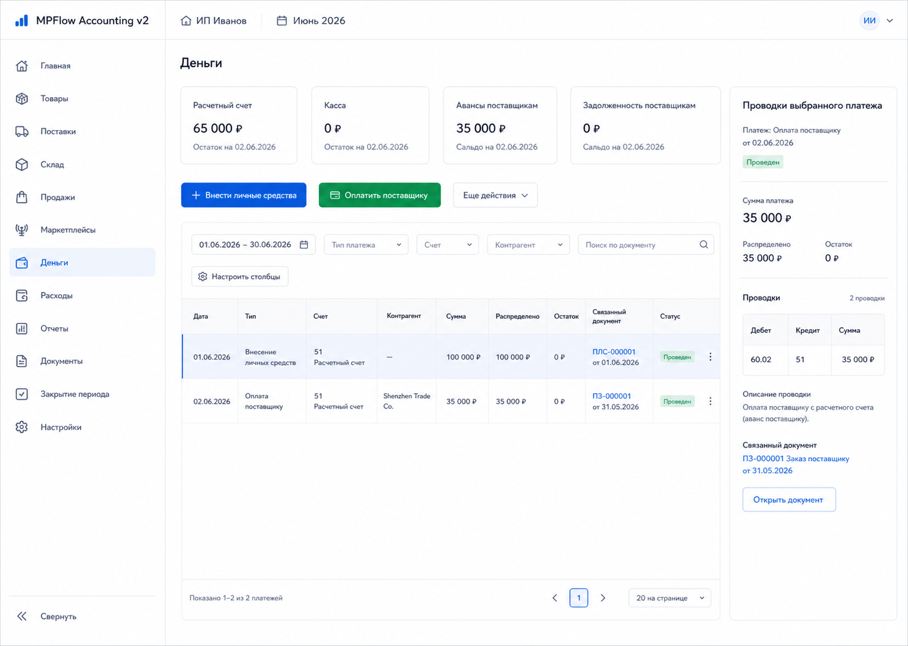
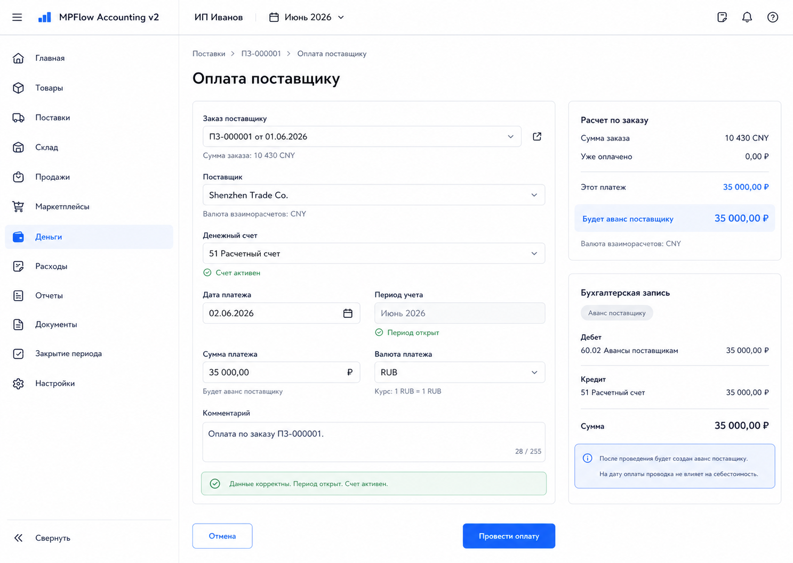
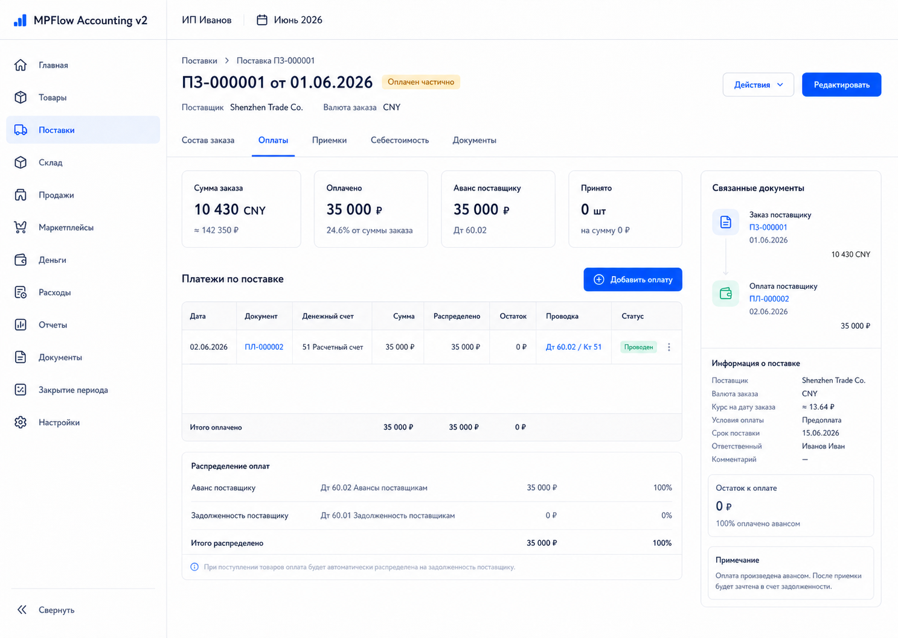

# Шаг 9. Оплата Поставщику И Авансы

## Цель

Добавить денежные счета, пополнение бизнеса личными средствами и оплату поставщику как аванс по заказу.

Это первый шаг после стартового остатка, где меняются деньги и взаиморасчеты. По OpenStax cash is an asset: движение денег должно идти через документ, журнал, главную книгу и audit trail.

## Пользовательский результат

Пользователь может:

- завести или использовать расчетный счет;
- внести личные средства в бизнес;
- оплатить поставщику по заказу;
- увидеть платеж в разделе `Деньги`;
- увидеть аванс в карточке поставки;
- увидеть проводки в журнале и главной книге.

Важный нюанс валютных закупок: пользователь вводит фактически списанную сумму в RUB. Валютная сумма заказа в CNY/USD хранится отдельно на заказе и используется позже как пропорция распределения рублевой себестоимости при приемке.

## Frontend

### Раздел `Деньги`

Route: `/money`.

Назначение: показать денежные счета, платежи и текущие взаиморасчеты.

Структура:

- основной sidebar;
- topbar with organization and period;
- header `Деньги`;
- KPI row;
- action row;
- filters;
- payments table;
- selected payment panel.

KPI:

- расчетные счета;
- касса;
- авансы поставщикам;
- задолженность поставщикам;
- платежи за период.

Action row:

- `Внести личные средства`;
- `Оплатить поставщику`;
- `Добавить денежный счет`;
- no global quick action panel.

Filters:

- период;
- денежный счет;
- тип платежа;
- поставщик;
- статус;
- search by document/order/comment.

Payments table:

- дата;
- тип;
- счет;
- контрагент;
- сумма RUB;
- распределено;
- остаток;
- связанный документ;
- статус;
- проводка.

### Форма `Внести личные средства`

Route/modal: `/money/owner-contributions/new`.

Поля:

- дата;
- денежный счет;
- сумма RUB;
- комментарий.

Right summary:

- будущая проводка `Дт 51 / Кт 80.01`;
- пояснение `Это вложение владельца, не выручка`;
- period status.

Кнопки:

- `Отмена`;
- `Сохранить черновик`;
- `Провести взнос`.

### Форма `Оплатить поставщику`

Route/modal: `/procurement/purchase-orders/:id/payments/new` or `/money/supplier-payments/new`.

Поля:

- заказ поставщику;
- поставщик, read-only after order selection;
- денежный счет;
- дата платежа;
- сумма списания RUB;
- валюта заказа, read-only;
- сумма в валюте поставщика, optional reference;
- комментарий.

Right summary:

- заказ и поставщик;
- сколько уже оплачено по заказу;
- сколько будет авансом после проведения;
- будущая проводка `Дт 60.02 / Кт 51`;
- reminder `Рублевая себестоимость товара будет распределена при приемке`.

Кнопки:

- `Отмена`;
- `Сохранить черновик`;
- `Провести оплату`.

### Карточка поставки -> `Оплаты`

Route: `/procurement/purchase-orders/:id`, tab `Оплаты`.

Показывать:

- сумма заказа in supplier currency;
- оплачено RUB;
- аванс поставщику RUB;
- список платежей;
- нераспределенный остаток оплаты;
- проводки selected payment;
- links to money document and journal entry.

Actions:

- `Добавить оплату`: opens supplier payment form bound to this order;
- payment row click: updates right panel;
- journal link: opens `/reports/journal/:entryId`;
- payment document link: opens `/documents/:id`.

## Backend

Модули:

- `money`;
- `cash-accounts`;
- `payments`;
- `settlements`;
- `posting-rules/payments`.

Endpoints:

- `GET /api/money/cash-accounts`;
- `POST /api/money/cash-accounts`;
- `PATCH /api/money/cash-accounts/:id`;
- `GET /api/money/payments`;
- `POST /api/money/owner-contributions`;
- `POST /api/procurement/purchase-orders/:id/payments`;
- `GET /api/procurement/purchase-orders/:id/payments`;
- `GET /api/settlements/suppliers/:id`.

Commands/services:

- `createCashAccount(input)`;
- `createOwnerContribution(input)`;
- `postOwnerContribution(documentId)`;
- `createSupplierPayment(input)`;
- `postSupplierPayment(documentId)`;
- `allocatePaymentToPurchaseOrder(paymentId, purchaseOrderId, amountRub)`;
- `createSettlementEntry(input)`;
- `getCashAccountBalance(cashAccountId)`;

Validation:

- payment amount `> 0`;
- cash account active;
- payment date in open period;
- purchase order exists and is not cancelled;
- supplier payment cannot target a different supplier than purchase order supplier;
- allocation amount cannot exceed payment amount;
- owner contribution cannot have supplier counterparty;
- RUB amount is required even when order currency is CNY/USD;
- supplier currency amount is optional and informational in step 9.

Negative cash policy:

- negative cash is a warning by default in local managerial accounting; a later policy flag may make it a hard block;
- UI shows warning if payment makes account balance negative;
- later bank reconciliation can make this stricter.

Chart account mapping:

- `cash_account.account_type='bank'` uses chart account `51 Расчетный счет`;
- `cash_account.account_type='cash'` uses chart account `50 Касса`;
- both accounts must exist in chart account seed from step 3.

## БД

### `cash_account`

- `id uuid primary key`;
- `organization_id uuid not null references organization(id)`;
- `code text not null`;
- `name text not null`;
- `account_type text not null check (account_type in ('bank','cash'))`;
- `currency text not null default 'RUB'`;
- `chart_account_id uuid not null references chart_account(id)`;
- `is_active boolean not null default true`;
- `created_at timestamptz not null default now()`;
- `updated_at timestamptz not null default now()`.

Indexes:

- unique `(organization_id, code)`;
- index `(organization_id, account_type)`.

### `payment`

- `id uuid primary key`;
- `organization_id uuid not null references organization(id)`;
- `document_id uuid not null references document(id)`;
- `payment_direction text not null check (payment_direction in ('incoming','outgoing'))`;
- `payment_type text not null check (payment_type in ('owner_contribution','supplier_payment','procurement_cost_payment','channel_payout','operating_expense_payment','owner_withdrawal','other_incoming','other_outgoing'))`;
- `cash_account_id uuid not null references cash_account(id)`;
- `counterparty_id uuid references counterparty(id)`;
- `payment_date date not null`;
- `amount_rub numeric(18,2) not null check (amount_rub > 0)`;
- `currency text not null default 'RUB'`;
- `supplier_currency text`;
- `supplier_currency_amount numeric(18,2)`;
- `status text not null default 'posted' check (status in ('draft','posted','reversed'))`;
- `comment text`;
- `created_at timestamptz not null default now()`;

Indexes:

- unique `(organization_id, document_id)`;
- index `(organization_id, payment_date)`;
- index `(organization_id, counterparty_id)`;
- index `(organization_id, payment_direction)`;
- index `(organization_id, payment_type)`.

Direction rules:

- `owner_contribution`, `channel_payout`, `other_incoming` must be `incoming`;
- `supplier_payment`, `procurement_cost_payment`, `operating_expense_payment`, `owner_withdrawal`, `other_outgoing` must be `outgoing`;
- enforce direction/purpose consistency in Zod and preferably in a DB check constraint;
- cash-account balance sign comes from `payment_direction`, not from negative amounts.

### `payment_allocation`

- `id uuid primary key`;
- `organization_id uuid not null references organization(id)`;
- `payment_id uuid not null references payment(id) on delete cascade`;
- `target_document_id uuid not null references document(id)`;
- `allocation_purpose text not null default 'goods_purchase' check (allocation_purpose in ('goods_purchase','procurement_cost','operating_expense','payout_reconciliation','other'))`;
- `amount_rub numeric(18,2) not null check (amount_rub > 0)`;
- `created_at timestamptz not null default now()`.

Indexes:

- index `(organization_id, target_document_id)`;
- index `(organization_id, payment_id)`.
- index `(organization_id, allocation_purpose)`.

### `settlement_entry`

- `id uuid primary key`;
- `organization_id uuid not null references organization(id)`;
- `counterparty_id uuid not null references counterparty(id)`;
- `document_id uuid not null references document(id)`;
- `purchase_order_id uuid references purchase_order(id)`;
- `settlement_type text not null check (settlement_type in ('advance','payable','setoff'))`;
- `amount_rub numeric(18,2) not null`;
- `entry_date date not null`;
- `created_at timestamptz not null default now()`.

Indexes:

- index `(organization_id, counterparty_id, entry_date)`;
- index `(organization_id, purchase_order_id)`;
- index `(organization_id, document_id)`.

## Учетные правила

Owner contribution:

```text
Дт 51 Расчетный счет
Кт 80.01 Вложения владельца
```

Supplier payment before receipt:

```text
Дт 60.02 Авансы поставщикам
Кт 51 Расчетный счет
```

Supplier payment also creates:

- `document` with `document_type='supplier_payment'`;
- `payment`;
- `payment_allocation` to purchase order document with `allocation_purpose='goods_purchase'`;
- `settlement_entry` with type `advance`;
- `journal_entry` and `journal_line`;
- `audit_event`.

Why advance:

- supplier has been paid, but goods are not yet received;
- this is not inventory yet;
- payable will be recognized at receipt in step 10;
- then advance is set off against payable.

Currency/cost rule:

- RUB payment amount is the accounting amount for money and advance;
- supplier currency amount is reference/traceability;
- step 10 suggests receipt RUB goods cost from linked `payment_allocation` rows with `allocation_purpose='goods_purchase'`;
- if the payment fully covers the goods, the user should not type the same RUB amount again: the receipt form uses the payment amount as the default cost to distribute;
- if the payment is partial, missing, overpaid or includes non-goods amounts, the receipt form shows the difference and requires confirmation/override;
- do not invent exchange rates silently.
- separate bank commission is not posted by supplier payment in step 9; if it must be capitalized into inventory cost, it should be added later through `procurement_cost` in step 11, not hidden inside the goods receipt amount.

## Ошибки пользователя

- Сумма `<= 0`: field error.
- Не выбран счет: field error.
- Не выбран заказ for supplier payment: field error.
- Период закрыт: block post.
- Поставщик платежа не совпадает с поставщиком заказа: block.
- Заказ отменен: block.
- Оплата больше суммы заказа: warning, allowed only with explicit confirmation because freight/commission/overpayment may be intentional later.
- Денег на счете недостаточно: warning by default, not a hard block unless accounting policy later enables strict cash control.

## Тесты

Unit:

- payment validation;
- owner contribution journal generation;
- supplier payment journal generation;
- allocation amount validation;
- settlement entry calculation.

Integration:

- owner contribution increases account `51`;
- supplier payment decreases account `51` and increases `60.02`;
- payment allocation appears in purchase order card;
- payment in closed period rejected;
- supplier mismatch rejected.

Scenario:

- user contributes money, creates purchase order, pays supplier advance, sees payment in money screen, purchase order payment tab, journal, and ledger.

## Definition of Done

- Можно создать расчетный счет.
- Можно внести личные средства.
- Можно оплатить поставщику по заказу.
- В карточке поставки виден аванс.
- Журнал и главная книга показывают проводки.
- Рублевая сумма платежа не смешивается с валютной суммой заказа.
- Рендеры и текстовые контракты описывают route, layout, кнопки, API, состояния и DB effects.

## Рендеры



### `renders/01-money-accounts.png`

User scenario:

- пользователь открыл `/money`;
- у него есть расчетный счет, личный взнос и платеж поставщику.

Route:

- `/money`

Layout:

- основной sidebar;
- topbar with organization and period;
- header `Деньги`;
- KPI row;
- action row;
- filters;
- payments table;
- selected payment side panel.

Visible content:

- KPI cards: bank accounts, cash, supplier advances, supplier payables, period payments;
- buttons: `Внести личные средства`, `Оплатить поставщику`, `Добавить денежный счет`;
- filters: period, cash account, payment type, supplier, status, search;
- table columns: date, type, account, counterparty, amount RUB, allocated, remainder, linked document, status, journal;
- side panel for selected payment with journal entry summary.

Controls and click behavior:

- `Внести личные средства`: opens `/money/owner-contributions/new` modal/page;
- `Оплатить поставщику`: opens payment form and requires purchase order selection;
- `Добавить денежный счет`: opens cash account modal and calls `POST /api/money/cash-accounts`;
- filter changes call `GET /api/money/payments`;
- row click updates selected payment panel;
- journal link navigates to `/reports/journal/:entryId`;
- linked document opens `/documents/:id`.

Validation and error states:

- no cash accounts: show empty state with `Добавить денежный счет`;
- no payments: table empty state but KPI still visible;
- negative cash warning shown in side panel if applicable;
- loading: KPI/table skeleton;
- API error: retry banner.

Backend and database effects:

- opening screen calls `GET /api/money/cash-accounts` and `GET /api/money/payments`;
- creating cash account inserts `cash_account`;
- posting payments creates `document`, `payment`, journal entries and audit events.

Must not include:

- bank reconciliation workflow;
- marketplace payouts;
- manual debit/credit editor;
- technical health statuses.



### `renders/02-supplier-payment-form.png`

User scenario:

- пользователь оплачивает заказ китайскому поставщику;
- он вводит фактически списанную сумму RUB и видит, что это аванс поставщику.

Route:

- `/procurement/purchase-orders/:id/payments/new` or `/money/supplier-payments/new`

Layout:

- основной sidebar;
- topbar with organization and period;
- form page with fields on left;
- right calculation/accounting summary.

Visible content:

- fields: purchase order, supplier readonly, cash account, payment date, amount RUB, order currency, optional supplier currency amount, comment;
- summary: order amount in CNY/USD, already paid RUB, payment amount RUB, future advance balance, future journal entry `Дт 60.02 / Кт 51`;
- warning if cash account would go negative.

Controls and click behavior:

- purchase order selector calls `GET /api/procurement/purchase-orders?status=ordered`;
- cash account selector calls `GET /api/money/cash-accounts`;
- changing amount recalculates future advance and negative cash warning locally;
- `Сохранить черновик`: creates payment document without posting;
- `Провести оплату`: calls `POST /api/procurement/purchase-orders/:id/payments` and posts document;
- `Отмена`: returns to purchase order card or money list.

Validation and error states:

- missing order/account/date/amount: field errors;
- amount <= 0: field error;
- supplier mismatch: blocking error;
- closed period: post disabled;
- payment over order amount: warning requiring confirmation.

Backend and database effects:

- successful post inserts `document`, `payment`, `payment_allocation`, `settlement_entry`;
- creates journal entry `Дт 60.02 / Кт 51`;
- updates purchase order payment read model/status;
- no inventory lot or receipt is created.

Must not include:

- goods receipt quantities;
- inventory cost allocation table;
- fake exchange-rate auto calculation;
- technical health statuses.



### `renders/03-purchase-order-payments-tab.png`

User scenario:

- пользователь открыл заказ поставщику и перешел на вкладку `Оплаты`;
- он хочет понять, сколько уже оплачено и какие проводки созданы.

Route:

- `/procurement/purchase-orders/:id`, tab `Оплаты`

Layout:

- основной sidebar;
- topbar with organization and period;
- purchase order header;
- tabs;
- payment summary cards;
- payments table;
- right selected payment/journal panel.

Visible content:

- order amount in supplier currency;
- paid RUB total;
- supplier advance RUB;
- unpaid/unallocated info;
- payments table: date, document, cash account, amount RUB, supplier currency reference, allocation, status, journal;
- selected payment panel with `Дт 60.02 / Кт 51`.

Controls and click behavior:

- `Добавить оплату`: opens supplier payment form bound to this order;
- row click selects payment;
- payment document link navigates to `/documents/:id`;
- journal link navigates to `/reports/journal/:entryId`;
- tab changes stay inside purchase order card.

Validation and error states:

- no payments: empty state `Оплат пока нет`;
- loading: table skeleton;
- order cancelled: add payment action disabled;
- closed period affects new payment form, not historical display.

Backend and database effects:

- tab calls `GET /api/procurement/purchase-orders/:id/payments`;
- adding payment creates payment records and journal entries as above;
- viewing tab does not write to DB.

Must not include:

- receipt/lot creation controls;
- manual advance adjustment without document;
- technical health statuses.
