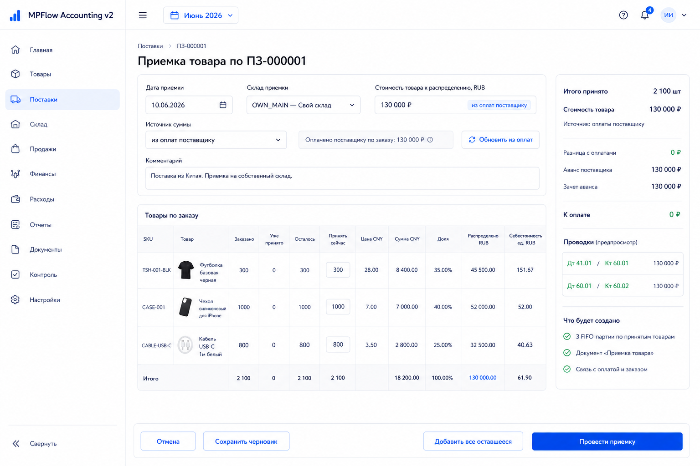
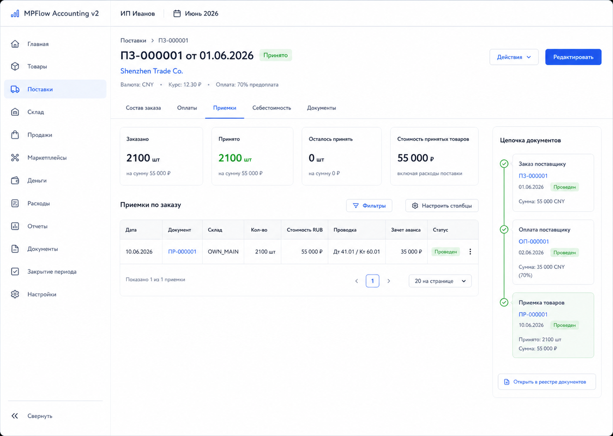
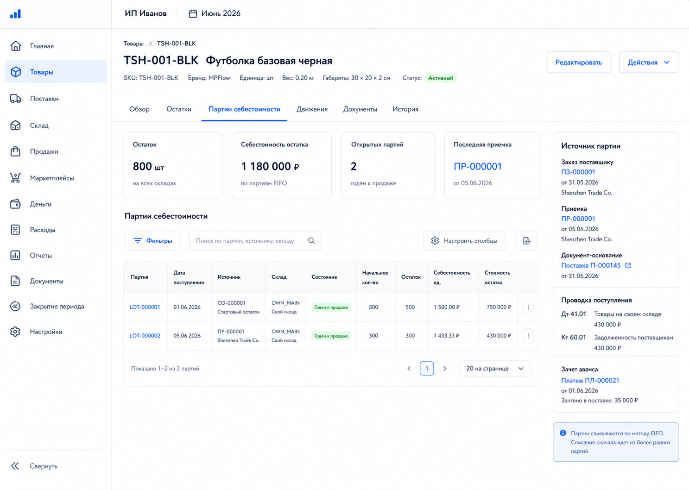

# Шаг 10. Приемка Товара

## Цель

Закрыть первый полный закупочный контур: заказали товар, внесли деньги, оплатили поставщику, приняли товар, получили FIFO-партии, складской остаток, проводки и зачет аванса.

Это первый шаг, где заказ поставщику превращается в товарный актив. По OpenStax это perpetual inventory: при поступлении товара Inventory увеличивается сразу, а обязательство перед поставщиком признается в учете.

## Пользовательский результат

Пользователь создает приемку по заказу and указывает фактически полученные количества. Рублевая стоимость товара к распределению подставляется из связанных оплат поставщику, если они есть; пользователь вводит ее вручную только когда оплаты нет, она частичная, смешанная или требует осознанного уточнения. После проведения:

- товар появляется на складе;
- создаются FIFO-партии;
- в журнале появляется закупочная проводка;
- аванс поставщика зачитывается против задолженности;
- карточка поставки показывает принятое и оставшееся количество;
- карточка товара показывает партию из приемки.

Если товар получен частично, заказ остается с остатком к приемке. Потери, претензии к поставщику и списания недопоставки будут отдельными документами позже; на шаге 10 мы фиксируем только фактически принятое количество.

## Frontend

### Карточка поставки -> `Приемки`

Route: `/procurement/purchase-orders/:id`, tab `Приемки`.

Назначение: показать, сколько заказано, сколько уже принято и что осталось принять.

Visible content:

- ordered qty;
- received qty;
- remaining qty;
- receipt count;
- list of goods receipts;
- document chain: purchase order -> payments -> receipt -> lots;
- button `Создать приемку`.

Actions:

- `Создать приемку`: opens `/procurement/purchase-orders/:id/receipts/new`;
- receipt row click: updates right panel;
- receipt document link: opens `/documents/:id`;
- `Исправить приемку`: for posted receipt opens step 23 correction preview; it is not a direct inline edit of posted lots or journal entries;
- lot link: opens `/products/:id` tab `Партии себестоимости`;
- journal link: opens `/reports/journal/:entryId`.

### Форма `Приемка товара`

Route: `/procurement/purchase-orders/:id/receipts/new`.

Поля header:

- дата приемки;
- склад приемки, active own warehouse in step 10;
- `Стоимость товара к распределению, RUB`, locked/read-only while source is `из оплат поставщику`;
- source selector `Источник суммы`: `из оплат поставщику`, `ввести вручную`, `смешанная сумма`;
- readonly hint `Оплачено поставщику по заказу`, calculated from linked supplier payment allocations;
- button `Обновить из оплат`;
- field `Причина ручного изменения`, required if user overrides suggested amount;
- комментарий.

Строки from purchase order:

- товар: photo, SKU, name;
- заказано;
- уже принято;
- осталось принять;
- принять сейчас;
- цена поставщика;
- сумма строки в валюте поставщика;
- доля распределения;
- распределенная стоимость RUB;
- будущая себестоимость единицы RUB.

Right summary:

- total received qty;
- supplier currency basis;
- RUB goods cost total;
- source of RUB goods cost: linked payments/manual/mixed;
- paid goods amount already allocated to this order;
- difference between suggested payment amount and receipt goods cost;
- paid amount that remains advance for not-yet-received or shortage quantity;
- allocation method: by supplier currency amount or by quantity fallback;
- payable amount;
- available supplier advance;
- setoff amount;
- remaining payable;
- future journal entries:
  - `Дт 41.01 / Кт 60.01`;
  - `Дт 60.01 / Кт 60.02` if advance exists.

Кнопки:

- `Отмена`: returns to purchase order card;
- `Сохранить черновик`: creates receipt document but does not post lots/journal;
- `Провести приемку`: posts receipt, creates lots, movements, journal and setoff;
- `Добавить все оставшееся`: fills `принять сейчас` with remaining qty.
- `Обновить из оплат`: reloads linked `payment_allocation` rows and recalculates the suggested RUB goods cost; it does not create a payment.

### Карточка товара -> `Партии себестоимости`

Route: `/products/:id`, tab `Партии себестоимости`.

После приемки должна появиться партия:

- source `Приемка товара`;
- purchase order;
- supplier;
- received date;
- warehouse;
- received qty;
- unit cost RUB;
- remaining qty;
- linked journal entries.

## Backend

Модули:

- `goods-receipts`;
- `procurement-costing`;
- `inventory`;
- `settlements`;
- `posting-rules/goods-receipt`.

Endpoints:

- `POST /api/procurement/purchase-orders/:id/receipts`;
- `GET /api/procurement/purchase-orders/:id/receipts`;
- `GET /api/procurement/receipts/:id`;
- `POST /api/procurement/receipts/:id/post`;
- `GET /api/procurement/purchase-orders/:id/receipt-preview`.

Commands/services:

- `createGoodsReceipt(input)`;
- `postGoodsReceipt(receiptId)`;
- `calculateReceiptCostAllocation(input)`;
- `calculateAdvanceSetoff(purchaseOrderId, receiptAmountRub)`;
- `createReceiptLots(receiptId)`;
- `createReceiptStockMovements(receiptId)`;
- `updatePurchaseOrderReceiptStatus(purchaseOrderId)`;

Validation:

- purchase order exists and is posted/ordered;
- purchase order is not cancelled;
- receipt date in open period;
- receipt date `>= purchase_order.ordered_at`;
- received qty `> 0` for at least one line;
- cannot receive more than ordered minus previously received;
- goods cost RUB total `>= 0`;
- warehouse is active and own warehouse for this step;
- product line must exist in purchase order;
- receipt cannot be posted twice;
- posted receipt quantity/cost cannot be edited inline; user must use step 23 correction flow with dependency preview;
- if all allocation bases are zero, quantity fallback must have positive total qty.

Cost preview:

- backend exposes preview endpoint so UI and posting use the same allocation logic;
- frontend may calculate locally for responsiveness, but backend result is source of truth.

## БД

### `goods_receipt`

- `id uuid primary key`;
- `organization_id uuid not null references organization(id)`;
- `document_id uuid not null references document(id)`;
- `purchase_order_id uuid not null references purchase_order(id)`;
- `warehouse_id uuid not null references warehouse(id)`;
- `receipt_date date not null`;
- `goods_cost_rub_total numeric(18,2) not null check (goods_cost_rub_total >= 0)`;
- `goods_cost_source text not null check (goods_cost_source in ('linked_supplier_payments','manual','mixed'))`;
- `suggested_goods_cost_rub numeric(18,2) not null default 0`;
- `manual_cost_reason text`;
- `allocation_method text not null check (allocation_method in ('supplier_amount','quantity'))`;
- `status text not null check (status in ('draft','posted','cancelled'))`;
- `comment text`;
- `created_at timestamptz not null default now()`;
- `updated_at timestamptz not null default now()`.

Indexes:

- unique `(organization_id, document_id)`;
- index `(organization_id, purchase_order_id)`;
- index `(organization_id, receipt_date)`.

### `goods_receipt_line`

- `id uuid primary key`;
- `goods_receipt_id uuid not null references goods_receipt(id) on delete cascade`;
- `purchase_order_line_id uuid not null references purchase_order_line(id)`;
- `product_id uuid not null references product(id)`;
- `line_no int not null`;
- `qty_received numeric(18,4) not null check (qty_received > 0)`;
- `supplier_amount_basis numeric(18,2) not null default 0`;
- `allocation_weight numeric(18,8) not null default 0`;
- `allocated_goods_cost_rub numeric(18,2) not null check (allocated_goods_cost_rub >= 0)`;
- `unit_cost_rub numeric(18,6) not null check (unit_cost_rub >= 0)`;
- `rounding_delta_rub numeric(18,2) not null default 0`.

Indexes:

- unique `(goods_receipt_id, line_no)`;
- index `(goods_receipt_id, product_id)`;
- index `(purchase_order_line_id)`.

Existing tables used:

- `document`;
- `document_line`;
- `document_link`;
- `journal_entry`;
- `journal_line`;
- `inventory_lot`;
- `stock_movement`;
- `settlement_entry`;
- `payment_allocation`.

## Учетные правила

Receipt creates inventory and payable:

```text
Дт 41.01 Товары на своем складе
Кт 60.01 Задолженность поставщикам
```

If supplier advance exists:

```text
Дт 60.01 Задолженность поставщикам
Кт 60.02 Авансы поставщикам
```

Setoff amount:

```text
min(receipt payable amount, available linked supplier advance)
```

How payment becomes inventory cost:

- supplier payment itself does not create inventory and does not directly change FIFO lots;
- before receipt, the payment is an advance on `60.02`;
- receipt uses linked `payment_allocation` rows with `allocation_purpose='goods_purchase'` as the default RUB goods cost source;
- posting receipt recognizes inventory and payable for `goods_cost_rub_total`;
- advance setoff then clears `60.02` against `60.01`;
- if linked payment amount is higher than received goods cost, the difference remains supplier advance;
- if linked payment amount is lower than received goods cost, the difference remains supplier payable.

Cost suggestion from linked payments:

- the UI must not blindly put the whole supplier payment into the current receipt when the order is only partly received;
- if the order is fully prepaid and the receipt receives all remaining ordered quantity, suggested `goods_cost_rub_total` equals the unallocated linked goods-payment amount;
- if the order is fully prepaid but the receipt receives only part of the order, suggested `goods_cost_rub_total` is proportional to received supplier-currency basis;
- formula:

```text
suggested_goods_cost_rub =
  linked_goods_payment_rub
  * current_receipt_supplier_basis
  / total_order_supplier_basis
  - goods_cost_already_allocated_to_previous_receipts
```

- any paid amount related to unreceived quantity remains on `60.02 Авансы поставщикам` until later receipt or shortage resolution;
- if payments are partial, mixed, overpaid, or not enough to infer full purchase cost, the form switches to `mixed`/`manual` attention state and requires user confirmation or manual cost reason.

Example, full prepayment with shortage:

- ordered 1,000 units, linked goods payment is `130,000 RUB`;
- received 990 units;
- the default `suggested_goods_cost_rub` is `128,700 RUB`, not `130,000 RUB`;
- `128,700 RUB` is capitalized into received inventory;
- `1,300 RUB` remains on `60.02 Авансы поставщикам` as the paid share of the missing 10 units;
- if the missing 10 units are later received, a second receipt uses the remaining `1,300 RUB`;
- if the user decides the missing 10 units are a supplier claim or loss, step 12 resolves the remaining `1,300 RUB`.

Field editability:

- `Стоимость товара к распределению` is read-only by default when source is `из оплат поставщику`;
- user can edit it only after changing `Источник суммы` to `ввести вручную` or `смешанная сумма`;
- manual edit requires `manual_cost_reason`;
- ordinary full-prepayment flow must not require editing this field;
- valid reasons for manual/mixed source: receipt before payment, partial payment, payment includes non-goods amounts, migration from old records, imported bank amount differs from supplier invoice, or manager intentionally accepts a different RUB purchase cost with audit trail.

Cost allocation:

1. For each receipt line, calculate supplier basis:

```text
qty_received * purchase_order_line.supplier_unit_price
```

2. If total supplier basis `> 0`, allocate `goods_cost_rub_total` proportionally by supplier basis.

3. If total supplier basis `= 0`, allocate by received quantity.

4. Apply rounding to `numeric(18,2)` line totals; last positive line absorbs rounding delta.

5. Unit cost:

```text
allocated_goods_cost_rub / qty_received
```

Inventory:

- create one FIFO lot per receipt line;
- create positive stock movement per receipt line;
- lot source is `goods_receipt_line`;
- received_at = receipt_date.

Document links:

- purchase order document -> goods receipt document with link type `receipt`;
- supplier payment documents -> goods receipt document with link type `advance_setoff` if setoff happens.

Important boundary:

- goods receipt cost should normally include only the purchase price of the goods;
- directly attributable acquisition costs such as delivery, customs, packaging and fulfillment preparation are added through `procurement_cost` in step 11;
- do not force the user to type the same goods payment twice: receipt pre-fills from linked supplier payments and asks for a reason only when the user changes the amount.
- shortage quantity is not silently capitalized into received goods. The received quantity gets only its own purchase-cost share by default; the paid share for missing goods stays as supplier advance until step 12 resolves it as later receipt, supplier claim, loss, or close-without-accounting.
- if the user discovers after posting that accepted quantity was too high, they do not edit the FIFO lot directly. They open `Исправить приемку`; correction preview shows stock, lots, transfers, sales and reports that will be affected. In an open period the system creates a versioned correction; in a closed period it creates current-period correction/storno according to step 23.

## Ошибки пользователя

- Принять больше, чем осталось по заказу: line error.
- Принять ноль по всем строкам: form error.
- Нет суммы к распределению and no linked supplier payment: field error with options `ввести вручную` or `сначала добавить оплату`.
- Manual amount differs from linked supplier payments without reason: block.
- User tries to allocate the full prepaid order amount to a partial receipt without choosing manual/mixed source: show warning `Часть оплаты относится к неполученному товару и останется авансом поставщика`.
- Дата в закрытом периоде: block.
- Дата раньше заказа: warning/block depending policy, default block.
- Приемка по отмененному заказу: block.
- Приемка товара, которого нет в заказе: block.
- Склад inactive or not own warehouse in step 10: block.
- User tries to edit posted accepted quantity directly: block with `Проведенная приемка исправляется через корректировку с предпросмотром влияния`.
- RUB cost entered but all received qty zero: block.

## Тесты

Unit:

- proportional RUB allocation by supplier amount;
- fallback allocation by quantity;
- rounding delta handling;
- advance setoff amount calculation;
- receipt cannot exceed ordered qty.

Integration:

- receipt draft creates document and receipt lines only;
- posted receipt creates document, journal entries, FIFO lots, stock movements;
- advance is set off against payable;
- receipt cannot exceed ordered remaining qty;
- repeated post is idempotent.

Scenario:

- owner contribution -> purchase order -> supplier payment -> goods receipt.
- Expected accounts reconcile:
  - `51` decreases by supplier payment;
  - `60.02` increases on payment and decreases on setoff;
  - `60.01` increases on receipt and decreases on setoff;
  - `41.01` increases by receipt RUB cost;
  - `80.01` reflects owner contribution.
- Product card shows FIFO lot from receipt.

## Definition of Done

- Можно создать приемку по заказу.
- Нельзя принять больше открытого количества.
- Приемка может быть частичной.
- Приемка создает FIFO-партии.
- Приемка создает складские движения.
- Приемка создает проводки закупки.
- Аванс поставщика зачитывается.
- Карточка поставки показывает приемки and remaining qty.
- Карточка товара показывает партию из приемки.
- Journal/ledger/inventory lots reconcile in scenario test.
- Рендеры и текстовые контракты описывают route, layout, кнопки, API, состояния и DB effects.

## Рендеры



### `renders/01-goods-receipt-form.png`

User scenario:

- пользователь получил товар по заказу and records actual quantities;
- he enters RUB cost to allocate across received lines by supplier currency weights.

Route:

- `/procurement/purchase-orders/:id/receipts/new`

Layout:

- основной sidebar;
- topbar with organization and period;
- form header;
- receipt fields;
- receipt line allocation table;
- right accounting/cost summary panel.

Visible content:

- fields: receipt date, warehouse, locked `Стоимость товара к распределению, RUB` when source is `из оплат поставщику`, `Источник суммы`, readonly `Оплачено поставщику по заказу`, comment;
- button `Обновить из оплат`;
- if source is manual or amount differs from linked supplier payments, visible required field `Причина ручного изменения`;
- line table: product thumbnail, product, ordered, previously received, remaining, receive now, supplier unit price, supplier amount basis, allocation share, allocated RUB, unit cost RUB;
- summary: total received qty, RUB goods cost total, source of amount, linked supplier payment amount, difference, paid advance left for unreceived/shortage goods, allocation method, payable, available advance, setoff, remaining payable;
- future journal entries `Дт 41.01 / Кт 60.01` and `Дт 60.01 / Кт 60.02`.

Controls and click behavior:

- `Добавить все оставшееся`: fills receive-now quantities with remaining qty;
- `Обновить из оплат`: reloads linked supplier payment allocations and recalculates suggested RUB goods cost;
- changing receive qty, source selector or RUB amount calls or recalculates preview; final preview should call `GET /api/procurement/purchase-orders/:id/receipt-preview`;
- `Сохранить черновик`: calls `POST /api/procurement/purchase-orders/:id/receipts`;
- `Провести приемку`: creates draft if needed and calls `POST /api/procurement/receipts/:id/post`;
- `Отмена`: returns to purchase order receipts tab.

Validation and error states:

- receive qty > remaining: line error;
- all receive qty zero: form error;
- no linked payment and no manual RUB cost: field error;
- manual amount differs from linked payment amount without reason: form error;
- partial receipt or shortage with linked full prepayment: summary must show the proportional received-goods cost and the remaining advance; it must not silently allocate the full payment to received lines;
- closed period: post disabled;
- allocation preview loading: summary skeleton;
- successful post: navigate to purchase order receipts tab or receipt document card.

Backend and database effects:

- draft save creates `document`, `goods_receipt`, `goods_receipt_line`;
- post creates `journal_entry`, `journal_line`, `inventory_lot`, `stock_movement`, settlement setoff entries, document links and audit events;
- purchase order received quantities/read status update.

Must not include:

- manual account picker;
- editing supplier order prices from receipt form;
- adding products that were not in the purchase order;
- asking the user to type the same goods payment twice when linked supplier payments exist;
- loss/write-off decision controls;
- marketplace sale controls;
- technical health statuses.



### `renders/02-purchase-order-receipts-tab.png`

User scenario:

- пользователь открыл заказ после проведенной приемки;
- он проверяет принятое, оставшееся and document chain.

Route:

- `/procurement/purchase-orders/:id`, tab `Приемки`

Layout:

- основной sidebar;
- topbar with organization and period;
- purchase order header;
- tabs;
- receipt summary cards;
- receipts table;
- right document chain panel.

Visible content:

- ordered qty;
- received qty;
- remaining qty;
- receipt count;
- receipts table: date, receipt document, warehouse, qty, RUB cost, status, lots, journal;
- right panel showing chain: purchase order -> payment -> receipt -> lots -> journal.

Controls and click behavior:

- `Создать приемку`: navigates to `/procurement/purchase-orders/:id/receipts/new`;
- receipt row click updates right panel;
- receipt document link opens `/documents/:id`;
- `Исправить приемку`: opens document correction modal from step 23 for posted receipt; if step 23 is not implemented yet, action is hidden;
- lot link opens product lots tab;
- journal link opens journal entry.

Validation and error states:

- no receipts: empty state `Приемок пока нет`;
- order fully received: create receipt action disabled with explanation;
- order cancelled: action disabled;
- loading: summary/table skeleton.

Backend and database effects:

- tab calls `GET /api/procurement/purchase-orders/:id/receipts`;
- viewing does not write to DB;
- create/post receipt follows form behavior above.

Must not include:

- payment creation controls in receipts tab;
- loss/write-off actions before those workflows exist;
- manual ledger controls;
- technical health statuses.



### `renders/03-product-lot-from-receipt.png`

User scenario:

- пользователь открыл карточку товара после приемки;
- он проверяет, что новая FIFO-партия получила себестоимость from receipt allocation.

Route:

- `/products/:id`, tab `Партии себестоимости`

Layout:

- основной sidebar;
- topbar with organization and period;
- product header;
- product tabs;
- FIFO lots table;
- right provenance panel for selected receipt lot.

Visible content:

- selected tab `Партии себестоимости`;
- table row for receipt lot: received date, source `Приемка`, purchase order, supplier, warehouse, initial qty, remaining qty, unit cost RUB, remaining cost;
- right panel with purchase order, goods receipt, payment/setoff, journal entry, allocation basis.

Controls and click behavior:

- lot row click updates provenance panel;
- purchase order link opens `/procurement/purchase-orders/:id`;
- receipt document link opens `/documents/:id`;
- journal link opens `/reports/journal/:entryId`;
- payment link opens payment document or purchase order payments tab.

Validation and error states:

- no receipt lots: show empty state;
- loading: table skeleton;
- product archived: keep historical lots visible;
- missing linked document due to corruption: show warning badge.

Backend and database effects:

- tab calls `GET /api/products/:id/lots`;
- provenance panel reads linked `document`, `purchase_order`, `goods_receipt`, `payment_allocation`, `journal_entry`;
- viewing does not write to DB.

Must not include:

- direct lot cost edit;
- manual FIFO reorder;
- sales/write-off buttons before those modules exist;
- technical health statuses.
