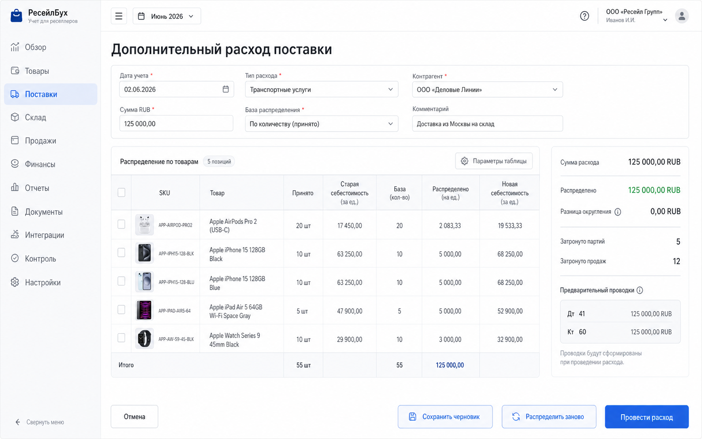
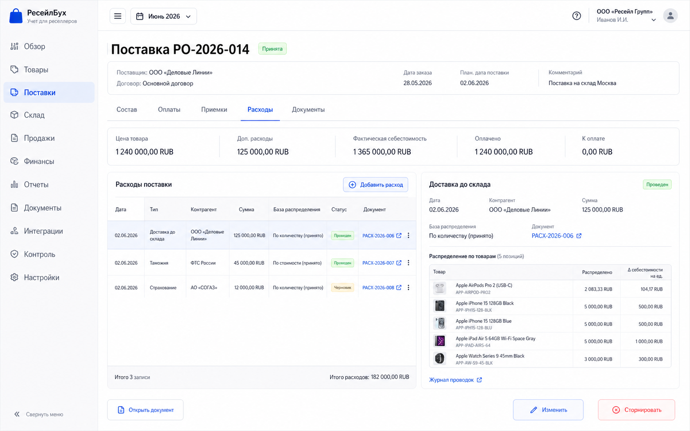

# Шаг 11. Дополнительные Расходы Поставки

## Цель

Добавить в закупочный контур расходы, которые должны увеличивать фактическую себестоимость товара: доставка до склада, таможня, упаковка партии, маркировка, подготовка к фулфилменту и другие расходы, прямо связанные с доведением товара до состояния готовности к продаже.

Этот шаг закрывает важный принцип торгового учета из OpenStax: товарный актив должен включать не только цену поставщика, но и затраты, необходимые для получения товара и подготовки его к продаже. В интерфейсе не использовать термин `landed cost`; пользователь видит `дополнительные расходы поставки` и `фактическая себестоимость`.

## Пользовательский результат

Пользователь открывает заказ или приемку, добавляет расход на доставку/таможню/упаковку, выбирает базу распределения и видит, как расход увеличивает себестоимость каждой строки и каждой FIFO-партии.

После проведения:

- по поставке видно `цена товара`, `доп. расходы`, `фактическая себестоимость`;
- партии товара получают пересчитанную себестоимость;
- журнал и главная книга показывают капитализацию расхода в товары;
- если часть партии уже продана, система запускает пересчет себестоимости продаж и маржи;
- расход остается отдельным документом, а не ручным исправлением стоимости товара.

## Frontend

### Вкладка поставки `Расходы`

Route: `/procurement/purchase-orders/:id`, tab `Расходы`.

Назначение: показать все дополнительные расходы, связанные с заказом и приемками.

Visible content:

- summary row: `Цена товара`, `Доп. расходы`, `Фактическая себестоимость`, `Распределено`, `Осталось распределить`;
- table `Расходы поставки`;
- columns: `Дата`, `Тип`, `Контрагент`, `Сумма`, `База распределения`, `Статус`, `Документ`, `Проведен`;
- line badges: `в себестоимости`, `черновик`, `требует распределения`;
- local button `Добавить расход`;
- empty state: `По этой поставке еще нет дополнительных расходов`.

Actions:

- `Добавить расход`: opens `/procurement/purchase-orders/:id/costs/new`;
- clicking expense row opens right-side preview panel;
- `Открыть документ` opens `/documents/:documentId`;
- `Провести` in row is visible only for draft cost documents and calls `POST /api/procurement/costs/:id/post`;
- `Изменить` is available only for draft or posted document in open period and opens the form with version history warning;
- `Отменить проведение` is not a destructive delete; it creates reversal or moves the document back to draft only if no closed-period dependency exists.

### Форма `Дополнительный расход поставки`

Route: `/procurement/purchase-orders/:id/costs/new`.

Header fields:

- `Дата учета`;
- `Тип расхода`: доставка до склада, таможня, упаковка партии, маркировка, подготовка к фулфилменту, прочее;
- `Контрагент`;
- `Сумма RUB`;
- `Оплата`: `не оплачено`, `создать оплату сейчас`, `привязать существующий платеж`;
- `База распределения`: по стоимости товара, по количеству, по весу, вручную;
- `Комментарий`.

Main table:

- product thumbnail;
- SKU and product name;
- receipt/order line;
- received qty;
- current unit cost RUB;
- allocation base value;
- allocated cost RUB;
- new unit cost RUB;
- manual allocation input if method is `вручную`;
- warning icon if the line already has sales after receipt date.

Right summary:

- total expense amount;
- allocated amount;
- rounding difference;
- expected journal entry;
- affected lots count;
- affected sales count;
- status of selected accounting period.

Buttons:

- `Отмена`: returns to purchase order tab `Расходы` without saving;
- `Сохранить черновик`: creates `procurement_cost` and allocation lines, no journal and no lot cost mutation;
- `Провести расход`: validates allocation, posts accounting entries, updates lot cost layers and creates recalculation jobs when needed;
- `Распределить заново`: recalculates allocation using selected method and overwrites only editable allocation cells;
- `Привязать оплату`: opens payment picker; selected payment becomes a linked outgoing payment allocation;
- `Создать оплату сейчас`: opens embedded payment section with cash account/date/amount; successful post creates both expense and payment documents in one transaction.

## Backend

Modules:

- `procurement-costs`;
- `cost-allocation`;
- `inventory-cost-adjustments`;
- `settlements`;
- `posting-rules/procurement-cost`;
- `recalculation-jobs`.

Endpoints:

- `GET /api/procurement/purchase-orders/:id/costs`;
- `POST /api/procurement/purchase-orders/:id/costs/preview`;
- `POST /api/procurement/purchase-orders/:id/costs`;
- `GET /api/procurement/costs/:id`;
- `PATCH /api/procurement/costs/:id`;
- `POST /api/procurement/costs/:id/post`;
- `POST /api/procurement/costs/:id/reverse`;

Commands/services:

- `previewProcurementCostAllocation(input)`;
- `createProcurementCost(input)`;
- `postProcurementCost(costId)`;
- `applyCostToInventoryLots(costId)`;
- `createSupplierPayableForCost(costId)`;
- `linkOrCreateCostPayment(input)`;
- `enqueueCostRecalculation(productIds, fromDate)`.

Validation:

- purchase order exists and is not cancelled;
- accounting date belongs to an open period;
- expense amount `> 0`;
- cost type is allowed;
- allocation method is allowed;
- at least one received line is selected;
- allocated total equals expense amount after rounding;
- manual allocation cannot allocate negative amount;
- weight allocation requires product weight for all selected lines;
- cannot post into a closed period;
- if linked payment amount is smaller than expense, leave unpaid payable; if larger, reject unless user explicitly records overpayment.

## БД

### `procurement_cost`

- `id uuid primary key`;
- `organization_id uuid not null references organization(id)`;
- `document_id uuid not null references document(id)`;
- `purchase_order_id uuid not null references purchase_order(id)`;
- `cost_date date not null`;
- `cost_type text not null check (cost_type in ('freight_in','customs','packaging','labeling','fulfillment_prep','other_capitalized'))`;
- `counterparty_id uuid references counterparty(id)`;
- `amount_rub numeric(18,2) not null check (amount_rub > 0)`;
- `allocation_method text not null check (allocation_method in ('goods_value','quantity','weight','manual'))`;
- `status text not null check (status in ('draft','posted','reversed'))`;
- `comment text`;
- `created_at timestamptz not null default now()`;
- `updated_at timestamptz not null default now()`.

Indexes:

- unique `(organization_id, document_id)`;
- index `(organization_id, purchase_order_id)`;
- index `(organization_id, cost_date)`.

### `procurement_cost_line`

- `id uuid primary key`;
- `procurement_cost_id uuid not null references procurement_cost(id) on delete cascade`;
- `goods_receipt_line_id uuid not null references goods_receipt_line(id)`;
- `product_id uuid not null references product(id)`;
- `inventory_lot_id uuid not null references inventory_lot(id)`;
- `allocation_base numeric(18,6) not null default 0`;
- `allocated_amount_rub numeric(18,2) not null check (allocated_amount_rub >= 0)`;
- `unit_cost_delta_rub numeric(18,6) not null default 0`;
- `rounding_delta_rub numeric(18,2) not null default 0`.

Indexes:

- unique `(procurement_cost_id, inventory_lot_id)`;
- index `(product_id)`;
- index `(goods_receipt_line_id)`.

### `inventory_cost_adjustment`

- `id uuid primary key`;
- `organization_id uuid not null references organization(id)`;
- `source_document_id uuid not null references document(id)`;
- `inventory_lot_id uuid not null references inventory_lot(id)`;
- `product_id uuid not null references product(id)`;
- `adjustment_date date not null`;
- `amount_rub numeric(18,2) not null`;
- `remaining_inventory_amount_rub numeric(18,2) not null`;
- `sold_cost_amount_rub numeric(18,2) not null`;
- `created_at timestamptz not null default now()`.

This table preserves the source of cost changes after the original receipt. It is not a manual ledger edit.

## Учетные правила

If the cost is unpaid:

```text
Дт 41.* Товары
Кт 60.01 Задолженность поставщику/подрядчику
```

If the user pays immediately:

```text
Дт 41.* Товары
Кт 51 Расчетный счет
```

Immediate payment creates/links `payment.payment_direction='outgoing'` and `payment.payment_type='procurement_cost_payment'`.

If part of affected inventory was already sold, the backend splits the effect:

```text
Дт 41.* Товары                    часть, оставшаяся в партиях
Дт 90.02 Себестоимость продаж      часть, уже ушедшая в продажи
Кт 60.01 или 51                    общая сумма расхода
```

Meaning of the split:

- `41.* Товары` is the balance-sheet inventory group. It is used only for goods that still exist in stock, in transit, or at a sales point.
- `90.02 Себестоимость продаж` is the profit-and-loss expense account for goods already sold. If the item has already left inventory through a sale, a later acquisition cost can no longer increase `41.*`; it must increase the cost of that past sale.
- Example: an added delivery cost is `30,000 RUB`; 80% of the affected units are still unsold and 20% were already sold. The system posts `24,000 RUB` to `41.*` and `6,000 RUB` to `90.02`.

Rules:

- additional costs are capitalized only when they are needed to bring inventory to saleable condition;
- advertising, salary, storage after readiness for sale and marketplace selling fees are not capitalized here and must go through later expense/fee steps;
- allocation changes must preserve total RUB amount with explicit rounding delta;
- lot-level history must show every cost layer: opening/receipt plus later procurement costs.

## Ошибки пользователя

- If amount is empty or zero, show inline error `Укажите сумму расхода`.
- If selected allocation method cannot be calculated, show line-level reason and disable `Провести расход`.
- If user selects a closed period, show `Период закрыт. Создайте корректировку в открытом периоде`.
- If product weight is missing for weight allocation, show product rows requiring weight and button `Открыть карточку товара`.
- If allocation total differs from amount, show difference and button `Распределить заново`.
- If the expense date is before accounting start date, reject posting.
- If linked payment belongs to another counterparty, require explicit confirmation or reject according to policy.

## Тесты

- Unit: allocation by value, quantity, weight, manual, rounding.
- Unit: capitalization split between remaining inventory and sold cost.
- Integration: draft cost creates no journal entries.
- Integration: posted cost creates balanced journal entry and lot cost adjustments.
- Integration: immediate payment creates payment document and links it to procurement cost.
- Scenario: receipt -> sale -> later delivery expense -> себестоимость продаж and sale margin are recalculated.
- Scenario: closed period blocks direct cost posting.

## Definition of Done

- Пользователь может добавить дополнительный расход к поставке.
- Preview распределения и posting используют один backend-сервис.
- Проведение расхода создает документ, проводки, supplier settlement/payment effects and lot cost adjustments.
- Партии и карточка поставки показывают фактическую себестоимость с допрасходами.
- Проданные ранее партии получают пересчет себестоимости продаж через фоновую задачу.
- Некапитализируемые расходы нельзя провести через этот сценарий.
- Все изменения имеют `audit_event` and links to source documents.
- Рендеры и текстовые контракты описывают route, layout, кнопки, API, состояния and DB effects.

## Рендеры



### `renders/01-cost-allocation-form.png`

Scenario: пользователь добавляет доставку из Китая к уже принятой поставке и проверяет, как она ляжет в себестоимость.

Route: `/procurement/purchase-orders/:id/costs/new`.

Layout:

- normal app sidebar with active item `Поставки`;
- topbar with working period selector and no duplicate date widgets;
- page title `Дополнительный расход поставки`;
- left form column with header fields;
- central allocation table;
- right summary panel.

Required visible UI:

- fields: `Дата учета`, `Тип расхода`, `Контрагент`, `Сумма RUB`, `База распределения`, `Комментарий`;
- allocation table with product thumbnails, SKU, name, received quantity, old unit cost, allocation base, allocated amount, new unit cost;
- right panel with `Сумма расхода`, `Распределено`, `Разница округления`, `Затронуто партий`, `Затронуто продаж`, and journal preview;
- buttons `Отмена`, `Сохранить черновик`, `Распределить заново`, `Провести расход`.

Button behavior:

- `Отмена` navigates back to purchase order tab `Расходы`;
- `Сохранить черновик` calls `POST /api/procurement/purchase-orders/:id/costs` with status `draft`;
- `Распределить заново` calls preview endpoint and refreshes only allocation cells;
- `Провести расход` calls create-or-update draft if needed, then `POST /api/procurement/costs/:id/post`; success navigates to the purchase order costs tab and shows posted row.

Must not include:

- marketplace sync status;
- manual debit/credit editor;
- duplicate quick actions;
- technical health blocks.



### `renders/02-receipt-costs-tab.png`

Scenario: после проведения пользователь смотрит поставку и видит, из чего сложилась себестоимость.

Route: `/procurement/purchase-orders/:id`, tab `Расходы`.

Layout:

- purchase order header with supplier, status, ordered/received summary;
- tab bar: `Состав`, `Оплаты`, `Приемки`, `Расходы`, `Документы`;
- summary strip: goods amount, extra costs, actual cost, paid/unpaid;
- table of procurement costs;
- right preview panel for selected cost.

Required visible UI:

- row for `Доставка до склада` with status `проведен`;
- linked document number;
- allocation method;
- amount RUB;
- affected lots count;
- journal link;
- button `Добавить расход`;
- selected preview shows allocated product rows with thumbnails and unit cost delta.

Button behavior:

- `Добавить расход` opens new cost form;
- cost row click selects preview panel;
- `Открыть документ` opens document card;
- `Изменить` opens form only if period is open;
- `Сторнировать` asks confirmation and posts reversal if allowed.

Must not include:

- sales analytics before sales steps exist;
- external marketplace fees;
- global quick action cards.
