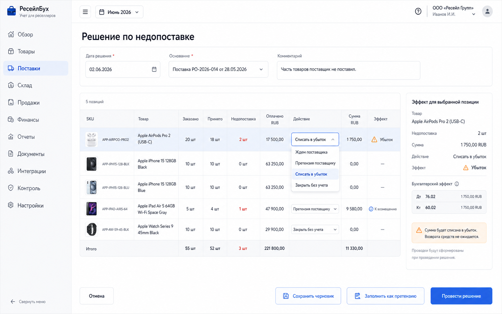
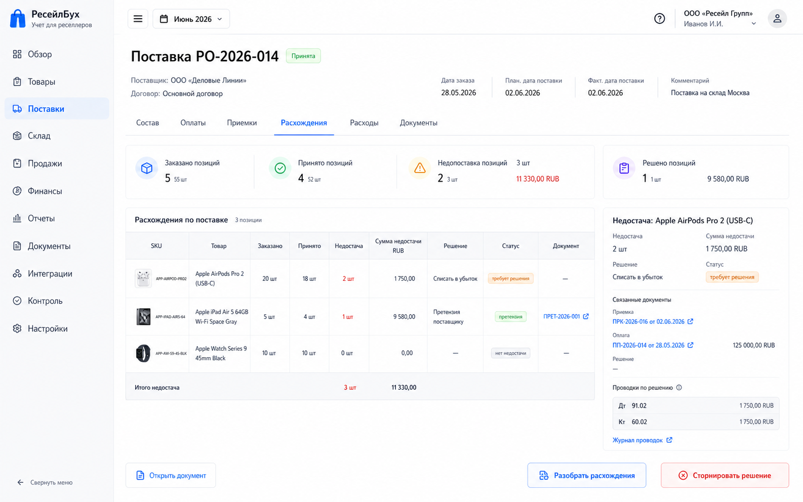

# Шаг 12. Недопоставки, Потери И Претензии

## Цель

Дать пользователю контролируемый способ закрывать расхождения между заказанным, оплаченным и фактически полученным товаром: оставить долг поставщика, оформить претензию, закрыть остаток заказа без учета или признать потерю.

Шаг нужен, чтобы пользователь не исправлял количество в заказе задним числом после приемки и не ломал audit trail. Заказ, приемка, оплата и решение по расхождению остаются связанными документами.

## Пользовательский результат

Пользователь видит в карточке поставки строки с недопоставкой, выбирает решение по каждой строке и понимает бухгалтерский эффект:

- `ждем поставщика` - заказ остается открытым;
- `претензия поставщику` - сумма переносится в требования/зачеты;
- `списать в убыток` - аванс или ожидаемая стоимость признается потерей;
- `закрыть без учета` - если товар не оплачен и обязательства нет, просто закрывается управленческий остаток заказа.

## Frontend

### Вкладка поставки `Расхождения`

Route: `/procurement/purchase-orders/:id`, tab `Расхождения`.

Visible content:

- summary: ordered, received, shortage qty, shortage amount basis, open supplier advance, unresolved lines;
- table grouped by product;
- columns: product thumbnail, SKU, ordered qty, received qty, shortage qty, paid share RUB, proposed action, status;
- local button `Разобрать расхождения`;
- explanation text: `Решение влияет на заказ и взаиморасчеты, но не меняет уже проведенную приемку`.

Actions:

- `Разобрать расхождения`: opens shortage resolution form;
- row click opens row detail with linked order, payments and receipts;
- `Оставить открытым`: keeps remaining quantity in order;
- `Закрыть строку`: available after resolution is posted.

### Форма `Решение по недопоставке`

Route: `/procurement/purchase-orders/:id/shortages/new`.

Header fields:

- `Дата решения`;
- `Основание`: акт сверки, письмо поставщика, внутреннее решение, другое;
- `Комментарий`;
- optional file attachment placeholder for future implementation.

Line table:

- product thumbnail;
- SKU and name;
- ordered qty;
- received qty;
- shortage qty;
- supplier amount basis;
- paid RUB basis;
- action selector per line;
- amount RUB;
- expected accounting effect.

Actions per line:

- `Ждем поставщика`: leaves line unresolved and not included in posted document;
- `Претензия поставщику`: creates supplier claim/receivable or keeps advance available for future setoff;
- `Списать в убыток`: writes off paid advance/proven loss;
- `Закрыть без учета`: closes unreceived/unpaid order remainder without journal entry.

Page buttons:

- `Отмена`: back to order card;
- `Сохранить черновик`: persists choices but no journal;
- `Провести решение`: posts only lines with final action and updates purchase order open quantities;
- `Заполнить как претензию`: sets all eligible lines to supplier claim;
- `Заполнить как потерю`: sets all paid shortage lines to loss and highlights high-risk impact.

## Backend

Modules:

- `shortage-resolution`;
- `supplier-claims`;
- `settlements`;
- `posting-rules/shortage`;
- `procurement-status`.

Endpoints:

- `GET /api/procurement/purchase-orders/:id/shortages/preview`;
- `POST /api/procurement/purchase-orders/:id/shortages`;
- `GET /api/procurement/shortages/:id`;
- `POST /api/procurement/shortages/:id/post`;

Validation:

- purchase order exists;
- shortage quantity equals ordered minus received minus already resolved;
- cannot resolve more than open shortage;
- paid RUB basis for shortage is calculated from linked goods-purchase payments proportionally to unresolved supplier-currency basis, excluding amounts already allocated to receipts or previous shortage resolutions;
- accounting date is in open period;
- loss action requires positive paid basis or explicit manual amount;
- claim action requires counterparty;
- close-without-accounting allowed only when no recognized payable/advance amount exists for the line;
- each line action must be compatible with current settlement state.

## БД

### `shortage_resolution`

- `id uuid primary key`;
- `organization_id uuid not null references organization(id)`;
- `document_id uuid not null references document(id)`;
- `purchase_order_id uuid not null references purchase_order(id)`;
- `resolution_date date not null`;
- `basis_type text not null check (basis_type in ('supplier_confirmation','reconciliation_act','internal_decision','other'))`;
- `status text not null check (status in ('draft','posted','reversed'))`;
- `comment text`;
- `created_at timestamptz not null default now()`;
- `updated_at timestamptz not null default now()`.

### `shortage_resolution_line`

- `id uuid primary key`;
- `shortage_resolution_id uuid not null references shortage_resolution(id) on delete cascade`;
- `purchase_order_line_id uuid not null references purchase_order_line(id)`;
- `product_id uuid not null references product(id)`;
- `qty_shortage numeric(18,4) not null check (qty_shortage > 0)`;
- `supplier_amount_basis numeric(18,2) not null default 0`;
- `amount_rub numeric(18,2) not null default 0`;
- `paid_basis_rub numeric(18,2) not null default 0`;
- `action text not null check (action in ('wait_supplier','supplier_claim','write_off_loss','close_no_accounting'))`;
- `settlement_entry_id uuid references settlement_entry(id)`;

Indexes:

- index `(purchase_order_line_id)`;
- index `(product_id)`;
- unique `(shortage_resolution_id, purchase_order_line_id)`.

### `supplier_claim`

- `id uuid primary key`;
- `organization_id uuid not null references organization(id)`;
- `counterparty_id uuid not null references counterparty(id)`;
- `source_document_id uuid not null references document(id)`;
- `claim_date date not null`;
- `amount_rub numeric(18,2) not null check (amount_rub > 0)`;
- `status text not null check (status in ('open','settled','written_off'))`;
- `created_at timestamptz not null default now()`.

## Учетные правила

If supplier still owes goods or money, do not silently expense it. Use supplier claim:

```text
Дт 76.02 Претензии поставщикам
Кт 60.02 Авансы поставщикам
```

If the user accepts the loss of a paid advance:

```text
Дт 91.02 Прочие расходы / потери
Кт 60.02 Авансы поставщикам
```

If unpaid remainder is simply closed:

```text
No journal entry.
```

Rules:

- shortage decision never creates inventory lots;
- posted receipt quantities are not edited by this workflow;
- shortage closes purchase order remainder only for resolved lines;
- supplier claim remains visible in settlements until paid, offset, or written off.
- default shortage handling keeps the missing quantity outside inventory cost. The paid share of missing goods remains supplier advance until the user decides claim/loss/later receipt.
- example: if 1,000 units were prepaid for `130,000 RUB` and only 990 were received, the receipt capitalizes `128,700 RUB`; the unresolved 10 units keep `1,300 RUB` on `60.02`. A claim posts `Дт 76.02 / Кт 60.02` for `1,300 RUB`; a loss posts `Дт 91.02 / Кт 60.02` for `1,300 RUB`; a later receipt of the 10 units capitalizes the remaining `1,300 RUB` into inventory.

## Ошибки пользователя

- If no line has a final action, show `Выберите, что сделать хотя бы с одной строкой`.
- If action `Списать в убыток` is selected for unpaid shortage, show `Списывать нечего: по строке нет оплаченного аванса или признанной суммы`.
- If user tries to close a shortage with active supplier payable, show the linked payable and require a settlement decision.
- If accounting period is closed, disable posting and explain correction route.
- If user changes order quantity instead of resolving shortage, show warning in purchase order edit flow: `По строке уже есть приемки. Для недопоставки используйте вкладку Расхождения`.

## Тесты

- Unit: shortage preview by ordered/received/resolved quantities.
- Unit: action eligibility by settlement state.
- Integration: supplier claim creates balanced journal entry and settlement entry.
- Integration: loss write-off clears supplier advance.
- Integration: close-without-accounting creates no journal.
- Scenario: partial receipt + partial supplier claim + remaining open order.
- Scenario: posted shortage blocks editing receipt quantities that would make resolution inconsistent.

## Definition of Done

- Карточка поставки показывает нерешенные расхождения.
- Пользователь может провести решение по недопоставке построчно.
- Система поддерживает claim, loss, close-without-accounting and wait states.
- Posted shortage resolution updates purchase order status and settlements.
- Existing receipts and payments are not destructively edited.
- All effects are traceable through document links and audit events.
- Рендеры описывают форму решения и вкладку расхождений.

## Рендеры



### `renders/01-shortage-resolution-form.png`

Scenario: пользователь получил меньше товара, чем заказал, и решает, что часть будет претензией поставщику, а часть будет списана как потеря.

Route: `/procurement/purchase-orders/:id/shortages/new`.

Layout:

- app sidebar active `Поставки`;
- topbar working period selector only once;
- page title `Решение по недопоставке`;
- header form with date, basis and comment;
- main table with product rows;
- right accounting effect panel.

Required visible UI:

- columns: product thumbnail, SKU, ordered, received, shortage, paid basis, action selector, amount RUB, effect;
- action dropdown values `Ждем поставщика`, `Претензия поставщику`, `Списать в убыток`, `Закрыть без учета`;
- right panel shows selected line journal preview and settlement impact;
- buttons `Отмена`, `Сохранить черновик`, `Заполнить как претензию`, `Провести решение`.

Button behavior:

- `Заполнить как претензию` fills eligible rows and recalculates right panel;
- line action dropdown updates validation immediately;
- `Провести решение` calls `POST /api/procurement/shortages/:id/post`; success navigates to order tab `Расхождения`;
- validation errors are inline by row and disable posting.

Must not include:

- editing received quantities;
- manual ledger rows;
- marketplace sales or sync elements.



### `renders/02-purchase-order-discrepancies-tab.png`

Scenario: пользователь открывает поставку после частичной приемки и видит unresolved shortage plus posted decisions.

Route: `/procurement/purchase-orders/:id`, tab `Расхождения`.

Layout:

- purchase order header;
- tab bar with active `Расхождения`;
- summary cards for ordered/received/shortage/resolved;
- discrepancy table;
- detail panel for selected shortage decision.

Required visible UI:

- unresolved row with badge `требует решения`;
- posted supplier claim row with document number and amount;
- loss write-off row with journal link;
- button `Разобрать расхождения`.

Button behavior:

- `Разобрать расхождения` opens shortage resolution form with unresolved rows prefilled;
- row click opens detail panel;
- `Открыть документ` opens document card;
- `Сторнировать решение` appears only for open period and asks confirmation.

Must not include:

- duplicate order totals already shown in header unless they are shortage-specific;
- product marketplace mappings;
- generic quick actions.
