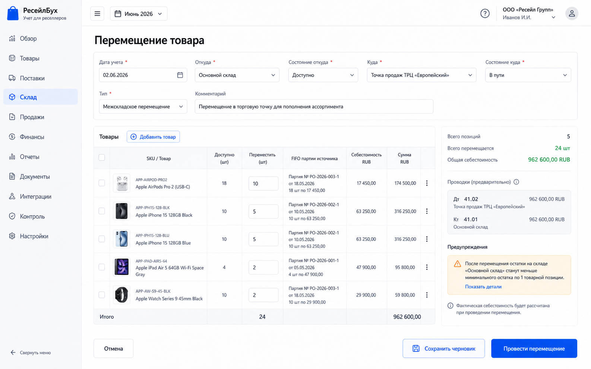
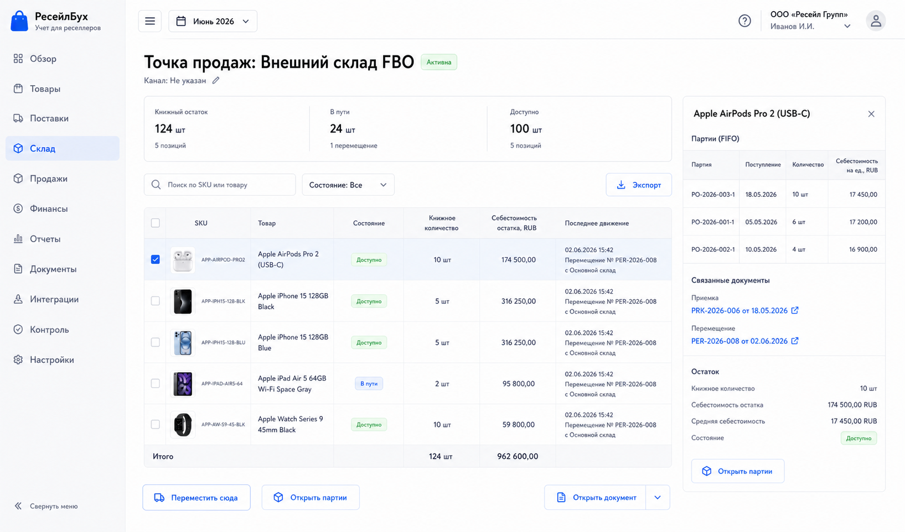

# Шаг 13. Перемещения И Отгрузка На Точки Продаж

## Цель

Добавить движение товара между местами хранения: свой склад, транзит, внешняя точка продаж. Это нужно до продаж, потому что себестоимость должна находиться там, откуда фактически продается товар.

Шаг остается маркетплейс-нейтральным. Система поддерживает `точки продаж`, но не вызывает API Ozon/Wildberries. Конкретные интеграции появятся через шаги каналов продаж.

## Пользовательский результат

Пользователь может:

- создать перемещение со своего склада в транзит;
- принять товар из транзита на точку продаж;
- переместить товар между состояниями;
- видеть, что количество и себестоимость переехали вместе;
- открыть карточку точки продаж и увидеть остатки.

Перемещение не создает выручку, расход или прибыль. Оно переносит товарный актив между субсчетами/аналитиками.

## Frontend

### Форма `Перемещение товара`

Route: `/inventory/transfers/new`.

Fields:

- `Дата учета`;
- `Откуда`: warehouse selector;
- `Состояние откуда`: годен, транзит, проверка, брак;
- `Куда`: warehouse/sales point selector;
- `Состояние куда`;
- `Тип`: обычное перемещение, отгрузка на точку продаж, приемка на точке продаж;
- `Комментарий`.

Lines:

- product thumbnail;
- SKU/name;
- available qty by source;
- qty to move;
- FIFO preview: lots to consume from source;
- transferred cost RUB;
- target location preview.

Buttons:

- `Добавить товар`: opens product picker with only products that have available stock in source;
- `Заполнить по выбранным остаткам`: fills qty from selected stock rows if user came from inventory overview;
- `Сохранить черновик`: creates transfer document, no stock movement;
- `Провести перемещение`: creates stock movements, cost applications and journal entry;
- `Отмена`: returns to inventory overview.

### Остатки точки продаж

Route: `/inventory/sales-points/:id`.

Visible content:

- sales point header: name, type, linked channel if any, status;
- stock summary by state;
- table of products with thumbnail, SKU, book qty, in transit qty, reserved qty, cost remaining;
- lot drawer for selected product;
- document chain of recent transfers.

Actions:

- `Переместить сюда`: opens transfer form with target prefilled;
- `Отгрузить с этой точки`: disabled until sales step unless manual transfer out is available;
- `Открыть партии`: opens lot drawer;
- transfer row click opens document card.

## Backend

Modules:

- `stock-transfers`;
- `fifo-cost-flow`;
- `inventory`;
- `posting-rules/stock-transfer`.

Endpoints:

- `GET /api/inventory/transfer-preview?from=&to=&productIds=`;
- `POST /api/inventory/transfers`;
- `GET /api/inventory/transfers/:id`;
- `PATCH /api/inventory/transfers/:id`;
- `POST /api/inventory/transfers/:id/post`;
- `GET /api/inventory/sales-points/:id/stock`.

Commands/services:

- `createStockTransfer(input)`;
- `previewTransferFifo(input)`;
- `postStockTransfer(transferId)`;
- `moveLotCostToTarget(transferId)`;
- `updateInventoryBalancesForTransfer(transferId)`.

Validation:

- source and target locations are active and different unless state changes within one warehouse;
- accounting date is in open period;
- qty to move `> 0`;
- source has enough available book qty in selected state;
- cannot move from future lots;
- cannot post transfer twice;
- target sales point may exist without integration connection.

## БД

### `stock_transfer`

- `id uuid primary key`;
- `organization_id uuid not null references organization(id)`;
- `document_id uuid not null references document(id)`;
- `transfer_date date not null`;
- `from_warehouse_id uuid not null references warehouse(id)`;
- `to_warehouse_id uuid not null references warehouse(id)`;
- `from_stock_state_id uuid not null references stock_state(id)`;
- `to_stock_state_id uuid not null references stock_state(id)`;
- `transfer_type text not null check (transfer_type in ('internal','to_sales_point','from_transit_to_sales_point','state_change'))`;
- `status text not null check (status in ('draft','posted','reversed'))`;
- `comment text`;
- `created_at timestamptz not null default now()`;
- `updated_at timestamptz not null default now()`.

### `stock_transfer_line`

- `id uuid primary key`;
- `stock_transfer_id uuid not null references stock_transfer(id) on delete cascade`;
- `product_id uuid not null references product(id)`;
- `line_no int not null`;
- `qty numeric(18,4) not null check (qty > 0)`;
- `cost_rub numeric(18,2) not null default 0`;

Indexes:

- unique `(stock_transfer_id, line_no)`;
- index `(product_id)`.

Existing `cost_application` is used to show which source lots funded the transfer.

## Учетные правила

If chart of accounts tracks location subaccounts, transfer creates reclassification:

```text
Дт 41.02 Товары в пути / 41.03 Товары на точках продаж
Кт 41.01 Товары на своем складе
```

If only warehouse analytics changes inside the same account, journal may be zero-impact and stock ledger still records movements. For this spec, keep subaccount posting for transparency.

Rules:

- transfer consumes FIFO layers from source and creates continuation layers at target with same cost basis;
- transfer does not change total inventory value;
- no revenue, no себестоимость продаж, no expense;
- transfer is a source document and must be traceable from lot history.

## Ошибки пользователя

- If selected source has insufficient stock, show available qty by product and disable posting.
- If source and target are the same with same state, show `Нечего перемещать: место и состояние совпадают`.
- If transfer date is before lot receipt date, reject line with source lot hint.
- If target sales point is inactive, require reactivation or different target.
- If period is closed, allow view only and route to correction workflow later.

## Тесты

- Unit: transfer FIFO preview consumes oldest available lots.
- Integration: posted transfer reduces source stock and increases target stock.
- Integration: total inventory value stays unchanged.
- Integration: transfer creates balanced journal entry between 41 subaccounts.
- Scenario: own warehouse -> transit -> sales point, cost continuity preserved.
- Scenario: cannot transfer more than available.

## Definition of Done

- Пользователь может создать, сохранить and post stock transfer.
- Source and target stock balances update correctly by warehouse and state.
- Cost applications show source lots.
- Product/lot screens show transfer document in movement history.
- Sales point stock page exists and uses generic terms, no marketplace-specific hardcode.
- Transfer posting is balanced and auditable.
- Рендеры cover transfer form and sales-point stock screen.

## Рендеры



### `renders/01-transfer-form.png`

Scenario: пользователь отгружает часть товара со своего склада в транзит на внешнюю точку продаж.

Route: `/inventory/transfers/new`.

Layout:

- sidebar active `Склад`;
- topbar period selector only;
- page title `Перемещение товара`;
- header form in one card-width section;
- line table below;
- right FIFO and accounting summary panel.

Required visible UI:

- fields `Дата учета`, `Откуда`, `Состояние откуда`, `Куда`, `Состояние куда`, `Тип`, `Комментарий`;
- line table with product thumbnails, SKU/name, available qty, qty to move, source FIFO lots, cost RUB;
- right panel with total qty, total cost, journal preview and warning if stock insufficient;
- buttons `Добавить товар`, `Сохранить черновик`, `Провести перемещение`, `Отмена`.

Button behavior:

- `Добавить товар` opens product picker filtered by source stock;
- qty edit calls preview endpoint after debounce;
- `Сохранить черновик` creates document without movements;
- `Провести перемещение` calls post endpoint; success navigates to transfer document card or sales point stock depending target.

Must not include:

- marketplace API draft creation;
- продажа покупателю;
- commission or payout blocks.



### `renders/02-sales-point-stock.png`

Scenario: после перемещения пользователь проверяет, сколько товара находится на внешней точке продаж.

Route: `/inventory/sales-points/:id`.

Layout:

- sidebar active `Склад`;
- page header `Точка продаж: FBO склад 1` or generic external point;
- stock summary strip;
- product stock table;
- right drawer with lots for selected product.

Required visible UI:

- summary values: book qty, in transit, available, total cost;
- table columns: product thumbnail, SKU, name, state, book qty, cost remaining, last movement;
- button `Переместить сюда`;
- selected product lot drawer with source receipt and transfer documents.

Button behavior:

- `Переместить сюда` opens transfer form with target prefilled;
- product row click opens lot drawer;
- document link opens document card.

Must not include:

- observed marketplace stock before sync step;
- Ozon/Wildberries-specific mandatory labels;
- quick action cards.
