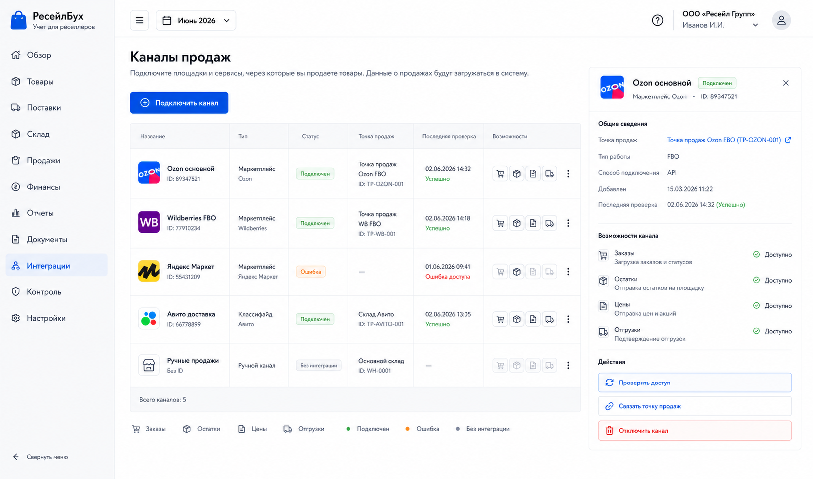
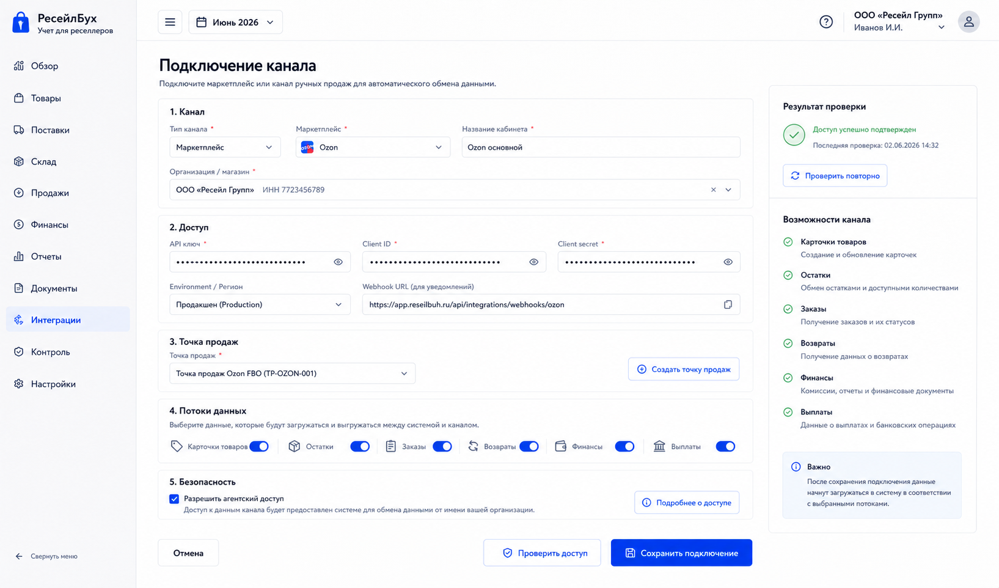

# Шаг 14. Каналы Продаж И Подключения

## Цель

Ввести расширяемую модель каналов продаж и подключений, чтобы ядро учета не зависело от конкретного маркетплейса. Канал описывает источник продаж и внешних данных; плагин знает, как с ним общаться; точка продаж связывает складской учет с каналом.

## Пользовательский результат

Пользователь видит список каналов продаж, подключает кабинет маркетплейса или ручной канал, проверяет доступ и связывает канал с точкой продаж. После этого интеграционный слой готов загружать карточки, остатки, продажи, финансы и выплаты, но сам шаг еще не материализует внешние события в учетные документы.

## Frontend

### Список `Каналы продаж`

Route: `/integrations/channels`.

Visible content:

- page title `Каналы продаж`;
- table of configured channels;
- columns: `Название`, `Тип`, `Статус`, `Точка продаж`, `Последняя проверка`, `Возможности`, `Действия`;
- status badges: connected, disabled, error, needs_setup;
- button `Подключить канал`;
- empty state explaining that channels let the system receive products/sales/finance from external sources.

Actions:

- `Подключить канал`: opens connection form;
- channel row click opens channel detail;
- `Проверить доступ`: calls credential validation without saving new external facts;
- `Отключить`: marks connection disabled; does not delete imported facts;
- `Связать точку продаж`: opens warehouse/sales-point selector.

### Форма `Подключение канала`

Route: `/integrations/channels/new`.

Fields:

- `Тип канала`: Ozon, Wildberries, ручной канал, другой плагин;
- `Название кабинета`;
- `Организация/магазин`;
- credential fields defined by plugin schema;
- `Точка продаж`: create new or link existing;
- toggles for supported streams: cards, stock, orders, returns, finance, payouts;
- checkbox `Разрешить агентский доступ к API канала` default off.

Buttons:

- `Проверить доступ`: validates credentials and shows capabilities;
- `Сохранить подключение`: stores encrypted credentials and channel connection;
- `Отмена`: returns to channel list;
- `Создать точку продаж`: inline creates warehouse of type `sales_point`.

## Backend

Modules:

- `sales-channels`;
- `integration-plugins`;
- `credential-vault`;
- `sales-points`;
- `channel-permissions`.

Endpoints:

- `GET /api/integrations/plugins`;
- `GET /api/integrations/channels`;
- `POST /api/integrations/channels/validate`;
- `POST /api/integrations/channels`;
- `GET /api/integrations/channels/:id`;
- `PATCH /api/integrations/channels/:id`;
- `POST /api/integrations/channels/:id/check`;
- `POST /api/integrations/channels/:id/disable`.

Plugin contract:

- `code`;
- `displayName`;
- `credentialSchema`;
- `capabilities`: products, stock, orders, returns, finance, payouts, supplyDrafts;
- `validateCredentials(input)`;
- sync methods are declared but implemented in later steps.

Validation:

- channel name unique within organization;
- plugin exists and is active;
- required credential fields present;
- credentials validate before active status;
- linked sales point belongs to organization and has `warehouse_type='sales_point'`;
- disabling channel is allowed only if no sync run is currently active.

## БД

### `integration_plugin`

- `id uuid primary key`;
- `code text not null unique`;
- `display_name text not null`;
- `version text not null`;
- `capabilities jsonb not null default '{}'`;
- `is_enabled boolean not null default true`;
- `created_at timestamptz not null default now()`.

### `sales_channel`

- `id uuid primary key`;
- `organization_id uuid not null references organization(id)`;
- `plugin_id uuid references integration_plugin(id)`;
- `channel_type text not null check (channel_type in ('marketplace','manual','wholesale','other'))`;
- `name text not null`;
- `status text not null check (status in ('needs_setup','connected','disabled','error'))`;
- `sales_point_warehouse_id uuid references warehouse(id)`;
- `last_checked_at timestamptz`;
- `last_error text`;
- `settings jsonb not null default '{}'`;
- `created_at timestamptz not null default now()`;
- `updated_at timestamptz not null default now()`;

Indexes:

- unique `(organization_id, name)`;
- index `(organization_id, status)`.

### `channel_credential`

- `id uuid primary key`;
- `sales_channel_id uuid not null references sales_channel(id) on delete cascade`;
- `credential_key text not null`;
- `encrypted_value text not null`;
- `created_at timestamptz not null default now()`;
- `updated_at timestamptz not null default now()`;

### `channel_capability`

- `id uuid primary key`;
- `sales_channel_id uuid not null references sales_channel(id) on delete cascade`;
- `capability_code text not null`;
- `is_enabled boolean not null default true`;
- unique `(sales_channel_id, capability_code)`.

## Учетные правила

This step creates no journal entries. A channel connection is setup/master data.

Rules:

- external facts must not become accounting documents at connection time;
- disabling a channel must preserve imported raw facts, mappings and documents;
- sales point links are inventory analytics, not marketplace-specific account hardcode;
- credentials are never returned to frontend after save.

## Ошибки пользователя

- Invalid credentials show provider-safe error without exposing secrets.
- Duplicate channel name shows inline field error.
- If plugin does not support requested stream, show disabled toggle with reason.
- If user enables agent API access, require explicit confirmation and audit event.
- If linked point has stock from another channel, show warning before linking.

## Тесты

- Unit: plugin schema validation.
- Unit: credential redaction in API responses.
- Integration: create channel with linked sales point.
- Integration: check access updates status and last error.
- Integration: disabling channel preserves raw external data.
- Security: credentials are encrypted at rest and never logged.

## Definition of Done

- Пользователь может создать and validate sales channel connection.
- Channels list shows status, capabilities and linked sales point.
- Generic plugin registry exists without hard-coded marketplace logic in accounting core.
- Credentials are stored encrypted and redacted.
- Channel creates no accounting postings by itself.
- Audit events record create/check/disable actions.
- Рендеры show channel list and connection form.

## Рендеры

### `renders/01-sales-channels-list.png`

Scenario: пользователь открывает интеграции и видит подключенные и неподключенные каналы продаж.

Route: `/integrations/channels`.

Layout:

- sidebar active `Интеграции`;
- page title `Каналы продаж`;
- table of channels;
- narrow right detail panel for selected channel.

Required visible UI:

- button `Подключить канал`;
- columns `Название`, `Тип`, `Статус`, `Точка продаж`, `Последняя проверка`, `Возможности`;
- row example: `Ozon основной`, status `подключен`, point `Точка продаж FBO`;
- second row example: `Ручные продажи`, status `без интеграции`;
- selected detail panel with buttons `Проверить доступ`, `Связать точку продаж`, `Отключить`.

Button behavior:

- `Подключить канал` opens `/integrations/channels/new`;
- `Проверить доступ` calls check endpoint and refreshes status;
- `Отключить` opens confirmation and then marks channel disabled;
- row click updates detail panel.

Must not include:

- sync run tables before step 16;
- product matching before step 15;
- sales totals before sales step.

### `renders/02-channel-connection-form.png`

Scenario: пользователь подключает новый маркетплейс-кабинет and chooses the sales point where imported stock/sales will belong.

Route: `/integrations/channels/new`.

Layout:

- sidebar active `Интеграции`;
- form sections: `Канал`, `Доступ`, `Точка продаж`, `Потоки данных`, `Безопасность`;
- right panel with validation result and capabilities.

Required visible UI:

- fields `Тип канала`, `Название кабинета`, credential inputs, `Точка продаж`;
- stream toggles: карточки, остатки, заказы, возвраты, финансы, выплаты;
- checkbox `Разрешить агентский доступ`;
- buttons `Проверить доступ`, `Сохранить подключение`, `Отмена`, `Создать точку продаж`;
- validation result block after check.

Button behavior:

- `Проверить доступ` validates credentials but does not save;
- `Создать точку продаж` opens inline modal and creates warehouse type `sales_point`;
- `Сохранить подключение` stores channel and credentials, then navigates to channel detail;
- toggles update settings but unsupported capabilities remain disabled.

Must not include:

- raw API tokens after save;
- backend health blocks;
- duplicate internal settings sidebar.
