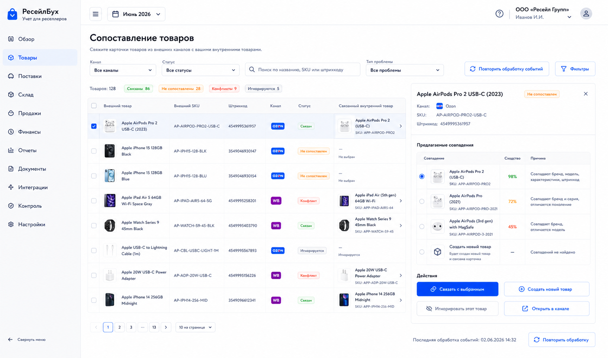
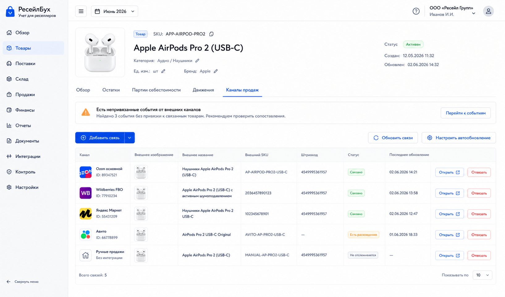

# Шаг 15. Связь Товаров С Внешними Карточками

## Цель

Научить систему связывать внутренние учетные товары с внешними карточками каналов продаж. Это отдельный шаг, потому что продажи, остатки и финансовые операции из маркетплейса нельзя корректно обработать, пока внешний SKU/barcode/offer не привязан к внутреннему товару.

## Пользовательский результат

Пользователь видит импортированные карточки канала, понимает какие уже связаны, какие требуют решения, и может:

- связать внешнюю карточку с существующим товаром;
- создать новый внутренний товар на основе внешней карточки;
- отвязать ошибочную связь;
- повторно обработать события, которые раньше не были сопоставлены.

## Frontend

### Экран `Сопоставление товаров`

Route: `/products/channel-mapping`.

Visible content:

- filter row: channel, status, search, problem type;
- left table of external products;
- right panel with suggested internal matches;
- action buttons near selected external card.

External product columns:

- external product image;
- external name;
- external offer id / SKU;
- barcode/article;
- channel;
- status: linked, unmatched, conflict, ignored;
- linked internal product thumbnail and SKU if exists.

Actions:

- `Связать`: opens product picker and creates link;
- `Создать товар`: opens product form prefilled from external data;
- `Игнорировать`: marks external card ignored for accounting processing;
- `Отвязать`: removes link after confirmation;
- `Повторить обработку событий`: requeues unresolved external events for selected card.

### Карточка товара -> `Каналы продаж`

Route: `/products/:id`, tab `Каналы продаж`.

Visible content:

- internal product identity with thumbnail/SKU/name;
- table of linked external cards;
- columns: channel, external image, external title, external SKU, barcode, status, last seen, actions;
- button `Добавить связь`.

Actions:

- `Добавить связь`: opens external card picker filtered by unmatched cards;
- `Открыть внешнюю карточку`: opens channel-provided URL if available;
- `Отвязать`: removes link but keeps external raw card.

## Backend

Modules:

- `external-products`;
- `product-channel-links`;
- `matching-suggestions`;
- `event-reprocessing`.

Endpoints:

- `GET /api/channels/:channelId/external-products`;
- `GET /api/products/channel-mapping`;
- `POST /api/products/:productId/external-links`;
- `DELETE /api/products/:productId/external-links/:linkId`;
- `POST /api/external-products/:id/create-internal-product`;
- `POST /api/external-products/:id/ignore`;
- `POST /api/external-products/:id/reprocess-events`.

Validation:

- external product belongs to organization through sales channel;
- internal product belongs to organization;
- one external product can link to only one internal product at a time;
- one internal product can link to many external products;
- duplicate link by `(channel_id, external_product_id)` is rejected;
- unlink is blocked if it would orphan posted accounting documents; allowed for future event processing only.

## БД

### `external_product`

- `id uuid primary key`;
- `organization_id uuid not null references organization(id)`;
- `sales_channel_id uuid not null references sales_channel(id)`;
- `external_id text not null`;
- `external_sku text`;
- `barcode text`;
- `title text not null`;
- `brand text`;
- `image_url text`;
- `raw_payload jsonb not null default '{}'`;
- `status text not null check (status in ('unmatched','linked','conflict','ignored'))`;
- `first_seen_at timestamptz not null default now()`;
- `last_seen_at timestamptz not null default now()`;

Indexes:

- unique `(sales_channel_id, external_id)`;
- index `(organization_id, status)`;
- index `(external_sku)`;
- index `(barcode)`.

### `product_external_link`

- `id uuid primary key`;
- `organization_id uuid not null references organization(id)`;
- `product_id uuid not null references product(id)`;
- `external_product_id uuid not null references external_product(id)`;
- `sales_channel_id uuid not null references sales_channel(id)`;
- `link_status text not null check (link_status in ('active','removed'))`;
- `created_by_user_id uuid`;
- `created_at timestamptz not null default now()`;
- `removed_at timestamptz`;
- `remove_reason text`;

Indexes:

- unique `(external_product_id) where link_status='active'`;
- index `(product_id, link_status)`;
- index `(sales_channel_id)`.

## Учетные правила

This step creates no journal entries.

Rules:

- mapping does not change inventory, money or settlements by itself;
- mapping changes how future external events are interpreted;
- raw external data is preserved even when link is removed;
- if posted accounting document already references a mapped sale, old document retains product identity used at posting time; correction workflow handles changes.

## Ошибки пользователя

- If external card is already linked, show current link and require unlink first.
- If two suggested internal products look similar, show conflict status rather than auto-linking.
- If user tries to unlink a card with posted sales, show `Есть проведенные документы. Новые события можно переназначить, но старые документы исправляются через корректировку`.
- If creating product from external card, required internal SKU/name/unit must be present or entered.

## Тесты

- Unit: suggestion scoring by SKU/barcode/title.
- Integration: link external product to internal product.
- Integration: create internal product from external card with image.
- Integration: unlink keeps raw external card and audit trail.
- Scenario: unmatched sale event becomes processable after product mapping and requeue.

## Definition of Done

- Пользователь can view unmatched external products.
- Link/unlink/create-from-external flows work and write audit events.
- Product card shows channel links.
- Mapping does not mutate accounting facts directly.
- Reprocess action queues unresolved events.
- Рендеры describe mapping table and product channel tab.

## Рендеры

### `renders/01-external-products-matching.png`

Scenario: после подключения канала пользователь видит импортированные карточки and links them to internal products.

Route: `/products/channel-mapping`.

Layout:

- sidebar active `Товары`;
- page title `Сопоставление товаров`;
- filter row;
- external products table on the left;
- selected card detail and suggested matches on the right.

Required visible UI:

- channel filter, status filter, search;
- rows with external image, title, external SKU, barcode, status;
- right panel with suggested internal products showing thumbnails, SKU, name, similarity reason;
- buttons `Связать`, `Создать товар`, `Игнорировать`, `Повторить обработку событий`.

Button behavior:

- `Связать` creates active `product_external_link`;
- `Создать товар` opens product form prefilled from external card;
- `Игнорировать` marks external card ignored;
- `Повторить обработку событий` calls reprocess endpoint for unresolved events tied to this external product.

Must not include:

- sales amounts;
- manual journal editing;
- marketplace-specific hardcoded account names.

### `renders/02-product-channel-links.png`

Scenario: пользователь открывает внутреннюю карточку товара and checks which external cards are attached.

Route: `/products/:id`, tab `Каналы продаж`.

Layout:

- product header with thumbnail, SKU, name;
- tabs with active `Каналы продаж`;
- linked external cards table;
- empty state if no links.

Required visible UI:

- table columns channel, external image, external title, external SKU, barcode, status, last seen;
- button `Добавить связь`;
- row actions `Открыть внешнюю карточку`, `Отвязать`;
- small warning if there are unresolved external events for this product.

Button behavior:

- `Добавить связь` opens picker with unmatched external cards;
- `Отвязать` asks confirmation and marks link removed;
- unresolved events badge opens sync inbox filtered by product.

Must not include:

- primary product edit form repeated inside this tab;
- procurement stock controls;
- decorative quick actions.
