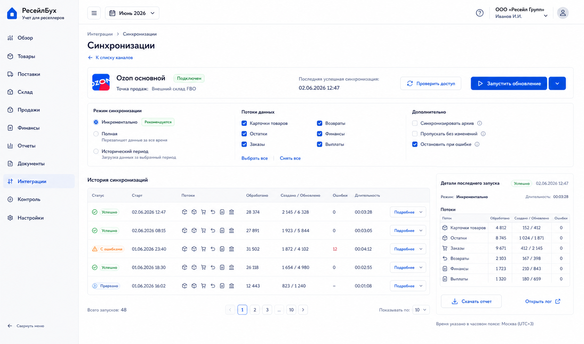
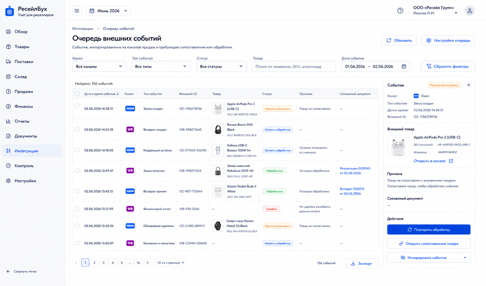

# Шаг 16. Синхронизация И Очередь Внешних Событий

## Цель

Добавить безопасный слой загрузки внешних данных: sync runs, raw events, observed stock and processing inbox. Внешний факт сначала сохраняется как наблюдение, а уже затем, если есть правила и сопоставление, превращается в учетный документ в следующих шагах.

Это следует AIS/audit trail из OpenStax: source document сохраняется до обработки, и от отчета можно вернуться к исходному внешнему событию.

## Пользовательский результат

Пользователь может запустить синхронизацию канала, увидеть сколько карточек/остатков/заказов/финансовых операций загружено, какие события обработались, а какие требуют действий.

## Frontend

### Экран `Синхронизации`

Route: `/integrations/channels/:id/sync`.

Visible content:

- channel header with status;
- button `Запустить обновление`;
- stream toggles: карточки, остатки, заказы, возвраты, финансы, выплаты;
- mode selector: incremental, full, backfill period;
- sync run history table;
- columns: start time, mode, streams, processed, created, skipped, errors, duration, status.

Actions:

- `Запустить обновление`: creates background sync run;
- `Остановить`: requests cancellation for running job;
- `Повторить`: starts run with same params;
- run row click opens run detail with per-stream metrics and errors.

### Экран `Очередь событий`

Route: `/integrations/inbox`.

Visible content:

- filters: channel, event type, status, product mapping, date;
- table of external events;
- columns: event time, channel, type, external id, product, status, reason, linked document;
- right detail panel with raw summary, not raw secret payload;
- buttons for reprocess and problem resolution.

Actions:

- `Повторить обработку`: requeues event;
- `Открыть сопоставление товара`: navigates to mapping filtered by external product;
- `Создать документ вручную`: available only for event types supported by later document flows;
- `Игнорировать`: marks event ignored with reason; does not delete raw payload.

## Backend

Modules:

- `sync-runs`;
- `external-events`;
- `observed-stock`;
- `event-processor`;
- `background-jobs`;
- `idempotency`.

Endpoints:

- `POST /api/integrations/channels/:id/sync-runs`;
- `GET /api/integrations/channels/:id/sync-runs`;
- `GET /api/integrations/sync-runs/:id`;
- `POST /api/integrations/sync-runs/:id/cancel`;
- `GET /api/integrations/events`;
- `GET /api/integrations/events/:id`;
- `POST /api/integrations/events/:id/reprocess`;
- `POST /api/integrations/events/:id/ignore`;
- `GET /api/integrations/observed-stock`.

Processing rules:

- raw payload is stored once by external id/idempotency key;
- event status starts as `new`;
- processor attempts to classify and map;
- if required product/channel mapping is missing, status becomes `needs_mapping`;
- if event can be materialized only after future steps, status remains `ready_for_processing`;
- processing attempts are stored with errors.

## БД

### `sync_run`

- `id uuid primary key`;
- `organization_id uuid not null references organization(id)`;
- `sales_channel_id uuid not null references sales_channel(id)`;
- `mode text not null check (mode in ('incremental','full','backfill'))`;
- `status text not null check (status in ('queued','running','completed','failed','cancelled'))`;
- `started_at timestamptz`;
- `finished_at timestamptz`;
- `requested_by_user_id uuid`;
- `params jsonb not null default '{}'`;
- `summary jsonb not null default '{}'`;
- `last_error text`.

### `sync_stream_run`

- `id uuid primary key`;
- `sync_run_id uuid not null references sync_run(id) on delete cascade`;
- `stream_code text not null`;
- `status text not null`;
- `processed_count int not null default 0`;
- `created_count int not null default 0`;
- `updated_count int not null default 0`;
- `skipped_count int not null default 0`;
- `error_count int not null default 0`;
- `started_at timestamptz`;
- `finished_at timestamptz`;

### `external_event`

- `id uuid primary key`;
- `organization_id uuid not null references organization(id)`;
- `sales_channel_id uuid not null references sales_channel(id)`;
- `sync_run_id uuid references sync_run(id)`;
- `event_type text not null`;
- `external_id text not null`;
- `event_time timestamptz`;
- `idempotency_key text not null`;
- `status text not null check (status in ('new','ready_for_processing','processed','needs_mapping','needs_attention','ignored','failed'))`;
- `raw_payload jsonb not null`;
- `normalized_payload jsonb not null default '{}'`;
- `linked_document_id uuid references document(id)`;
- `last_error text`;
- `created_at timestamptz not null default now()`;
- `updated_at timestamptz not null default now()`;

Indexes:

- unique `(sales_channel_id, idempotency_key)`;
- index `(organization_id, status)`;
- index `(event_type, event_time)`.

### `observed_stock`

- `id uuid primary key`;
- `organization_id uuid not null references organization(id)`;
- `sales_channel_id uuid not null references sales_channel(id)`;
- `external_product_id uuid references external_product(id)`;
- `product_id uuid references product(id)`;
- `warehouse_id uuid references warehouse(id)`;
- `location_status text not null default 'mapped' check (location_status in ('mapped','needs_location'))`;
- `observed_at timestamptz not null`;
- `qty_observed numeric(18,4) not null`;
- `raw_payload jsonb not null default '{}'`;
- unique `(sales_channel_id, external_product_id, warehouse_id, observed_at)`.

Warehouse mapping rule:

- if `sales_channel.sales_point_warehouse_id` is present, observed stock uses it as default `warehouse_id`;
- if the channel has no linked sales point yet, `warehouse_id` remains null and `location_status='needs_location'`;
- `needs_location` observed rows are visible in the inbox/reconciliation screens but cannot create inventory discrepancies until the user links the channel to a sales point.

## Учетные правила

This step creates no journal entries and no stock movements from observed data.

Rules:

- observed stock is not book stock;
- raw external event is source evidence, not yet an accounting document;
- idempotency prevents duplicate processing;
- accounting documents created later must link back to `external_event`.
- imported finance/sale/return/payout materializers must be one-to-one by `external_event.id`; reprocessing updates or reports the existing materialized record instead of creating duplicates.

## Ошибки пользователя

- Sync cannot start if channel is disabled or credentials invalid.
- Backfill period before accounting start date is allowed for reference, but materialization is blocked unless onboarding/backfill step handles it.
- Event with missing product mapping shows direct navigation to mapping screen.
- Ignore action requires reason.
- Raw payload display redacts secrets and personal data where possible.

## Тесты

- Unit: idempotency key generation.
- Integration: sync run creates stream runs and external events.
- Integration: repeated sync does not duplicate external events.
- Integration: observed stock does not create book stock.
- Scenario: unmatched event -> product mapping -> reprocess -> ready for sale materialization.

## Definition of Done

- Пользователь can run and inspect channel sync.
- Raw events and processing attempts are stored.
- Observed stock is visible but separate from accounting book stock.
- Unmatched events route user to product mapping.
- Idempotent sync prevents duplicates.
- Рендеры cover sync history and event inbox.

## Рендеры

### `renders/01-sync-runs.png`

Scenario: пользователь запускает обновление канала and checks stream results.

Route: `/integrations/channels/:id/sync`.

Layout:

- sidebar active `Интеграции`;
- channel header;
- controls row for mode and streams;
- sync runs table;
- right detail panel for selected run.

Required visible UI:

- button `Запустить обновление`;
- mode selector `Инкрементально`, `Полная`, `Исторический период`;
- stream checkboxes;
- table columns status, start time, streams, processed, created, errors, duration;
- run detail with per-stream counters.

Button behavior:

- `Запустить обновление` creates `sync_run` and job;
- `Остановить` appears only for running job;
- `Повторить` creates new run with same params;
- row click opens detail.

Must not include:

- accounting postings;
- sales margin cards;
- raw credentials.

### `renders/02-unmatched-events-inbox.png`

Scenario: часть событий не обработалась because product mapping is missing.

Route: `/integrations/inbox`.

Layout:

- filters on top;
- events table;
- right detail panel for selected event.

Required visible UI:

- filters channel/type/status/search;
- rows with statuses `нужно сопоставить`, `готово к обработке`, `обработано`, `ошибка`;
- detail panel with reason, external product preview, linked document if any;
- buttons `Повторить обработку`, `Открыть сопоставление товара`, `Игнорировать`.

Button behavior:

- `Открыть сопоставление товара` navigates to `/products/channel-mapping?externalProductId=...`;
- `Повторить обработку` calls event reprocess endpoint;
- `Игнорировать` asks reason and marks event ignored.

Must not include:

- editing raw JSON inline;
- technical stack status;
- duplicate global quick actions.
