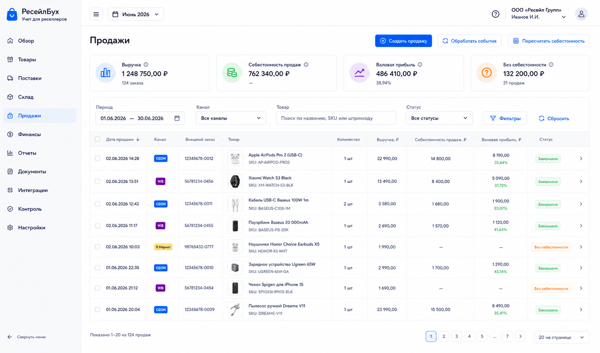
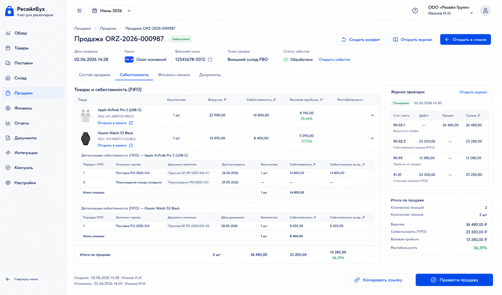

# Шаг 17. Продажи И Списание Себестоимости

## Цель

Добавить продажи как учетные документы, которые одновременно признают выручку и списывают себестоимость из FIFO-партий. Это ключевой perpetual inventory scenario from OpenStax: sale has two accounting effects, not one.

## Пользовательский результат

Пользователь видит список продаж из каналов или ручного ввода, открывает продажу и понимает:

- какая выручка признана;
- с какой точки продаж ушел товар;
- какие партии себестоимости списаны;
- есть ли проблемы с остатком;
- какая валовая прибыль до комиссий и логистики.

## Frontend

### Список `Продажи`

Route: `/sales`.

Visible content:

- filters: period, channel, product, status, cost status, return status;
- KPI strip: выручка, себестоимость продаж, валовая прибыль, продажи без себестоимости;
- sales table;
- columns: date, channel, external order, product thumbnail(s), qty, revenue, cost, gross profit, status, source.

Actions:

- `Создать продажу`: opens manual sale form;
- sale row click opens sale card;
- `Обработать события`: opens inbox filtered by sales events;
- `Пересчитать себестоимость`: queues recalculation for selected period/product.

### Карточка продажи

Route: `/sales/:id`.

Visible content:

- sale header: status, date, channel, external id, linked event/document;
- line table: product thumbnail, qty, sale price, revenue, warehouse/sales point, cost, gross profit;
- tab `Себестоимость`: FIFO lots consumed;
- tab `Финансы канала`: commissions/fees from later steps;
- tab `Документы`: source document, journal entry, external event.

Actions:

- `Провести`: for draft manual sales;
- `Отменить/сторнировать`: open-period reversal;
- `Создать возврат`: opens return form in step 18;
- `Открыть журнал`: opens journal entry;
- `Открыть событие`: opens external event detail.

## Backend

Modules:

- `sales`;
- `sale-materializer`;
- `fifo-consumption`;
- `profit-calculation`;
- `posting-rules/sale`.

Endpoints:

- `GET /api/sales`;
- `POST /api/sales`;
- `GET /api/sales/:id`;
- `PATCH /api/sales/:id`;
- `POST /api/sales/:id/post`;
- `POST /api/sales/:id/reverse`;
- `POST /api/integrations/events/:id/materialize-sale`;
- `GET /api/sales/:id/cost-applications`.

Validation:

- sale date in open period;
- each product is mapped and active;
- sale quantity `> 0`;
- source warehouse/sales point has enough available stock;
- cannot post duplicate external sale event;
- revenue amount `>= 0`;
- cost application must fully cover qty before posting; imported sale without stock remains `needs_attention`;
- sale from closed period requires correction workflow later.

## БД

### `sale`

- `id uuid primary key`;
- `organization_id uuid not null references organization(id)`;
- `document_id uuid not null references document(id)`;
- `sales_channel_id uuid references sales_channel(id)`;
- `external_event_id uuid references external_event(id)`;
- `sale_date date not null`;
- `external_order_id text`;
- `warehouse_id uuid not null references warehouse(id)`;
- `status text not null check (status in ('draft','posted','reversed','needs_attention'))`;
- `revenue_rub_total numeric(18,2) not null default 0`;
- `cost_rub_total numeric(18,2) not null default 0`;
- `gross_profit_rub numeric(18,2) not null default 0`;
- `created_at timestamptz not null default now()`;
- `updated_at timestamptz not null default now()`.

### `sale_line`

- `id uuid primary key`;
- `sale_id uuid not null references sale(id) on delete cascade`;
- `product_id uuid not null references product(id)`;
- `external_product_id uuid references external_product(id)`;
- `line_no int not null`;
- `qty numeric(18,4) not null check (qty > 0)`;
- `unit_price_rub numeric(18,2) not null default 0`;
- `revenue_rub numeric(18,2) not null default 0`;
- `cost_rub numeric(18,2) not null default 0`;
- `gross_profit_rub numeric(18,2) not null default 0`;
- unique `(sale_id, line_no)`.

### FIFO cost applications for sale

Sales do not create a separate physical FIFO table. Posting a sale writes rows into the universal `cost_application` table from step 7:

- `target_type='sale'`;
- `target_document_id = sale.document_id`;
- `target_line_type='sale_line'`;
- `target_line_id = sale_line.id`;
- `source_lot_id` points to the consumed inventory lot.

The backend may expose a read-only view `sale_cost_application_view` for sale screens and return workflows, but the source of truth remains `cost_application`.

## Учетные правила

Sale recognition:

```text
Дт 76.ТП Расчеты с точками продаж / 62 Дебиторская задолженность
Кт 90.01 Выручка
```

Cost recognition:

```text
Дт 90.02 Себестоимость продаж
Кт 41.03 Товары на точках продаж
```

Rules:

- sale consumes FIFO lots from sale location;
- sale stores exact lot applications in `cost_application`;
- revenue and cost are separate effects and both must be traceable;
- marketplace commission is not netted against revenue here; it is processed later as channel fee;
- if imported marketplace report provides net amount only, backend must normalize to gross revenue when possible or mark as needs attention.

## Ошибки пользователя

- If no stock at sales point, show `Недостаточно книжного остатка. Создайте перемещение, приемку или корректировку`.
- If product mapping missing, route to mapping screen.
- If sale duplicate external id, show existing sale link.
- If user changes sale date before lot receipt date, reject posting.
- If selected period is closed, show view-only and correction route.

## Тесты

- Unit: FIFO consumption across multiple lots.
- Integration: posted sale creates revenue and cost entries.
- Integration: stock and lot qty decrease after sale.
- Integration: imported sale event is idempotent.
- Scenario: sale from sales point after transfer.
- Scenario: missing stock blocks posting and leaves event in needs_attention.

## Definition of Done

- Пользователь can view, create and open sales.
- Sale posting recognizes revenue and себестоимость продаж.
- FIFO cost applications are persisted and visible.
- Imported sale events link to documents and remain idempotent.
- Sales list shows revenue, cost and gross profit.
- Рендеры cover list and sale card.

## Рендеры



### `renders/01-sales-list.png`

Scenario: пользователь проверяет продажи за рабочий период and sees whether all sales have cost.

Route: `/sales`.

Layout:

- sidebar active `Продажи`;
- topbar period selector;
- KPI strip;
- filters;
- sales table.

Required visible UI:

- KPIs `Выручка`, `Себестоимость продаж`, `Валовая прибыль`, `Без себестоимости`;
- filters period/channel/product/status;
- table columns date, channel, external order, product thumbnails, qty, revenue, cost, gross profit, status;
- buttons `Создать продажу`, `Обработать события`, `Пересчитать себестоимость`.

Button behavior:

- `Создать продажу` opens manual sale form;
- `Обработать события` opens inbox filtered by sale events;
- `Пересчитать себестоимость` queues recalculation job;
- row click opens sale card.

Must not include:

- netting marketplace fees into revenue;
- payout reconciliation;
- technical job health block.



### `renders/02-sale-card.png`

Scenario: пользователь открывает sale and verifies which lots created cost.

Route: `/sales/:id`.

Layout:

- sale header with status/date/channel/external id;
- line table;
- tabs `Себестоимость`, `Финансы канала`, `Документы`;
- right journal summary panel.

Required visible UI:

- product rows with thumbnails, qty, revenue, cost and gross profit;
- FIFO lot list in active `Себестоимость` tab;
- links to receipt/transfer source documents;
- buttons `Создать возврат`, `Открыть журнал`, `Открыть событие`.

Button behavior:

- `Создать возврат` opens `/sales/:id/returns/new`;
- `Открыть журнал` opens related journal entry;
- tab click changes visible details without navigating away;
- if sale is draft, `Провести` posts the sale.

Must not include:

- editable debit/credit lines;
- unrelated product master fields;
- duplicated KPI strip from list.
