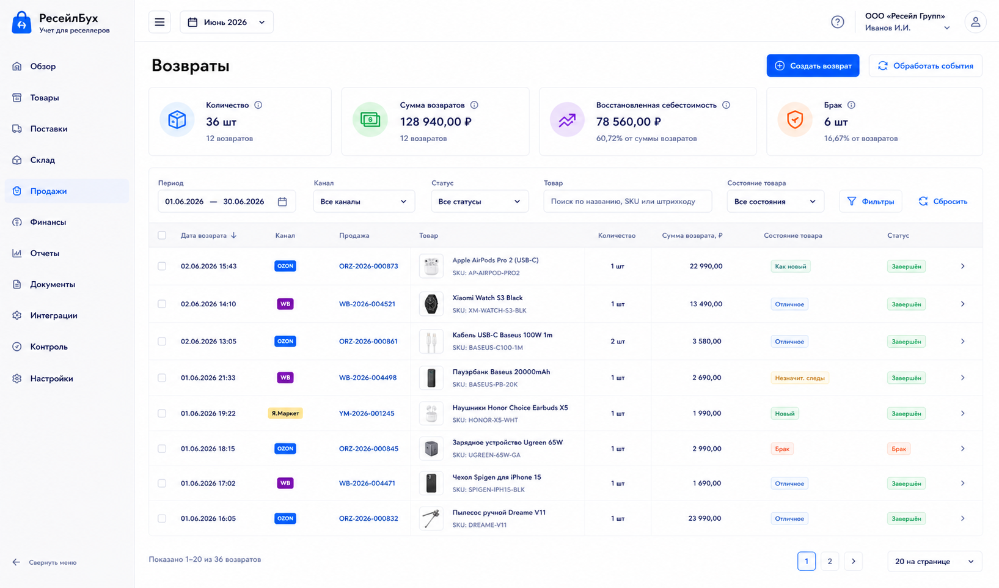
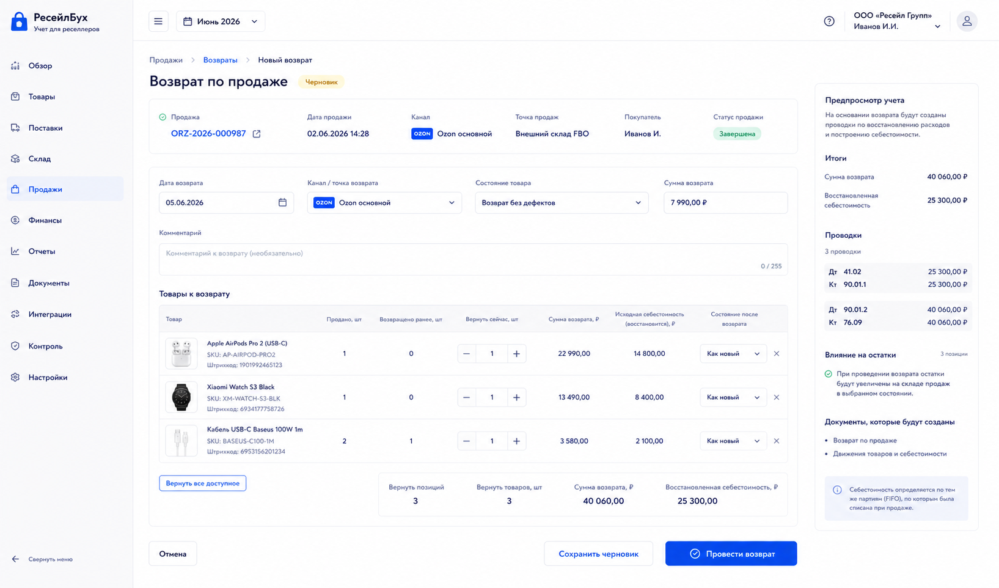

# Шаг 18. Возвраты И Состояния Возвращенного Товара

## Цель

Добавить возвраты покупателей/маркетплейса так, чтобы они восстанавливали себестоимость из исходной продажи, а не создавали новую случайную стоимость. Пользователь должен выбрать состояние товара: годен, на проверке, брак, потерян.

## Пользовательский результат

Пользователь видит список возвратов, создает возврат по продаже или получает его из канала, выбирает возвращаемые строки и состояние. После проведения:

- выручка уменьшается или создается обязательство перед каналом/покупателем;
- себестоимость продажи восстанавливается из исходных FIFO applications;
- товар возвращается на выбранную точку/склад и состояние;
- если товар бракованный, он не попадает в доступный к продаже остаток.

## Frontend

### Список `Возвраты`

Route: `/returns`.

Visible content:

- filters: period, channel, status, product, return state;
- KPI: returned qty, refund amount, restored cost, damaged qty;
- table: date, channel, sale, product thumbnails, qty, refund, state, status.

Actions:

- `Создать возврат`: opens sale picker first;
- row click opens return card;
- `Обработать события`: opens inbox filtered by return events.

### Форма `Возврат по продаже`

Route: `/sales/:saleId/returns/new`.

Fields:

- `Дата возврата`;
- `Канал/точка возврата`;
- `Состояние товара`: годен, на проверке, брак, потерян;
- `Сумма возврата RUB`;
- `Комментарий`.

Line table:

- product thumbnail;
- sold qty;
- already returned qty;
- return now qty;
- sale revenue to reverse;
- original cost to restore;
- target warehouse/state.

Buttons:

- `Сохранить черновик`;
- `Провести возврат`;
- `Отмена`;
- `Вернуть все доступное`.

## Backend

Modules:

- `returns`;
- `return-materializer`;
- `cost-restoration`;
- `posting-rules/return`;
- `stock-state-transitions`.

Endpoints:

- `GET /api/returns`;
- `POST /api/sales/:saleId/returns`;
- `GET /api/returns/:id`;
- `PATCH /api/returns/:id`;
- `POST /api/returns/:id/post`;
- `POST /api/returns/:id/reverse`;
- `POST /api/integrations/events/:id/materialize-return`.

Validation:

- original sale exists and is posted;
- return qty cannot exceed sold qty minus previous returns;
- return date belongs to open period;
- return date cannot be before sale date;
- target state is allowed;
- restored cost must come from original sale cost applications;
- duplicate external return event rejected by idempotency.

## БД

### `sales_return`

- `id uuid primary key`;
- `organization_id uuid not null references organization(id)`;
- `document_id uuid not null references document(id)`;
- `sale_id uuid not null references sale(id)`;
- `sales_channel_id uuid references sales_channel(id)`;
- `external_event_id uuid references external_event(id)`;
- `return_date date not null`;
- `warehouse_id uuid not null references warehouse(id)`;
- `stock_state_id uuid not null references stock_state(id)`;
- `status text not null check (status in ('draft','posted','reversed','needs_attention'))`;
- `refund_rub_total numeric(18,2) not null default 0`;
- `restored_cost_rub_total numeric(18,2) not null default 0`;
- `created_at timestamptz not null default now()`;
- `updated_at timestamptz not null default now()`.

### `sales_return_line`

- `id uuid primary key`;
- `sales_return_id uuid not null references sales_return(id) on delete cascade`;
- `sale_line_id uuid not null references sale_line(id)`;
- `product_id uuid not null references product(id)`;
- `qty numeric(18,4) not null check (qty > 0)`;
- `refund_rub numeric(18,2) not null default 0`;
- `restored_cost_rub numeric(18,2) not null default 0`;

### `return_cost_restoration`

- `id uuid primary key`;
- `sales_return_line_id uuid not null references sales_return_line(id) on delete cascade`;
- `original_cost_application_id uuid not null references cost_application(id)`;
- `inventory_lot_id uuid not null references inventory_lot(id)`;
- `qty_restored numeric(18,4) not null check (qty_restored > 0)`;
- `cost_rub numeric(18,2) not null check (cost_rub >= 0)`;

## Учетные правила

Refund/revenue reversal:

```text
Дт 90.01 Выручка / Возвраты продаж
Кт 76.ТП Расчеты с точками продаж
```

Cost restoration when goods return to saleable or inspection stock:

```text
Дт 41.* Товары
Кт 90.02 Себестоимость продаж
```

If item is damaged and immediately written off, create return to damaged state and later stock adjustment/write-off through inventory reconciliation step. Do not hide damage inside the return.

Rules:

- return cannot invent unit cost;
- return references original sale and original sale `cost_application` rows;
- returned goods may become available only if state is saleable;
- return from marketplace does not delete original sale.

## Ошибки пользователя

- If user tries to return more than sold, show remaining returnable qty.
- If original sale has missing cost, return cannot restore cost and status becomes needs_attention.
- If state `годен` is chosen for channel that requires inspection first, show policy warning.
- If period closed, direct posting disabled.

## Тесты

- Unit: returnable qty by sale line.
- Unit: proportional cost restoration from original applications.
- Integration: posted return reverses revenue and restores inventory cost.
- Integration: damaged return goes to non-saleable state.
- Scenario: sale of 10 units, return 3 units, later sale consumes restored lot correctly.

## Definition of Done

- Пользователь can create returns from sales.
- Imported return events can materialize idempotently.
- Return qty limits are enforced.
- Restored cost uses original sale cost.
- Product stock reflects selected return state.
- Рендеры cover returns list and return form.

## Рендеры



### `renders/01-returns-list.png`

Scenario: пользователь проверяет возвраты за месяц and sees damaged vs saleable returns.

Route: `/returns`.

Layout:

- sidebar active `Продажи`;
- page title `Возвраты`;
- KPI strip;
- filters;
- returns table.

Required visible UI:

- KPIs `Количество`, `Сумма возвратов`, `Восстановленная себестоимость`, `Брак`;
- table columns date, channel, sale, product thumbnails, qty, refund, state, status;
- buttons `Создать возврат`, `Обработать события`.

Button behavior:

- `Создать возврат` opens sale picker;
- `Обработать события` opens inbox filtered by returns;
- row click opens return card.

Must not include:

- marketplace payout reconciliation;
- procurement shortage controls;
- manual ledger editor.



### `renders/02-return-resolution-form.png`

Scenario: пользователь оформляет возврат по конкретной продаже and chooses return state.

Route: `/sales/:saleId/returns/new`.

Layout:

- sale context header;
- return header fields;
- line table;
- right summary with accounting preview.

Required visible UI:

- fields `Дата возврата`, `Канал/точка возврата`, `Состояние товара`, `Сумма возврата`, `Комментарий`;
- rows with product thumbnails, sold qty, already returned, return now, refund, original cost, target state;
- buttons `Вернуть все доступное`, `Сохранить черновик`, `Провести возврат`, `Отмена`.

Button behavior:

- `Вернуть все доступное` fills available return qty;
- qty edit recalculates refund/cost preview;
- `Провести возврат` posts entries and stock movement; success opens return card.

Must not include:

- changing original sale quantities;
- arbitrary cost input;
- duplicate period selector inside form.
