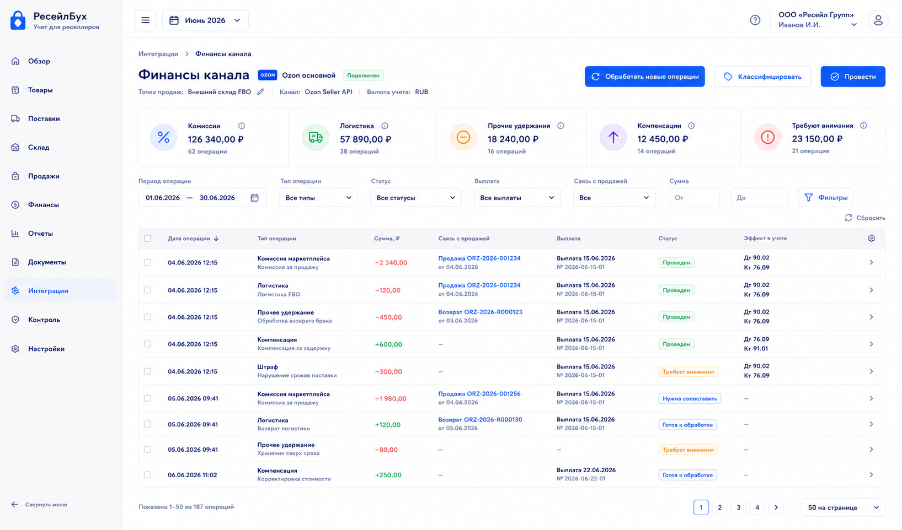
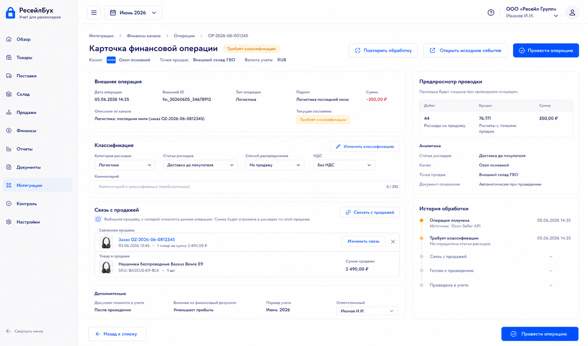

# Шаг 19. Комиссии, Логистика И Финансовые Операции Каналов

## Цель

Добавить учет финансовых операций канала продаж: комиссии маркетплейса, логистика до покупателя, обратная логистика, эквайринг, штрафы, компенсации, рекламные удержания и прочие начисления, которые приходят из отчетов канала.

Важно не занижать выручку на комиссии. В управленческом отчете пользователь должен видеть отдельно `выручку`, `себестоимость продаж`, `комиссии`, `логистику`, `прочие удержания` и прибыль.

## Пользовательский результат

Пользователь открывает финансовые операции канала, видит какие операции связаны с продажей/возвратом, какие не сопоставлены, и может вручную распределить или классифицировать операцию.

После проведения:

- комиссия уменьшает расчет с каналом;
- расход попадает в нужную статью;
- карточка продажи показывает полную маржинальность;
- несопоставленные операции остаются в очереди внимания.

## Frontend

### Экран `Финансы канала`

Route: `/integrations/channels/:id/finance`.

Visible content:

- filters: period, operation type, status, linked sale, payout;
- KPI: total commissions, logistics, other expenses, compensations, unmatched;
- finance event table;
- columns: date, type, external id, amount, linked sale/return, payout, status, accounting effect.

Actions:

- `Обработать новые операции`: materializes ready finance events;
- row click opens event card;
- `Классифицировать`: opens category selector;
- `Связать с продажей`: opens sale picker;
- `Провести`: posts classified event;
- `Игнорировать`: requires reason.

### Карточка финансовой операции

Route: `/integrations/finance-events/:id`.

Visible content:

- external event summary;
- normalized operation fields;
- classification block;
- link block: sale, return, payout, channel;
- accounting preview;
- history of processing attempts.

Actions:

- `Изменить классификацию`;
- `Связать с продажей`;
- `Провести операцию`;
- `Повторить обработку`;
- `Открыть исходное событие`.

## Backend

Modules:

- `channel-finance-events`;
- `finance-classification`;
- `sale-profit-details`;
- `posting-rules/channel-fee`;
- `event-materializer/finance`.

Endpoints:

- `GET /api/integrations/channels/:id/finance-events`;
- `GET /api/integrations/finance-events/:id`;
- `PATCH /api/integrations/finance-events/:id/classification`;
- `POST /api/integrations/finance-events/:id/link-sale`;
- `POST /api/integrations/finance-events/:id/post`;
- `POST /api/integrations/channels/:id/finance-events/process-ready`.

Validation:

- event belongs to organization;
- event is not posted twice;
- classification is allowed for operation type;
- sale link belongs to same channel unless explicitly allowed;
- amount sign is normalized: expenses positive in UI, credit/debit handled by backend;
- posting date in open period;
- compensation/income operations cannot be classified as selling expense.

## БД

### `channel_finance_event`

- `id uuid primary key`;
- `organization_id uuid not null references organization(id)`;
- `sales_channel_id uuid not null references sales_channel(id)`;
- `external_event_id uuid unique references external_event(id)`;
- `external_id text not null`;
- `operation_date date not null`;
- `operation_type text not null`;
- `category text not null check (category in ('commission','customer_logistics','return_logistics','acquiring','advertising','penalty','compensation','storage','other_expense','other_income','unclassified'))`;
- `amount_rub numeric(18,2) not null`;
- `linked_sale_id uuid references sale(id)`;
- `linked_return_id uuid references sales_return(id)`;
- `payout_id uuid`; -- FK to `payout(id)` is added in step 20, when `payout` exists
- `document_id uuid references document(id)`;
- `status text not null check (status in ('new','classified','posted','needs_attention','ignored','reversed'))`;
- `created_at timestamptz not null default now()`;
- `updated_at timestamptz not null default now()`;

Indexes:

- unique `(sales_channel_id, external_id)`;
- index `(organization_id, status)`;
- index `(linked_sale_id)`;
- index `(operation_date)`.

Source payload rule:

- imported finance events keep raw payload only in `external_event.raw_payload`;
- `channel_finance_event` stores normalized accounting fields and links back through `external_event_id`;
- manual finance events may have `external_event_id=null`, but imported events must have a unique `external_event_id`;
- reprocessing an external event must upsert by `external_event_id`, never create a duplicate finance event.
- `document_id` may be null while the normalized event is not yet classified or posted; posting creates or links a `document` and then requires `document_id`.

### `sale_profit_component`

- `id uuid primary key`;
- `organization_id uuid not null references organization(id)`;
- `sale_id uuid not null references sale(id)`;
- `source_document_id uuid references document(id)`;
- `component_type text not null check (component_type in ('revenue','sales_cost','commission','customer_logistics','return_logistics','acquiring','advertising','penalty','compensation','other'))`;
- `amount_rub numeric(18,2) not null`;
- `created_at timestamptz not null default now()`;

## Учетные правила

For marketplace commission/logistics deducted from channel settlement:

```text
Дт 44 Расходы на продажу
Кт 76.ТП Расчеты с точками продаж
```

For compensation from channel:

```text
Дт 76.ТП Расчеты с точками продаж
Кт 91.01 Прочие доходы
```

For penalties:

```text
Дт 91.02 Прочие расходы
Кт 76.ТП Расчеты с точками продаж
```

Rules:

- revenue remains gross; fees are separate expenses;
- event can be linked to sale for unit economics but posting can still exist without sale if report gives aggregate operation;
- operation must link to external event when imported;
- payout step later reconciles these operations with actual bank receipt.

## Ошибки пользователя

- If event has no classification, disable posting and show `Выберите статью операции`.
- If operation likely duplicates an existing posted event, show existing document link.
- If linked sale is returned/cancelled, show warning but allow if event date/source confirms.
- If channel settlement would become inconsistent, mark for payout reconciliation.
- If period closed, route through correction.

## Тесты

- Unit: sign normalization by operation category.
- Integration: commission posting credits channel settlement and debits selling expense.
- Integration: compensation posting increases channel settlement.
- Integration: linked sale profit components update sale margin.
- Scenario: sale -> commission -> logistics -> sale card margin updated.
- Scenario: unclassified event remains needs_attention.

## Definition of Done

- Пользователь can inspect, classify and post channel finance events.
- Posted events create balanced journal entries.
- Sale card shows linked fees/logistics in profitability.
- Imported events are idempotent and linked to source external events.
- Gross revenue is not netted by fees.
- Рендеры cover finance events list and event card.

## Рендеры



### `renders/01-marketplace-finance-events.png`

Scenario: пользователь смотрит удержания маркетплейса for the selected period.

Route: `/integrations/channels/:id/finance`.

Layout:

- sidebar active `Интеграции`;
- channel header;
- KPI strip by operation categories;
- filters;
- finance events table.

Required visible UI:

- KPIs `Комиссии`, `Логистика`, `Прочие удержания`, `Компенсации`, `Требуют внимания`;
- table columns date, operation type, amount, sale link, payout, status, effect;
- buttons `Обработать новые операции`, `Классифицировать`, `Провести`.

Button behavior:

- `Обработать новые операции` materializes ready events;
- row click opens right detail panel;
- `Классифицировать` opens category menu;
- `Провести` posts selected classified event.

Must not include:

- bank payout reconciliation;
- editing gross sale revenue;
- technical raw JSON as main content.



### `renders/02-fee-allocation-card.png`

Scenario: imported logistics fee is not linked to a sale and user manually attaches it.

Route: `/integrations/finance-events/:id`.

Layout:

- operation header;
- classification section;
- link section;
- accounting preview;
- processing history.

Required visible UI:

- fields operation date, external id, amount, current category;
- sale link picker with product thumbnail and order id;
- accounting preview with debit expense and credit channel settlement;
- buttons `Изменить классификацию`, `Связать с продажей`, `Провести операцию`, `Повторить обработку`.

Button behavior:

- classification change updates preview;
- sale link picker calls link endpoint;
- `Провести операцию` posts document and navigates back to finance list;
- `Повторить обработку` re-runs materializer from raw event.

Must not include:

- payout bank receipt;
- manual debit/credit editing;
- unrelated product form.
