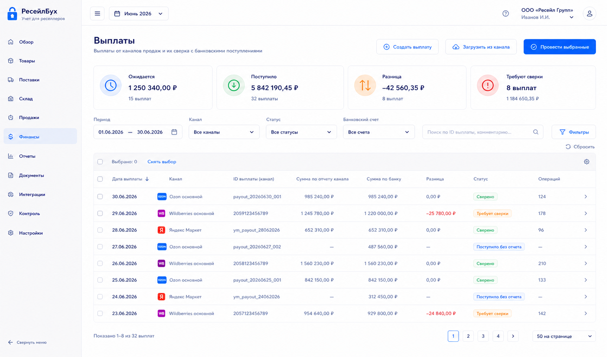
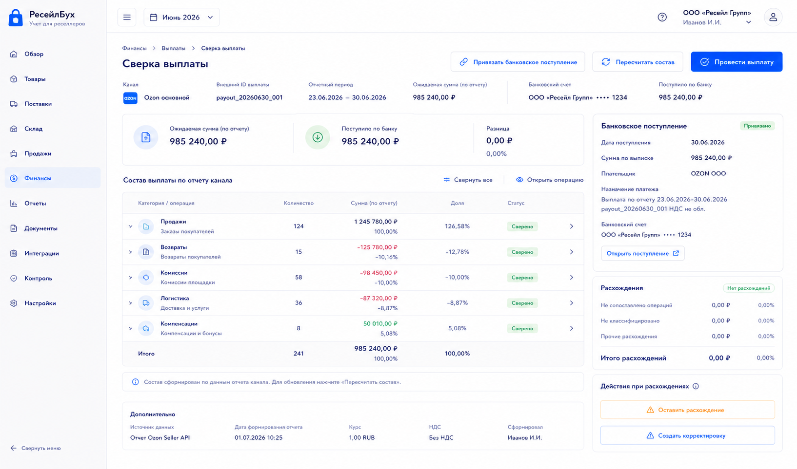

# Шаг 20. Выплаты Каналов И Сверка Клиринга

## Цель

Добавить выплаты маркетплейсов/каналов и сверку клирингового остатка: продажи и комиссии накапливаются на счете расчетов с каналом, а выплата переносит деньги на банковский счет.

Пользователь должен понимать, почему маркетплейс перечислил именно эту сумму: какие продажи, возвраты, комиссии, логистика и прочие операции вошли в выплату.

## Пользовательский результат

Пользователь видит выплаты, открывает выплату, сравнивает сумму отчета канала с фактическим банковским поступлением и закрывает расхождения.

После проведения:

- деньги на расчетном счете увеличиваются;
- задолженность/клиринг канала уменьшается;
- состав выплаты связан с внешними финансовыми операциями;
- расхождения остаются в статусе `требует сверки`, а не теряются.

## Frontend

### Список `Выплаты`

Route: `/finance/payouts`.

Visible content:

- filters: period, channel, status, bank account;
- KPI: expected payouts, received, difference, unreconciled;
- table: payout date, channel, report amount, bank amount, difference, status, operations count.

Actions:

- `Создать выплату`: manual payout form;
- `Загрузить из канала`: launches payout sync for selected channel;
- row click opens reconciliation page;
- `Провести выбранные`: posts validated payouts.

### Экран `Сверка выплаты`

Route: `/finance/payouts/:id/reconciliation`.

Visible content:

- payout header: channel, external payout id, report period, expected amount, bank account, received amount;
- reconciliation summary;
- operations table grouped by sales, returns, commissions, logistics, penalties, compensations;
- bank receipt block;
- discrepancy block.

Actions:

- `Привязать банковское поступление`: opens payment picker or creates incoming payment;
- `Пересчитать состав`: recalculates expected payout from included operations;
- `Провести выплату`: posts bank receipt and clears channel settlement;
- `Оставить расхождение`: creates unresolved reconciliation item with reason;
- `Открыть операцию`: navigates to finance event/sale/return.

## Backend

Modules:

- `payouts`;
- `payout-reconciliation`;
- `bank-payments`;
- `posting-rules/channel-payout`;
- `settlement-reports`.

Endpoints:

- `GET /api/finance/payouts`;
- `POST /api/finance/payouts`;
- `GET /api/finance/payouts/:id`;
- `POST /api/finance/payouts/:id/link-bank-payment`;
- `POST /api/finance/payouts/:id/recalculate`;
- `POST /api/finance/payouts/:id/post`;
- `POST /api/finance/payouts/:id/leave-difference`;

Validation:

- payout belongs to organization/channel;
- payout amount can be reconciled to included posted/unposted finance events;
- bank payment date in open period;
- bank account currency RUB for initial implementation;
- cannot post payout twice;
- difference over tolerance requires reason;
- linked operations cannot be included in two posted payouts.

## БД

### `payout`

- `id uuid primary key`;
- `organization_id uuid not null references organization(id)`;
- `document_id uuid not null references document(id)`;
- `sales_channel_id uuid not null references sales_channel(id)`;
- `external_event_id uuid unique references external_event(id)`;
- `external_payout_id text`;
- `payout_date date not null`;
- `period_from date`;
- `period_to date`;
- `expected_amount_rub numeric(18,2) not null default 0`;
- `bank_amount_rub numeric(18,2) not null default 0`;
- `difference_rub numeric(18,2) not null default 0`;
- `cash_account_id uuid references cash_account(id)`;
- `payment_id uuid references payment(id)`;
- `status text not null check (status in ('draft','ready','posted','needs_reconciliation','reversed'))`;
- `created_at timestamptz not null default now()`;
- `updated_at timestamptz not null default now()`.

`document_id` is created together with the payout draft. A payout may be unposted, but it is still a source document. Posting creates journal entries and may create/link the incoming `payment`.

Step 20 migration also upgrades step 19:

```sql
ALTER TABLE channel_finance_event
  ADD CONSTRAINT channel_finance_event_payout_fk
  FOREIGN KEY (payout_id) REFERENCES payout(id);
```

### `payout_line`

- `id uuid primary key`;
- `payout_id uuid not null references payout(id) on delete cascade`;
- `source_type text not null check (source_type in ('sale','return','finance_event','manual_adjustment'))`;
- `source_id uuid not null`;
- `amount_rub numeric(18,2) not null`;
- `line_group text not null`;

### `reconciliation_item`

- `id uuid primary key`;
- `organization_id uuid not null references organization(id)`;
- `source_type text not null`;
- `source_id uuid not null`;
- `reconciliation_type text not null check (reconciliation_type in ('payout_difference','bank_difference','missing_operation'))`;
- `amount_rub numeric(18,2) not null`;
- `status text not null check (status in ('open','resolved','ignored'))`;
- `reason text`;
- `created_at timestamptz not null default now()`.

## Учетные правила

Bank receipt of payout:

```text
Дт 51 Расчетный счет
Кт 76.ТП Расчеты с точками продаж
```

The linked money movement is `payment.payment_direction='incoming'` and `payment.payment_type='channel_payout'`.

Rules:

- payout does not create revenue again; revenue was recognized by sale documents;
- payout clears channel settlement after fees/returns/compensations are posted;
- payout difference is not silently expensed; it becomes reconciliation item until classified;
- bank receipt is a money document and must link to cash account.

## Ошибки пользователя

- If payout amount differs from included operations, show difference and disable posting until reason/action selected.
- If bank payment already linked to another payout, block.
- If operation is included in another posted payout, show duplicate error.
- If channel finance events are unprocessed, show count and button to open finance events.
- If period closed, payout posting disabled.

## Тесты

- Unit: payout expected amount from lines.
- Integration: posted payout debits cash and credits channel settlement.
- Integration: payout lines cannot be double-used.
- Scenario: sales + commissions + payout -> channel settlement clears.
- Scenario: payout with difference creates reconciliation item.

## Definition of Done

- Пользователь can view and reconcile payouts.
- Payout posting creates bank receipt and settlement journal entry.
- Payout lines connect to sales/returns/finance events.
- Differences are explicit and reviewable.
- No duplicate revenue recognition occurs.
- Рендеры cover payouts list and reconciliation page.

## Рендеры



### `renders/01-payouts-list.png`

Scenario: пользователь смотрит выплаты каналов за месяц and sees unreconciled differences.

Route: `/finance/payouts`.

Layout:

- sidebar active `Финансы`;
- KPI strip;
- filters;
- payouts table.

Required visible UI:

- KPIs `Ожидается`, `Поступило`, `Разница`, `Требуют сверки`;
- table columns date, channel, report amount, bank amount, difference, status, operations count;
- buttons `Создать выплату`, `Загрузить из канала`, `Провести выбранные`.

Button behavior:

- `Создать выплату` opens manual payout form;
- `Загрузить из канала` starts sync for payouts;
- row click opens reconciliation;
- `Провести выбранные` posts only ready payouts.

Must not include:

- sale-level editing;
- raw credential fields;
- unrelated procurement payments.



### `renders/02-payout-reconciliation.png`

Scenario: пользователь сверяет отчет маркетплейса with actual bank receipt.

Route: `/finance/payouts/:id/reconciliation`.

Layout:

- payout header;
- summary comparison panel;
- operations table grouped by category;
- bank receipt panel;
- discrepancy panel.

Required visible UI:

- expected amount, bank amount, difference;
- operations groups sales, returns, commissions, logistics, compensations;
- button `Привязать банковское поступление`;
- button `Пересчитать состав`;
- button `Провести выплату`;
- if difference exists, field `Причина расхождения` and button `Оставить расхождение`.

Button behavior:

- `Привязать банковское поступление` opens payment picker/create form;
- `Пересчитать состав` calls recalculate endpoint;
- `Провести выплату` posts payout if reconciled;
- operation row click opens source document/event.

Must not include:

- manual journal editor;
- duplicate KPI from list;
- generic quick actions.
