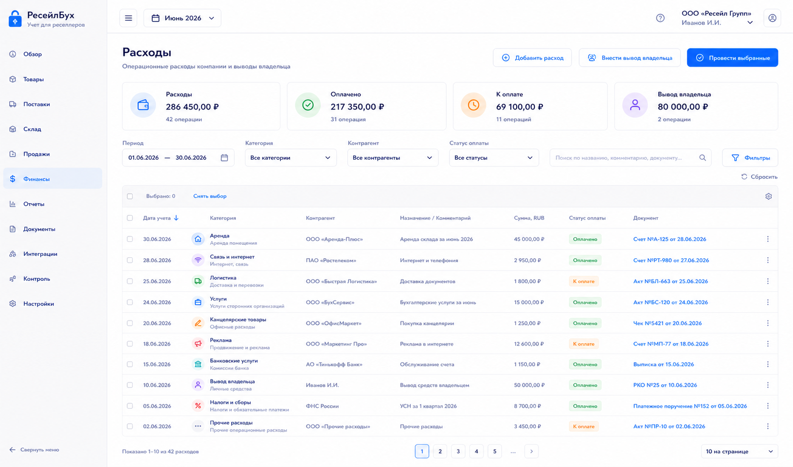
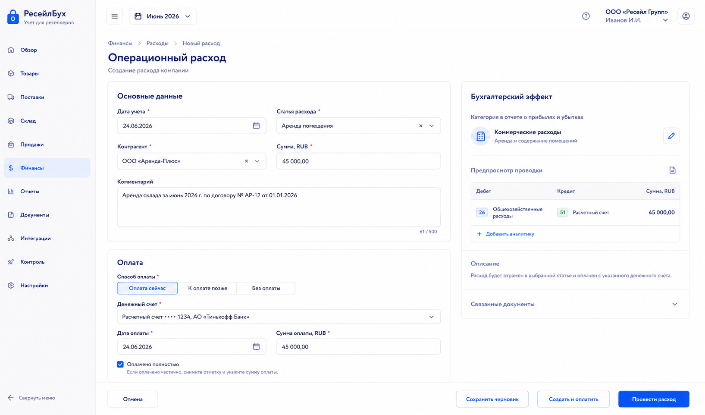

# Шаг 21. Операционные Расходы И Прочие Денежные Операции

## Цель

Добавить расходы, не связанные напрямую с себестоимостью конкретной поставки или продажей: зарплата, аренда, сервисы, связь, офис, бухгалтерия, прочие управленческие расходы, а также вывод средств владельцем.

Пользователь должен фиксировать такие операции документально, чтобы P&L, cash flow и баланс строились из системы, а не из отдельной таблицы.

## Пользовательский результат

Пользователь открывает `Расходы`, создает расход, выбирает статью, контрагента, способ оплаты и видит проводку. Расход может быть оплачен сразу или остаться задолженностью.

## Frontend

### Список `Расходы`

Route: `/finance/expenses`.

Visible content:

- filters: period, category, counterparty, payment status;
- KPI: total expenses, paid, unpaid, owner withdrawals;
- expenses table;
- columns: date, category, counterparty, amount, payment status, document, accounting effect.

Actions:

- `Добавить расход`: opens form;
- `Внести вывод владельца`: opens owner withdrawal form;
- row click opens expense card;
- `Провести выбранные`: posts ready draft expenses.

### Форма `Операционный расход`

Route: `/finance/expenses/new`.

Fields:

- `Дата учета`;
- `Статья`: зарплата, аренда, услуги, реклама вне маркетплейса, связь, офис, прочее;
- `Контрагент`;
- `Сумма RUB`;
- `Оплата`: оплачено сейчас, оплатить позже;
- `Денежный счет` if paid now;
- `Комментарий`;
- optional attachment placeholder.

Buttons:

- `Сохранить черновик`;
- `Провести расход`;
- `Создать и оплатить`;
- `Отмена`.

## Backend

Modules:

- `operating-expenses`;
- `expense-categories`;
- `payments`;
- `posting-rules/operating-expense`;
- `owner-transactions`.

Endpoints:

- `GET /api/finance/expenses`;
- `POST /api/finance/expenses`;
- `GET /api/finance/expenses/:id`;
- `PATCH /api/finance/expenses/:id`;
- `POST /api/finance/expenses/:id/post`;
- `POST /api/finance/owner-withdrawals`;

Validation:

- amount `> 0`;
- category exists and is active;
- accounting date in open period;
- cash account required for paid-now;
- unpaid expense requires counterparty if payable tracking is enabled;
- owner withdrawal is not expense in P&L; it reduces owner capital/equity.

## БД

### `expense_category`

- `id uuid primary key`;
- `organization_id uuid references organization(id)`;
- `code text not null`;
- `name text not null`;
- `default_account_code text not null`;
- `is_system boolean not null default false`;
- `is_active boolean not null default true`;
- unique `(organization_id, code)`.

### `operating_expense`

- `id uuid primary key`;
- `organization_id uuid not null references organization(id)`;
- `document_id uuid not null references document(id)`;
- `expense_date date not null`;
- `category_id uuid not null references expense_category(id)`;
- `counterparty_id uuid references counterparty(id)`;
- `amount_rub numeric(18,2) not null check (amount_rub > 0)`;
- `payment_mode text not null check (payment_mode in ('paid_now','pay_later'))`;
- `cash_account_id uuid references cash_account(id)`;
- `payment_id uuid references payment(id)`;
- `status text not null check (status in ('draft','posted','reversed'))`;
- `comment text`;
- `created_at timestamptz not null default now()`;
- `updated_at timestamptz not null default now()`.

### `owner_transaction`

- `id uuid primary key`;
- `organization_id uuid not null references organization(id)`;
- `document_id uuid not null references document(id)`;
- `transaction_date date not null`;
- `transaction_type text not null check (transaction_type in ('contribution','withdrawal'))`;
- `cash_account_id uuid not null references cash_account(id)`;
- `amount_rub numeric(18,2) not null check (amount_rub > 0)`;
- `status text not null check (status in ('draft','posted','reversed'))`;
- `comment text`;

## Учетные правила

Paid operating expense:

```text
Дт 26 / 44 / 91.02 Расход
Кт 51 Расчетный счет
```

Unpaid operating expense:

```text
Дт 26 / 44 / 91.02 Расход
Кт 60.01 / 76 Задолженность контрагенту
```

Owner withdrawal:

```text
Дт 80.02 Изъятия владельца
Кт 51 Расчетный счет
```

Payment usage:

- paid operating expense creates or links `payment.payment_direction='outgoing'` and `payment.payment_type='operating_expense_payment'`;
- owner withdrawal creates or links `payment.payment_direction='outgoing'` and `payment.payment_type='owner_withdrawal'`;
- neither workflow uses negative payment amounts.

Rules:

- owner withdrawal is not a business expense and must not reduce operating profit;
- procurement-related delivery/packaging before sale readiness belongs to step 11, not here;
- marketplace selling fees belong to step 19;
- all cash movement must use `payment`/cash account.

## Ошибки пользователя

- If category is procurement-capitalized, show link to `Дополнительный расход поставки`.
- If user marks paid now without cash account, require account.
- If cash account has insufficient balance, warn but allow according to policy if negative balance is enabled; otherwise block.
- If owner withdrawal selected in expense form, route to owner transaction and explain it is not P&L expense.

## Тесты

- Unit: category account mapping.
- Integration: paid expense creates document, payment and journal.
- Integration: unpaid expense creates payable settlement.
- Integration: owner withdrawal affects equity, not expenses.
- Scenario: monthly salary and rent appear in P&L and cash flow.

## Definition of Done

- Пользователь can create and post operating expenses.
- Paid-now and pay-later modes work.
- Owner withdrawal is supported separately from expenses.
- Expense categories map to accounts and reports.
- Documents, payments, settlements and audit links are preserved.
- Рендеры cover expense list and form.

## Рендеры



### `renders/01-expenses-list.png`

Scenario: пользователь смотрит расходы месяца and separates paid/unpaid expenses.

Route: `/finance/expenses`.

Layout:

- sidebar active `Финансы`;
- page title `Расходы`;
- KPI strip;
- filters;
- expenses table.

Required visible UI:

- KPIs `Расходы`, `Оплачено`, `К оплате`, `Вывод владельца`;
- filters period/category/counterparty/payment status;
- buttons `Добавить расход`, `Внести вывод владельца`, `Провести выбранные`;
- table columns date, category, counterparty, amount, payment status, document.

Button behavior:

- `Добавить расход` opens form;
- `Внести вывод владельца` opens owner withdrawal form;
- row click opens expense card;
- `Провести выбранные` posts checked drafts.

Must not include:

- marketplace commission events;
- procurement cost allocation;
- technical payment gateway status.



### `renders/02-expense-form.png`

Scenario: пользователь records salary or rent expense and pays it from bank account.

Route: `/finance/expenses/new`.

Layout:

- form section for expense fields;
- payment section;
- right accounting preview panel.

Required visible UI:

- fields `Дата учета`, `Статья`, `Контрагент`, `Сумма RUB`, `Оплата`, `Денежный счет`, `Комментарий`;
- buttons `Сохранить черновик`, `Провести расход`, `Создать и оплатить`, `Отмена`;
- right panel with P&L category and journal preview.

Button behavior:

- changing category updates account preview;
- `Создать и оплатить` creates expense and payment in one transaction;
- `Провести расход` posts without payment if pay-later selected;
- validation errors shown inline.

Must not include:

- product rows;
- external channel selectors unless category requires them;
- duplicate quick action panel.
