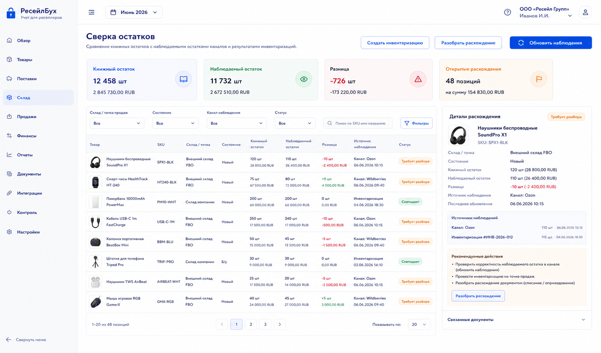
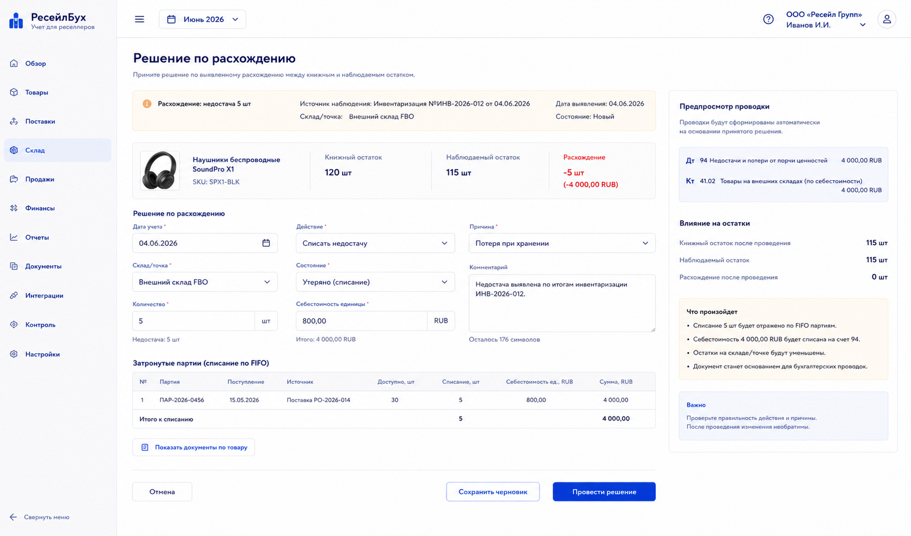

# Шаг 22. Инвентаризация И Сверка Остатков

## Цель

Добавить контроль фактических остатков: ручная инвентаризация, сравнение книжного остатка с наблюдаемым остатком канала и документальное закрытие расхождений.

OpenStax подчеркивает, что ошибки запасов искажают и прибыль, и баланс. Поэтому расхождение нельзя исправлять прямым редактированием остатка; нужен документ: списание, оприходование или перевод состояния.

## Пользовательский результат

Пользователь видит расхождения, открывает карточку расхождения, выбирает действие и получает учетный документ:

- списать недостачу;
- оприходовать излишек;
- перевести товар в другое состояние;
- игнорировать наблюдение;
- оставить на проверке.

## Frontend

### Экран `Сверка остатков`

Route: `/inventory/reconciliation`.

Visible content:

- filters: date, warehouse/sales point, product, source, status;
- summary: book qty, observed qty, difference qty, difference cost, open discrepancies;
- discrepancy table;
- columns: product thumbnail, SKU, warehouse, state, book qty, observed qty, diff, cost impact, source, status.

Actions:

- `Создать инвентаризацию`: opens stocktake form;
- `Разобрать расхождение`: opens resolution form for selected row;
- `Обновить наблюдения`: starts stock sync if source is channel;
- `Игнорировать`: requires reason and expiry date.

### Форма `Решение по расхождению`

Route: `/inventory/reconciliation/:id/resolve`.

Fields:

- `Дата учета`;
- `Действие`: списание, оприходование, перевод состояния, игнорировать;
- `Склад/точка`;
- `Состояние`;
- `Количество`;
- `Себестоимость единицы` for positive surplus;
- `Причина`;
- `Комментарий`.

Buttons:

- `Сохранить черновик`;
- `Провести решение`;
- `Отмена`;
- `Показать документы по товару`.

## Backend

Modules:

- `inventory-reconciliation`;
- `stocktake`;
- `stock-adjustments`;
- `observed-vs-book`;
- `posting-rules/stock-adjustment`.

Endpoints:

- `GET /api/inventory/reconciliation`;
- `POST /api/inventory/stocktakes`;
- `GET /api/inventory/stocktakes/:id`;
- `POST /api/inventory/reconciliation/:id/resolve`;
- `POST /api/inventory/adjustments/:id/post`;
- `POST /api/inventory/reconciliation/:id/ignore`.

Validation:

- adjustment date in open period;
- write-off qty cannot exceed available book qty unless policy allows negative correction with warning;
- surplus requires unit cost RUB;
- state transfer requires valid source and target states;
- observed stock source is immutable; resolution creates separate accounting document;
- duplicate resolution for same discrepancy blocked.

## БД

### `stocktake`

- `id uuid primary key`;
- `organization_id uuid not null references organization(id)`;
- `document_id uuid not null references document(id)`;
- `stocktake_date date not null`;
- `warehouse_id uuid not null references warehouse(id)`;
- `status text not null check (status in ('draft','completed','cancelled'))`;
- `comment text`;

### `stocktake_line`

- `id uuid primary key`;
- `stocktake_id uuid not null references stocktake(id) on delete cascade`;
- `product_id uuid not null references product(id)`;
- `stock_state_id uuid not null references stock_state(id)`;
- `book_qty numeric(18,4) not null`;
- `counted_qty numeric(18,4) not null`;
- `difference_qty numeric(18,4) not null`;

### `inventory_discrepancy`

- `id uuid primary key`;
- `organization_id uuid not null references organization(id)`;
- `source_type text not null check (source_type in ('stocktake','observed_stock','manual'))`;
- `source_id uuid not null`;
- `product_id uuid not null references product(id)`;
- `warehouse_id uuid not null references warehouse(id)`;
- `stock_state_id uuid references stock_state(id)`;
- `book_qty numeric(18,4) not null`;
- `observed_qty numeric(18,4) not null`;
- `difference_qty numeric(18,4) not null`;
- `status text not null check (status in ('open','resolved','ignored'))`;
- `created_at timestamptz not null default now()`;

### `stock_adjustment`

- `id uuid primary key`;
- `organization_id uuid not null references organization(id)`;
- `document_id uuid not null references document(id)`;
- `inventory_discrepancy_id uuid references inventory_discrepancy(id)`;
- `adjustment_date date not null`;
- `adjustment_type text not null check (adjustment_type in ('write_off','surplus','state_transfer'))`;
- `status text not null check (status in ('draft','posted','reversed'))`;
- `reason text not null`;
- `comment text`;

### `stock_adjustment_line`

- `id uuid primary key`;
- `stock_adjustment_id uuid not null references stock_adjustment(id) on delete cascade`;
- `product_id uuid not null references product(id)`;
- `warehouse_id uuid not null references warehouse(id)`;
- `from_stock_state_id uuid references stock_state(id)`;
- `to_stock_state_id uuid references stock_state(id)`;
- `qty numeric(18,4) not null check (qty > 0)`;
- `unit_cost_rub numeric(18,6)`;
- `total_cost_rub numeric(18,2) not null default 0`;

## Учетные правила

Write-off shortage:

```text
Дт 94 Недостачи и потери / 91.02 Прочие расходы
Кт 41.* Товары
```

Surplus recognition:

```text
Дт 41.* Товары
Кт 91.01 Прочие доходы
```

State transfer:

```text
No P&L effect unless account/subaccount changes; stock state and lot availability change.
```

Rules:

- stocktake does not change stock by itself;
- resolution document changes stock;
- observed stock is never booked automatically;
- write-off consumes FIFO lots and records cost applications;
- surplus creates new inventory lot with user-provided or policy-derived cost.

## Ошибки пользователя

- If surplus has no unit cost, block posting.
- If write-off exceeds available stock, show available lots.
- If user tries to edit book qty directly, explain that adjustment document is required.
- If discrepancy already resolved, show linked document.
- If marketplace observation is stale, show observed timestamp and warn before resolving.

## Тесты

- Unit: discrepancy calculation.
- Integration: stocktake creates discrepancies but no stock movement.
- Integration: write-off reduces stock and posts loss.
- Integration: surplus creates lot and posts income.
- Scenario: observed stock differs from book -> resolution -> discrepancy closed.

## Definition of Done

- Пользователь can view book-vs-observed discrepancies.
- Stocktake creates discrepancies without direct stock mutation.
- Resolution creates explicit stock adjustment document.
- Write-off, surplus and state transfer are supported.
- Discrepancies link to source observations and resulting documents.
- Рендеры cover reconciliation list and resolution form.

## Рендеры



### `renders/01-inventory-reconciliation.png`

Scenario: пользователь compares book stock with observed channel stock and stocktake results.

Route: `/inventory/reconciliation`.

Layout:

- sidebar active `Склад`;
- summary strip;
- filters;
- discrepancy table;
- right detail panel.

Required visible UI:

- summary values book qty, observed qty, difference, open discrepancies;
- columns product thumbnail, SKU, warehouse, state, book qty, observed qty, diff, source, status;
- buttons `Создать инвентаризацию`, `Разобрать расхождение`, `Обновить наблюдения`.

Button behavior:

- `Создать инвентаризацию` opens stocktake form;
- `Разобрать расхождение` opens resolution form for selected row;
- `Обновить наблюдения` starts stock sync for selected channel;
- row click opens detail panel with source documents.

Must not include:

- automatic one-click stock mutation without document;
- sales profit cards;
- raw marketplace credentials.



### `renders/02-stock-adjustment-form.png`

Scenario: пользователь списывает недостачу or оприходует излишек from a discrepancy.

Route: `/inventory/reconciliation/:id/resolve`.

Layout:

- discrepancy context header;
- action form;
- affected product/lot table;
- right accounting preview.

Required visible UI:

- fields `Дата учета`, `Действие`, `Склад/точка`, `Состояние`, `Количество`, `Себестоимость единицы`, `Причина`, `Комментарий`;
- selected product thumbnail and SKU;
- source observation/book quantities;
- buttons `Показать документы по товару`, `Сохранить черновик`, `Провести решение`, `Отмена`.

Button behavior:

- action change toggles required unit cost field;
- `Показать документы по товару` opens movement history side panel;
- `Провести решение` posts stock adjustment and closes discrepancy;
- validation errors block posting.

Must not include:

- editing source observed stock;
- manual debit/credit grid;
- duplicate stock summary from list unless used as context.
