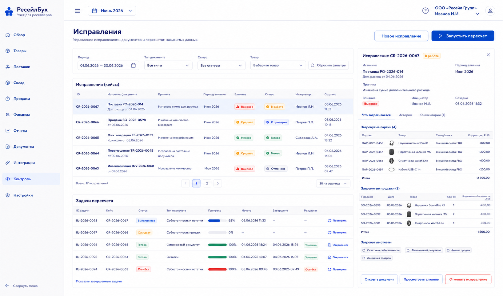
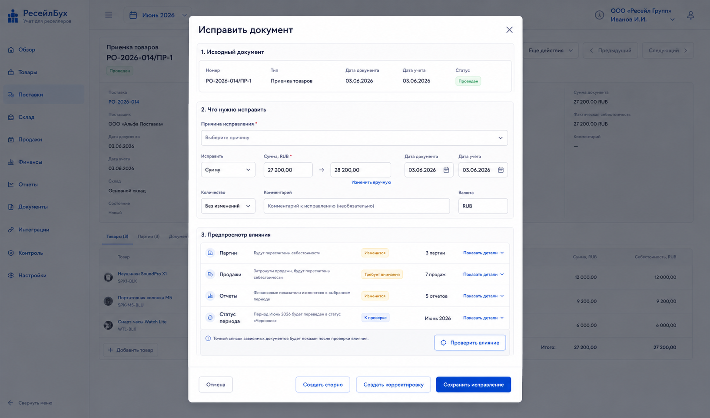

# Шаг 23. Исправления, Сторно И Пересчеты

## Цель

Сделать пользовательские ошибки штатным сценарием, а не аварийным вмешательством в БД. Пользователь должен исправлять источник ошибки: документ, сопоставление, классификацию или дату. Система показывает последствия и пересчитывает зависимые остатки, себестоимость и прибыль.

Это прямое применение audit trail из OpenStax: ошибка исправляется через документ/корректировку, а не правкой главной книги.

## Пользовательский результат

Пользователь открывает центр исправлений или конкретный документ и видит:

- можно ли редактировать документ напрямую;
- какие продажи, партии, выплаты или отчеты будут затронуты;
- какие периоды открыты или закрыты;
- будет ли создана новая версия, сторно или корректирующий документ;
- статус фонового пересчета.

## Frontend

### Экран `Исправления`

Route: `/controls/corrections`.

Visible content:

- filters: period, document type, status, affected product, job status;
- list of correction cases and recalculation jobs;
- columns: created at, source document, reason, affected period, impact, status, initiated by;
- right panel with dependency graph.

Actions:

- `Новое исправление`: opens document search and correction wizard;
- `Открыть документ`: opens source document;
- `Запустить пересчет`: queues recalculation for selected scope;
- `Повторить задачу`: retries failed job;
- `Отменить черновик исправления`: cancels not-posted correction case.

### Модальное окно `Исправить документ`

Route/context: any document card action `Исправить`.

Visible content:

- source document summary;
- editable fields if period open;
- correction mode if period closed: сторно, корректировка текущим периодом, создать связанный документ;
- impact preview: lots, sales, returns, settlements, reports;
- reason field required.

Buttons:

- `Проверить влияние`;
- `Сохранить исправление`;
- `Создать сторно`;
- `Создать корректировку`;
- `Отмена`.

Document editing modes:

- draft document: edited in its own business form, no correction case needed;
- posted document in open period: user clicks `Исправить`, edits a correction copy, enters reason, runs impact preview, then applies a versioned correction;
- posted document in closed period: direct save is disabled; user creates сторно or current-period correction document;
- imported external document: raw external event remains unchanged; user corrects mapping/classification or creates correction materialization.

## Backend

Modules:

- `corrections`;
- `document-versioning`;
- `reversal-engine`;
- `dependency-graph`;
- `recalculation-jobs`;
- `posting-rebuild`;
- `profit-rebuild`.

Endpoints:

- `GET /api/controls/corrections`;
- `POST /api/documents/:id/correction-preview`;
- `POST /api/documents/:id/apply-correction`;
- `POST /api/documents/:id/reverse`;
- `POST /api/recalculation-jobs`;
- `GET /api/recalculation-jobs`;
- `POST /api/recalculation-jobs/:id/retry`;

Validation:

- posted document in open period can be edited only through versioned correction;
- closed period document cannot be directly edited;
- correction reason required;
- dependency preview must be computed before apply;
- recalculation scope must be bounded by organization/product/date;
- job idempotency prevents duplicate concurrent rebuild for same scope.

## БД

### `correction_case`

- `id uuid primary key`;
- `organization_id uuid not null references organization(id)`;
- `source_document_id uuid not null references document(id)`;
- `correction_type text not null check (correction_type in ('open_period_edit','reversal','current_period_adjustment','reprocess_external_event'))`;
- `reason text not null`;
- `status text not null check (status in ('draft','previewed','applied','cancelled','failed'))`;
- `impact_summary jsonb not null default '{}'`;
- `created_by_user_id uuid`;
- `created_at timestamptz not null default now()`;
- `applied_at timestamptz`.

### `recalculation_job`

- `id uuid primary key`;
- `organization_id uuid not null references organization(id)`;
- `job_type text not null check (job_type in ('inventory_cost','sales_profit','settlements','reports','external_event_reprocess'))`;
- `scope jsonb not null`;
- `status text not null check (status in ('queued','running','completed','failed','cancelled'))`;
- `progress numeric(5,2) not null default 0`;
- `started_at timestamptz`;
- `finished_at timestamptz`;
- `last_error text`;
- `created_at timestamptz not null default now()`.

### `document_dependency`

- `id uuid primary key`;
- `organization_id uuid not null references organization(id)`;
- `source_document_id uuid not null references document(id)`;
- `dependent_document_id uuid not null references document(id)`;
- `dependency_type text not null`;
- unique `(source_document_id, dependent_document_id, dependency_type)`.

## Учетные правила

Rules:

- ledger rows are never edited directly;
- open-period correction creates new `document_version`, posts reversing/superseding journal and stock effects where the document type requires it, invalidates derived projections, and writes audit events;
- closed-period correction creates reversal/current-period adjustment documents;
- original posted journal entries are preserved or reversed, not physically removed from audit history;
- recalculation rebuilds FIFO/profit from source documents in chronological order.

Generated read models can be cleared and rebuilt. Source documents, posted `journal_entry`, `journal_line`, `stock_movement` and `cost_application` rows are not physically deleted. If a prior generated effect must be neutralized, the system creates reversal rows linked to the original.

Example reversal:

```text
Original: Дт 41 / Кт 60
Reversal: Дт 60 / Кт 41
```

Decreasing a previously posted amount:

- the correction engine treats the change as a negative delta, not as a manual ledger edit;
- for goods or capitalized procurement costs still in stock, the negative delta reduces `41.* Товары`;
- for goods already sold, the negative delta reduces `90.02 Себестоимость продаж`;
- the other side depends on the source document: supplier payable/advance, money account, claim, or refund receivable.

Example, procurement cost was posted as `30,000 RUB` but must be corrected to `20,000 RUB`:

```text
Original effect: Дт 41.* / Кт 60.01 or 51   30,000
Correct effect:  Дт 41.* / Кт 60.01 or 51   20,000
Net correction:  Дт 60.01 or 51 / Кт 41.*   10,000
```

If part of the affected goods was already sold, the credit side is split between `41.*` and `90.02` using the same lot/sale proportions that were used for cost capitalization.

Correcting a posted goods receipt down:

- if the original receipt accepted too many units, the correction decreases accepted quantity and RUB cost proportionally by supplier basis unless the user gives a manual reason;
- if the removed quantity is still in stock, the system creates negative stock/cost effects linked to the receipt correction;
- if the removed quantity has already been transferred, sold or returned, dependency preview must show affected documents and recalculation jobs;
- if applying the correction would create negative stock on any date/location, the system blocks direct application and asks the user to correct dependent documents first or use inventory reconciliation.

Example, original receipt accepted 1,000 units for `130,000 RUB`, but actual count is 990:

```text
Corrected inventory cost: 128,700
Remaining supplier advance for missing 10 units: 1,300
Net open-period correction: Дт 60.02 / Кт 41.*   1,300
```

The remaining `1,300 RUB` is then handled by the shortage workflow: later receipt, supplier claim, loss, or close without accounting.

## Ошибки пользователя

- If dependency preview cannot be built, block correction and show support/debug id.
- If correction would affect closed period, offer current-period adjustment only.
- If user tries to delete imported external sale, explain that raw event remains and can be ignored/reprocessed.
- If recalculation already running for product/date, show existing job instead of starting duplicate.
- If correction creates negative stock, show affected date and product.

## Тесты

- Unit: dependency graph for receipt -> transfer -> sale -> return.
- Integration: open-period posted document edit creates version, reversal/superseding entries and recalculation jobs without deleting original posted entries.
- Integration: closed-period edit creates reversal/adjustment, not direct mutation.
- Integration: failed recalculation can be retried.
- Scenario: change receipt cost after sales and verify sale margins update.
- Scenario: decrease a posted procurement cost and verify remaining inventory and already sold cost are reduced by the correct proportions.
- Scenario: correct receipt quantity from 1,000 to 990 and verify missing paid share returns to `60.02` instead of being hidden in received unit cost.
- Scenario: unlink/relink external product and reprocess events.

## Definition of Done

- Пользователь can preview correction impact before applying.
- Open/closed period correction rules are enforced.
- Reversal and current-period adjustment workflows exist.
- Recalculation jobs track status and can retry failures.
- Audit trail shows before/after values and reason.
- Рендеры cover correction center and document correction modal.

## Рендеры



### `renders/01-correction-center.png`

Scenario: пользователь ищет прошлую ошибку and sees recalculation jobs caused by corrections.

Route: `/controls/corrections`.

Layout:

- sidebar active `Контроль`;
- filters;
- correction cases table;
- recalculation jobs table or right panel;
- dependency detail for selected case.

Required visible UI:

- filters period/document type/status/product;
- columns source document, reason, affected period, impact, status;
- buttons `Новое исправление`, `Запустить пересчет`, `Повторить задачу`, `Открыть документ`;
- selected case panel with affected lots/sales/reports.

Button behavior:

- `Новое исправление` opens document search;
- `Запустить пересчет` opens scope dialog and creates job;
- `Повторить задачу` retries failed job;
- row click updates impact panel.

Must not include:

- direct ledger edit grid;
- database admin controls;
- decorative quick actions.



### `renders/02-document-correction-modal.png`

Scenario: пользователь исправляет стоимость приемки and sees affected sales before applying.

Route/context: `/documents/:id`, action `Исправить`.

Layout:

- modal over document card;
- source document summary;
- editable/correction fields;
- impact preview;
- bottom action buttons.

Required visible UI:

- source document number/date/status;
- reason field;
- change fields such as amount/qty/date depending document type;
- impact list: lots, sales, reports, period status;
- buttons `Проверить влияние`, `Сохранить исправление`, `Создать сторно`, `Создать корректировку`, `Отмена`.

Button behavior:

- `Проверить влияние` calls correction-preview endpoint;
- if period open, `Сохранить исправление` applies versioned edit and starts recalculation;
- if period closed, direct save disabled and current-period correction/storno buttons are enabled;
- `Отмена` closes modal without changes.

Must not include:

- manual debit/credit editing;
- unrelated document types;
- repeated full document registry.
