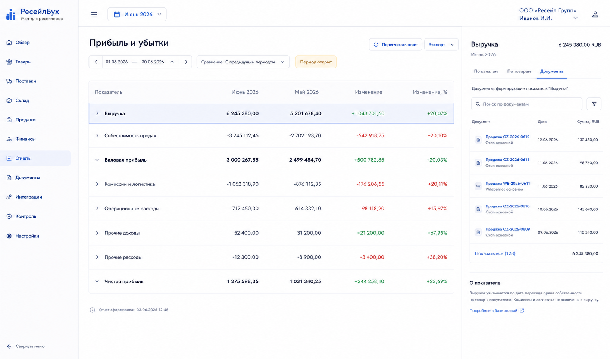
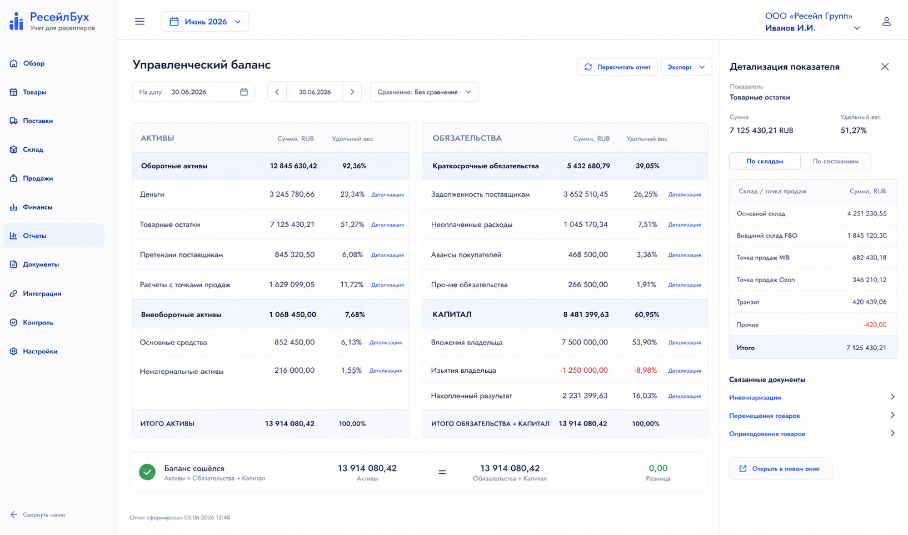
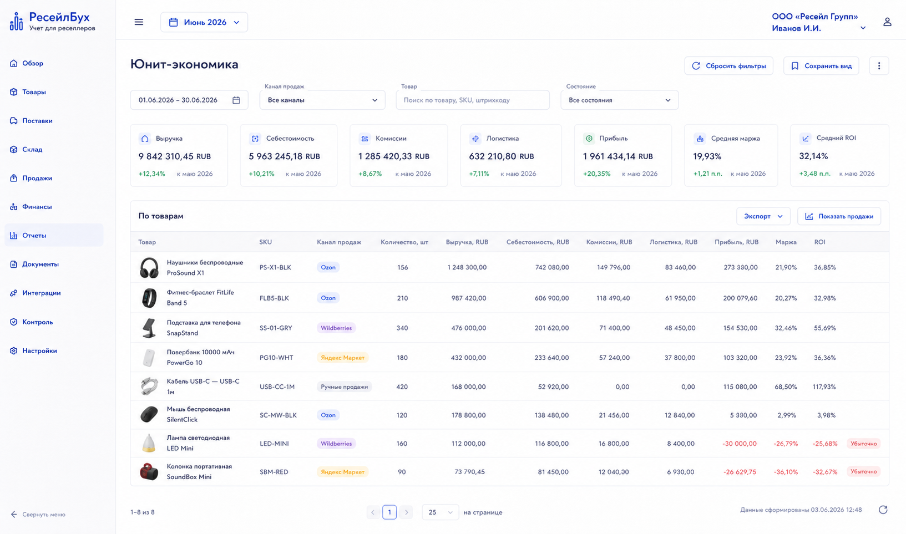

# Шаг 24. Отчеты И Аналитика

## Цель

Собрать основные управленческие отчеты из главной книги, товарных партий, продаж, финансовых операций и денежных документов:

- прибыль и убытки;
- баланс;
- движение денег;
- юнит-экономика;
- товарные остатки и оборачиваемость;
- взаиморасчеты с поставщиками и каналами.

Отчеты строятся из документов и проводок, а не из ручных таблиц.

## Пользовательский результат

Пользователь выбирает период/дату и видит ключевые отчеты на русском языке: `выручка`, `себестоимость продаж`, `валовая прибыль`, `расходы на продажу`, `операционные расходы`, `деньги`, `товары`, `задолженность`, `капитал`.

## Frontend

### `Прибыль и убытки`

Route: `/reports/profit-and-loss`.

Visible content:

- period selector;
- rows: revenue, cost of sales, gross profit, selling expenses, marketplace fees, operating expenses, other income/expense, net profit;
- drilldown links on each row;
- comparison with previous period.

Actions:

- `Провалиться`: opens source documents for row;
- `Экспорт`: downloads CSV/XLSX later;
- `Пересчитать отчет`: queues report recalculation.

### `Баланс`

Route: `/reports/balance-sheet`.

Visible content:

- date selector;
- assets: cash, inventory, supplier claims, marketplace receivable, other receivables;
- liabilities: supplier payables, unpaid expenses, channel obligations;
- equity: owner contributions, owner withdrawals, retained result;
- balance check: assets = liabilities + equity.

### `Юнит-экономика`

Route: `/reports/unit-economics`.

Visible content:

- filters: period, product, channel, category;
- table by product/channel;
- columns: qty sold, revenue, cost, commission, logistics, other fees, gross profit, margin, ROI;
- product thumbnails.

## Backend

Modules:

- `reports`;
- `ledger-reporting`;
- `inventory-reporting`;
- `profit-reporting`;
- `cash-flow-reporting`;
- `report-drilldown`;
- `report-snapshots`.

Endpoints:

- `GET /api/reports/profit-and-loss?period=`;
- `GET /api/reports/balance-sheet?date=`;
- `GET /api/reports/cash-flow?period=`;
- `GET /api/reports/unit-economics?period=&product=&channel=`;
- `GET /api/reports/inventory?date=`;
- `GET /api/reports/drilldown`;
- `POST /api/reports/recalculate`.

Validation:

- report period/date cannot be before accounting start date unless backfill reference mode;
- closed periods can use snapshots;
- open periods calculate live but show `период открыт`;
- drilldown respects organization and permissions.

## БД

### `report_snapshot`

- `id uuid primary key`;
- `organization_id uuid not null references organization(id)`;
- `report_code text not null`;
- `period_id uuid references accounting_period(id)`;
- `as_of_date date`;
- `status text not null check (status in ('draft','final','invalidated'))`;
- `data jsonb not null`;
- `created_at timestamptz not null default now()`;
- unique `(organization_id, report_code, period_id, status) where status='final'`.

### `report_saved_view`

- `id uuid primary key`;
- `organization_id uuid not null references organization(id)`;
- `user_id uuid`;
- `report_code text not null`;
- `name text not null`;
- `filters jsonb not null default '{}'`;
- `created_at timestamptz not null default now()`.

## Учетные правила

Rules:

- P&L uses income/expense accounts and sale profit components;
- balance sheet uses ledger balances at date;
- cash flow uses payment documents and cash accounts;
- unit economics uses sale lines, cost applications and linked channel finance events;
- report rows must drill down to source documents/journal lines/events;
- closed period reports may be snapshotted and invalidated only by official correction.

## Ошибки пользователя

- If report has incomplete costs, show count and drilldown to sales without себестоимость.
- If period open, show `Период открыт: цифры могут измениться`.
- If marketplace events unmatched, show warning and link to inbox.
- If balance check fails, show technical/control alert with drilldown to unbalanced entries; this is a control screen, not a normal product state.

## Тесты

- Unit: account grouping into P&L and balance.
- Integration: report numbers reconcile to ledger/journal lines.
- Integration: unit economics updates after fee and cost recalculation.
- Scenario: procurement -> sale -> fee -> payout -> P&L/balance/cash flow agree.
- Scenario: closed period snapshot stays stable until correction invalidates it.

## Definition of Done

- Main reports are accessible from `Отчеты`.
- Reports use Russian business terms.
- Drilldown links source documents.
- Report warnings identify incomplete data.
- Balance equality is checked.
- Рендеры cover P&L, balance and unit economics.

## Рендеры

### `renders/01-profit-and-loss.png`

Scenario: пользователь оценивает profitability for the month.

Route: `/reports/profit-and-loss`.

Layout:

- sidebar active `Отчеты`;
- report title;
- period controls;
- report table;
- right drilldown panel for selected row.

Required visible UI:

- rows `Выручка`, `Себестоимость продаж`, `Валовая прибыль`, `Комиссии и логистика`, `Операционные расходы`, `Чистая прибыль`;
- previous period comparison column;
- warning badge if period open;
- buttons `Экспорт`, `Пересчитать отчет`.

Button behavior:

- row click opens drilldown panel with source documents;
- `Пересчитать отчет` queues report recalculation;
- `Экспорт` downloads report.

Must not include:

- COGS label;
- decorative charts without source data;
- manual row editing.

### `renders/02-balance-sheet.png`

Scenario: пользователь смотрит financial position on a date.

Route: `/reports/balance-sheet`.

Layout:

- date selector;
- two-column balance layout: assets vs liabilities/equity;
- equality check footer;
- drilldown panel.

Required visible UI:

- asset rows money, inventory, supplier claims, channel settlements;
- liability rows supplier debt, unpaid expenses;
- equity rows contributions, withdrawals, accumulated result;
- balance equality check `Активы = Обязательства + Капитал`;
- drilldown links.

Button behavior:

- row click opens journal/ledger drilldown;
- date change reloads report;
- export button downloads report.

Must not include:

- tax declaration language;
- manual account balance editing.

### `renders/03-unit-economics.png`

Scenario: пользователь ищет убыточные товары by product/channel.

Route: `/reports/unit-economics`.

Layout:

- filters;
- KPI strip;
- table by product;
- product thumbnails in each row.

Required visible UI:

- filters period/product/channel;
- columns product thumbnail, SKU, qty, revenue, cost, commissions, logistics, profit, margin, ROI;
- badge `убыточно` for negative rows;
- button `Показать продажи`.

Button behavior:

- product row opens sale-line drilldown;
- `Показать продажи` navigates to sales filtered by product/channel;
- filter changes reload report.

Must not include:

- aggregate-only chart without table;
- product edit form;
- payout reconciliation details.
