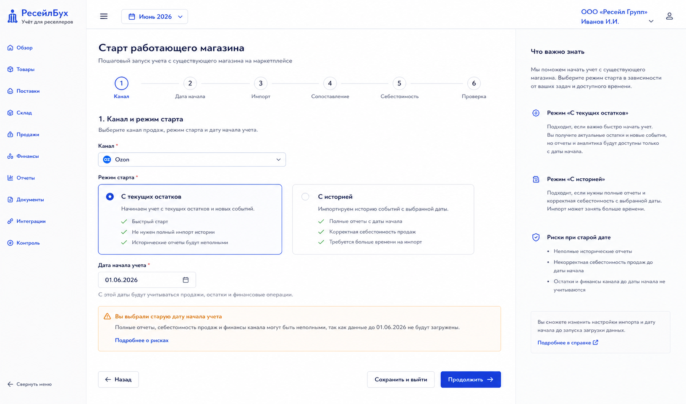
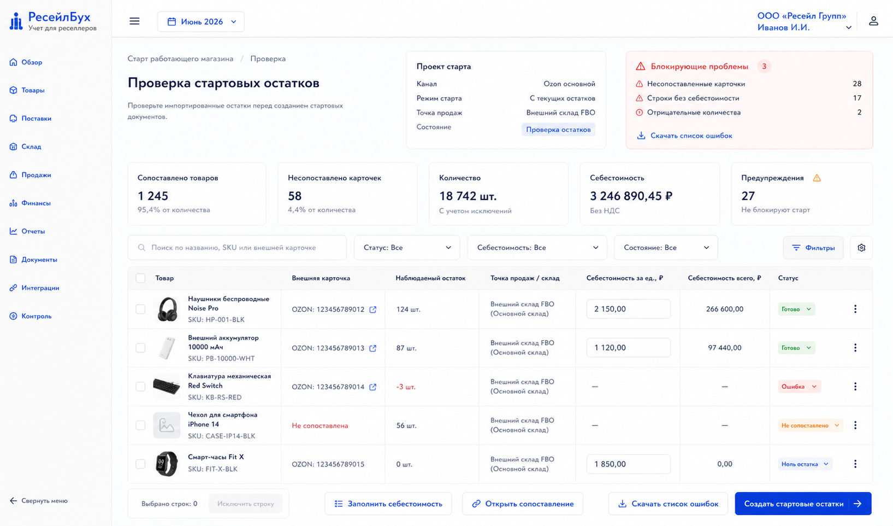

# Шаг 25. Старт Учета Для Уже Работающего Магазина

## Цель

Помочь пользователю начать учет не с нуля, а с уже работающего магазина на маркетплейсе: импортировать карточки, сопоставить товары, выбрать дату начала учета, принять текущие остатки как стартовые партии и загрузить исторические события только там, где это нужно.

## Пользовательский результат

Пользователь запускает мастер `Начать с работающего магазина`, подключает канал, загружает текущие остатки/карточки, сопоставляет товары, вводит себестоимость стартовых партий и получает документы стартового остатка.

Дата начала учета здесь особенно важна: она определяет, с какого дня система считает себя источником правды. Если пользователь выбирает старую дату, мастер показывает, что нужно загрузить или ввести все операции после этой даты.

## Frontend

### Мастер `Старт работающего магазина`

Route: `/onboarding/existing-store`.

Steps:

1. Выбор канала и режима старта.
2. Дата начала учета.
3. Импорт карточек и остатков.
4. Сопоставление товаров.
5. Себестоимость стартовых остатков.
6. Проверка и создание документов.

No duplicate inner sidebar. Use horizontal stepper only because it has a clear wizard role.

Actions:

- `Продолжить`;
- `Назад`;
- `Сохранить и выйти`;
- `Загрузить данные`;
- `Создать стартовые остатки`;
- `Открыть созданные документы`.

### Экран проверки стартовых остатков

Route: `/onboarding/existing-store/:projectId/review`.

Visible content:

- summary: mapped products, unmatched cards, total qty, total cost, warnings;
- table by product with thumbnail, SKU, channel card, observed qty, warehouse/sales point, unit cost, total cost, status;
- blocking issues panel.

Actions:

- `Заполнить себестоимость`;
- `Открыть сопоставление`;
- `Исключить строку`;
- `Создать стартовые остатки`;
- `Скачать список ошибок`.

## Backend

Modules:

- `existing-store-onboarding`;
- `backfill-projects`;
- `opening-balance-batch`;
- `historical-event-policy`;
- `onboarding-validation`.

Endpoints:

- `POST /api/onboarding/existing-store/projects`;
- `GET /api/onboarding/existing-store/projects/:id`;
- `POST /api/onboarding/existing-store/projects/:id/import`;
- `POST /api/onboarding/existing-store/projects/:id/match-products`;
- `PATCH /api/onboarding/existing-store/projects/:id/items/:itemId`;
- `POST /api/onboarding/existing-store/projects/:id/review`;
- `POST /api/onboarding/existing-store/projects/:id/create-opening-balances`.

Validation:

- accounting start date not before organization start unless updating policy through controlled flow;
- old start date requires explicit confirmation and backfill plan;
- each item used for opening balance must have internal product and unit cost;
- duplicate external product rows merged or flagged;
- opening balance document date equals accounting start date;
- historical events before start date remain reference unless project mode materializes them.

## БД

### `backfill_project`

- `id uuid primary key`;
- `organization_id uuid not null references organization(id)`;
- `sales_channel_id uuid references sales_channel(id)`;
- `mode text not null check (mode in ('current_stock_start','historical_backfill'))`;
- `accounting_start_date date not null`;
- `status text not null check (status in ('draft','importing','needs_review','ready','applied','cancelled','failed'))`;
- `summary jsonb not null default '{}'`;
- `created_by_user_id uuid`;
- `created_at timestamptz not null default now()`;
- `updated_at timestamptz not null default now()`.

### `backfill_item`

- `id uuid primary key`;
- `backfill_project_id uuid not null references backfill_project(id) on delete cascade`;
- `external_product_id uuid references external_product(id)`;
- `product_id uuid references product(id)`;
- `warehouse_id uuid references warehouse(id)`;
- `observed_qty numeric(18,4) not null default 0`;
- `unit_cost_rub numeric(18,6)`;
- `total_cost_rub numeric(18,2)`;
- `status text not null check (status in ('needs_mapping','needs_cost','ready','excluded','applied'))`;
- `issue text`;

### `opening_balance_batch`

- `id uuid primary key`;
- `organization_id uuid not null references organization(id)`;
- `backfill_project_id uuid references backfill_project(id)`;
- `document_ids uuid[] not null default '{}'`;
- `created_at timestamptz not null default now()`.

## Учетные правила

Opening balances created by this wizard use existing step 6 posting:

```text
Дт 41.* Товары
Кт 80.01 Вложения владельца / 84 Нераспределенный результат управленческого учета
```

Rules:

- current stock start creates inventory lots as of accounting start date;
- historical events after start date can be imported/materialized only if product mapping and opening cost base are complete;
- wizard never creates sales before opening stock unless backfill policy explicitly allows chronological rebuild;
- user must see incomplete period risk when start date is old.

## Ошибки пользователя

- If user picks start date months ago without importing history, show blocking warning with choices: move start date closer, enable historical backfill, or proceed with incomplete reports acknowledged.
- If external products are unmatched, block opening balance for those rows.
- If unit cost missing, block row and show inline input.
- If observed stock is stale, show timestamp and allow refresh.
- If opening balances already exist for same product/date/location, require merge or skip decision.

## Тесты

- Unit: onboarding project validation.
- Integration: create opening balance documents from ready backfill items.
- Integration: unmatched items block apply.
- Scenario: current Ozon-like stock import -> product mapping -> opening balances -> inventory overview.
- Scenario: old start date warning and backfill plan.

## Definition of Done

- Пользователь can start accounting for an existing store.
- Wizard imports cards/observed stock through channel APIs.
- Product mapping and unit cost completion are required before applying.
- Opening balance documents are created and linked to backfill project.
- Old start date risk is explicit and enforced.
- Рендеры cover wizard and review screen.

## Рендеры



### `renders/01-backfill-wizard.png`

Scenario: пользователь starts accounting from an existing marketplace store.

Route: `/onboarding/existing-store`.

Layout:

- no inner sidebar;
- horizontal stepper with six steps;
- main form for channel/mode/start date;
- right risk explanation panel.

Required visible UI:

- fields channel, start mode, accounting start date;
- mode cards `С текущих остатков` and `С историей`;
- warning block for old start date;
- buttons `Назад`, `Продолжить`, `Сохранить и выйти`, `Загрузить данные`.

Button behavior:

- date change recalculates risk warning;
- `Загрузить данные` starts import for selected channel;
- `Продолжить` advances only if required fields valid;
- `Сохранить и выйти` saves project draft.

Must not include:

- backend health status;
- settings sidebar;
- sales report before data exists.



### `renders/02-opening-import-review.png`

Scenario: user reviews imported stock and enters unit costs before creating opening balance documents.

Route: `/onboarding/existing-store/:projectId/review`.

Layout:

- project summary;
- blocking issues panel;
- item table;
- bottom action bar.

Required visible UI:

- summary values mapped products, unmatched cards, total qty, total cost, warnings;
- table with product thumbnails, external card, observed qty, warehouse/sales point, unit cost input, total cost, status;
- buttons `Заполнить себестоимость`, `Открыть сопоставление`, `Исключить строку`, `Создать стартовые остатки`, `Скачать список ошибок`.

Button behavior:

- unit cost input updates total cost;
- `Открыть сопоставление` navigates to mapping filtered by issue rows;
- `Создать стартовые остатки` creates opening balance documents only for ready rows;
- after success show links to created documents and inventory overview.

Must not include:

- direct stock mutation without documents;
- marketplace-specific hardcoded labels beyond channel name selected by user;
- duplicate date field outside wizard context.
