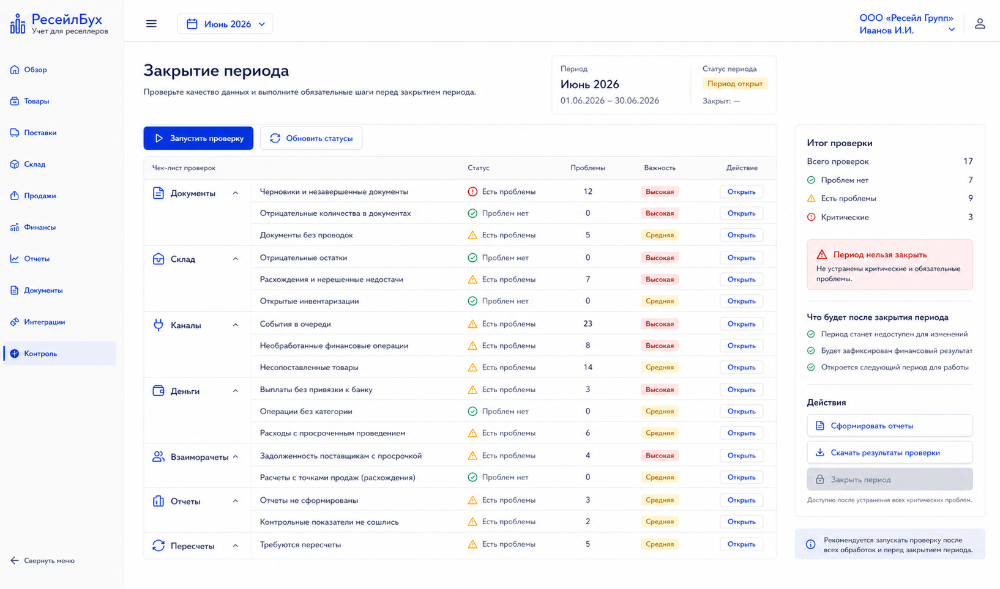
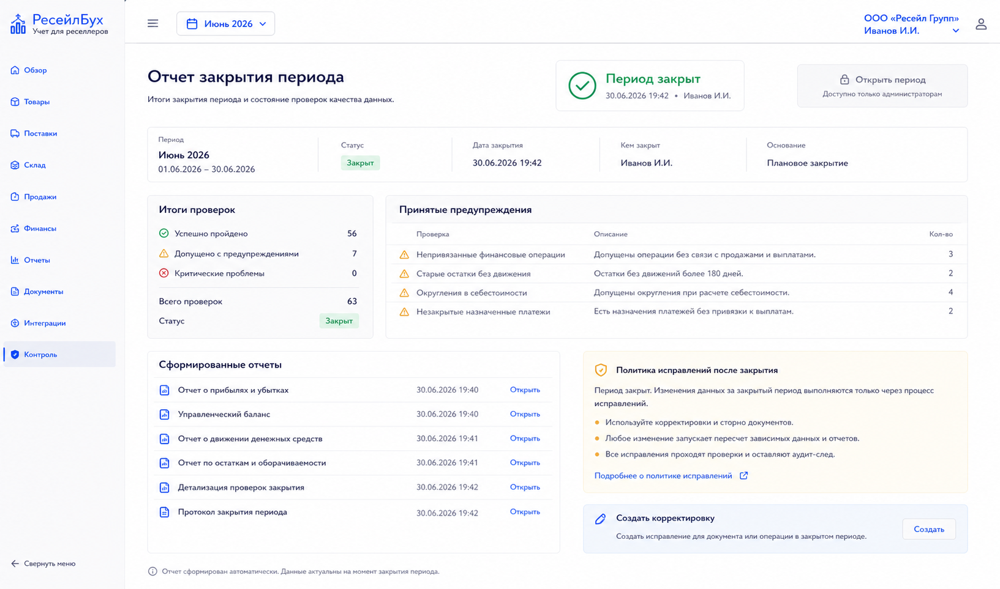

# Шаг 26. Закрытие Периода И Контроль Качества Данных

## Цель

Сделать закрытие месяца полноценной контрольной процедурой: перед закрытием система проверяет деньги, склад, маркетплейс-события, взаиморасчеты, незавершенные пересчеты и отчеты. После закрытия прямые изменения документов периода запрещены.

## Пользовательский результат

Пользователь открывает месяц, видит checklist закрытия, исправляет проблемы, формирует финальные отчеты and locks period. Если позже найдена ошибка, используется корректировка текущим периодом или сторно.

## Frontend

### Экран `Закрытие периода`

Route: `/controls/period-closing/:periodId`.

Visible content:

- period header: month, status, start/end dates;
- checklist grouped by areas: documents, inventory, channels, money, settlements, reports, recalculations;
- each check has status, count, drilldown link, required/optional marker;
- final report links;
- close button.

Actions:

- `Запустить проверку`: recalculates checklist;
- `Открыть проблему`: navigates to relevant screen;
- `Сформировать отчеты`: creates final report snapshots;
- `Закрыть период`: locks period if required checks pass;
- `Открыть период`: admin-only, requires reason and audit event.

### Отчет закрытия

Route: `/controls/period-closing/:periodId/report`.

Visible content:

- closure summary;
- who closed and when;
- final P&L/balance/cash/inventory report links;
- list of ignored/accepted warnings;
- correction policy after close.

## Backend

Modules:

- `period-closing`;
- `closing-checks`;
- `report-snapshots`;
- `period-locks`;
- `control-dashboard`.

Endpoints:

- `GET /api/accounting-periods/:id/closing`;
- `POST /api/accounting-periods/:id/closing/run-checks`;
- `POST /api/accounting-periods/:id/closing/generate-reports`;
- `POST /api/accounting-periods/:id/close`;
- `POST /api/accounting-periods/:id/reopen`;
- `GET /api/accounting-periods/:id/closing-report`.

Required checks:

- no unposted documents in period that affect accounting;
- no unbalanced journal entries;
- no sales missing cost;
- no open payout differences above tolerance;
- no open critical inventory discrepancies;
- no failed/running recalculation jobs for period;
- cash accounts reconciled or explicitly accepted;
- reports generated after last material correction.

## БД

### `period_closing_run`

- `id uuid primary key`;
- `organization_id uuid not null references organization(id)`;
- `accounting_period_id uuid not null references accounting_period(id)`;
- `status text not null check (status in ('running','completed','failed'))`;
- `started_by_user_id uuid`;
- `started_at timestamptz not null default now()`;
- `finished_at timestamptz`;
- `summary jsonb not null default '{}'`;

### `period_closing_check`

- `id uuid primary key`;
- `period_closing_run_id uuid not null references period_closing_run(id) on delete cascade`;
- `check_code text not null`;
- `severity text not null check (severity in ('required','warning','info'))`;
- `status text not null check (status in ('passed','failed','accepted','skipped'))`;
- `count int not null default 0`;
- `details jsonb not null default '{}'`;
- `accepted_by_user_id uuid`;
- `accepted_reason text`;

### `period_lock`

- `id uuid primary key`;
- `organization_id uuid not null references organization(id)`;
- `accounting_period_id uuid not null references accounting_period(id)`;
- `locked_at timestamptz not null default now()`;
- `locked_by_user_id uuid`;
- `unlock_reason text`;
- `status text not null check (status in ('locked','reopened'))`;

## Учетные правила

Rules:

- closing does not create ordinary revenue/expense entries by itself in this managerial system unless configured for temporary account closing later;
- closing locks source documents and postings in period;
- corrections after close use step 23 workflows;
- final report snapshots are tied to closing run;
- reopening is exceptional and audited.

## Ошибки пользователя

- If required check fails, disable `Закрыть период` and show exact drilldown.
- If user accepts warning, require reason.
- If new document appears after report snapshot, mark reports stale and require regeneration.
- If user tries to create document in closed period elsewhere, show period lock message and nearest open period option.

## Тесты

- Unit: closing checklist status aggregation.
- Integration: close period locks posting/editing.
- Integration: stale report snapshot blocks close.
- Integration: reopen requires permission and reason.
- Scenario: sales missing cost -> close blocked -> fix stock -> rerun -> close.
- Scenario: correction after close creates current-period adjustment.

## Definition of Done

- Пользователь can run closing checks.
- Required failures block closing.
- Final report snapshots are generated.
- Closed period blocks direct edits/posting.
- Reopen is permissioned and audited.
- Рендеры cover checklist and close report.

## Рендеры

### `renders/01-period-closing-checklist.png`

Scenario: пользователь закрывает месяц and sees data quality blockers.

Route: `/controls/period-closing/:periodId`.

Layout:

- sidebar active `Контроль`;
- period header;
- checklist grouped sections;
- final action panel.

Required visible UI:

- sections `Документы`, `Склад`, `Каналы`, `Деньги`, `Взаиморасчеты`, `Отчеты`, `Пересчеты`;
- each row with status icon, count, severity and `Открыть`;
- buttons `Запустить проверку`, `Сформировать отчеты`, `Закрыть период`;
- close button disabled while required checks fail.

Button behavior:

- `Запустить проверку` creates closing run;
- `Открыть` navigates to problem drilldown;
- `Сформировать отчеты` creates final snapshots;
- `Закрыть период` locks period after confirmation.

Must not include:

- decorative progress cards without checks;
- manual ledger corrections;
- quick actions unrelated to close.

### `renders/02-period-close-report.png`

Scenario: period is closed and user reviews final state.

Route: `/controls/period-closing/:periodId/report`.

Layout:

- closed period header;
- summary of checks;
- report links;
- accepted warnings list;
- correction policy notice.

Required visible UI:

- closed status with timestamp/user;
- links to P&L, balance, cash flow, inventory report;
- checklist summary passed/accepted;
- button `Открыть период` visible only to admin;
- button `Создать корректировку` navigates to correction center.

Button behavior:

- report link opens snapshot;
- `Открыть период` requires reason modal;
- `Создать корректировку` starts correction workflow.

Must not include:

- editable period fields;
- duplicated full checklist if summary is enough;
- technical health block.
