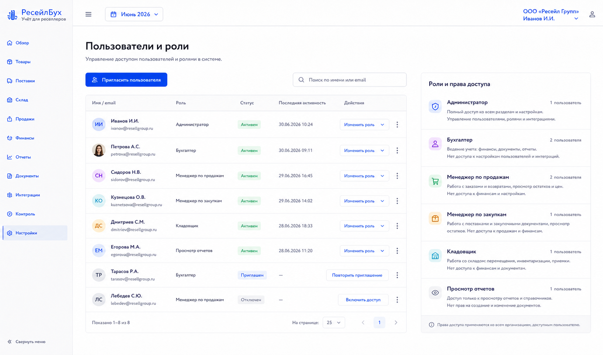
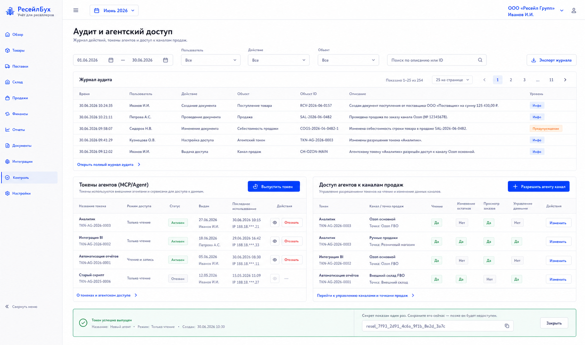

# Шаг 27. Пользователи, Аудит И Агентский Доступ

## Цель

Добавить доступы, роли, аудит действий и управляемые токены для внешних агентов/MCP. Это закрывает контрольную часть системы: кто создал документ, кто исправил прошлый период, кто разрешил агенту читать или писать данные.

## Пользовательский результат

Администратор может:

- пригласить пользователя;
- назначить роль;
- видеть журнал действий;
- выпустить read-only/read-write токен для агента;
- отозвать токен;
- отдельно разрешить или запретить агентский доступ к API конкретного канала продаж.

## Frontend

### Экран `Пользователи и роли`

Route: `/settings/users`.

Visible content:

- users table;
- columns: name/email, role, status, last active, actions;
- role summary;
- invite form/modal.

Actions:

- `Пригласить пользователя`;
- `Изменить роль`;
- `Отключить доступ`;
- `Повторить приглашение`.

### Экран `Аудит и агенты`

Route: `/controls/audit`.

Visible content:

- audit event filters: period, user, action, object type, severity;
- audit table;
- agent tokens section;
- marketplace/channel API permission section.

Actions:

- `Выпустить токен`;
- `Отозвать токен`;
- `Скопировать токен` only immediately after creation;
- `Разрешить агенту канал`;
- `Запретить агенту канал`;
- `Открыть объект` from audit row.

## Backend

Modules:

- `auth`;
- `users`;
- `roles-permissions`;
- `audit-log`;
- `agent-tokens`;
- `channel-agent-permissions`.

Endpoints:

- `GET /api/settings/users`;
- `POST /api/settings/users/invite`;
- `PATCH /api/settings/users/:id/role`;
- `POST /api/settings/users/:id/disable`;
- `GET /api/controls/audit-events`;
- `POST /api/agent-tokens`;
- `GET /api/agent-tokens`;
- `POST /api/agent-tokens/:id/revoke`;
- `POST /api/channels/:id/agent-permission`;

Permissions:

- `owner/admin`: all actions;
- `operator`: create/edit operational documents in open periods;
- `viewer`: read-only reports/documents;
- `agent_read`: API read-only;
- `agent_write`: API write through validated commands only.

Validation:

- cannot remove last admin;
- token secret shown once;
- read-only token cannot call mutation endpoints;
- agent write obeys the same domain validations as UI;
- channel agent access requires explicit per-channel permission;
- every privileged action writes audit event.

## БД

### `user_account`

- `id uuid primary key`;
- `organization_id uuid not null references organization(id)`;
- `email text not null`;
- `display_name text`;
- `status text not null check (status in ('invited','active','disabled'))`;
- `last_active_at timestamptz`;
- `created_at timestamptz not null default now()`;
- unique `(organization_id, email)`.

### `role`

- `id uuid primary key`;
- `organization_id uuid references organization(id)`;
- `code text not null`;
- `name text not null`;
- `permissions jsonb not null default '[]'`;
- `is_system boolean not null default false`;

### `user_role`

- `user_id uuid not null references user_account(id) on delete cascade`;
- `role_id uuid not null references role(id) on delete cascade`;
- primary key `(user_id, role_id)`.

### `agent_token`

- `id uuid primary key`;
- `organization_id uuid not null references organization(id)`;
- `name text not null`;
- `token_hash text not null`;
- `mode text not null check (mode in ('read_only','read_write'))`;
- `status text not null check (status in ('active','revoked'))`;
- `created_by_user_id uuid`;
- `created_at timestamptz not null default now()`;
- `last_used_at timestamptz`;
- `revoked_at timestamptz`;

### `channel_agent_permission`

- `id uuid primary key`;
- `organization_id uuid not null references organization(id)`;
- `sales_channel_id uuid not null references sales_channel(id)`;
- `agent_token_id uuid references agent_token(id)`;
- `permission text not null check (permission in ('none','read','write'))`;
- `created_at timestamptz not null default now()`;
- unique `(sales_channel_id, agent_token_id)`.

Step 4 already reserves actor fields on `document`, `document_version` and `audit_event`. Step 27 adds real FK constraints and permission semantics instead of migrating from free-text actors.

Actor fields finalized in this step:

- `actor_user_id`;
- `actor_agent_token_id`;
- `action`;
- `object_type`;
- `object_id`;
- `severity`;
- `before_json`;
- `after_json`;
- `ip_address`;
- `created_at`.

Migration requirements:

- add FK constraints from `document.created_by_user_id`, `document.posted_by_user_id`, `document.cancelled_by_user_id`, `document_version.created_by_user_id` and `audit_event.actor_user_id` to `user_account(id)`;
- add FK constraints from corresponding `*_agent_token_id` columns to `agent_token(id)`;
- keep `*_label` fields for system/migration actors and display fallback;
- backfill local pre-auth rows with `actor_label='system'` or first admin user when that is explicitly chosen during setup.

## Учетные правила

This step does not add journal entries.

Rules:

- permissions guard document creation, posting, correction and period closing;
- audit events are control evidence and must not be user-editable;
- agent write must use normal command handlers so accounting invariants cannot be bypassed;
- marketplace API access by agent is off by default.

## Ошибки пользователя

- If user tries to disable last admin, block.
- If token is read-only and mutation attempted, return 403 and audit denied action.
- If agent lacks channel permission, channel API proxy refuses request.
- If role change would remove user's own admin access, require second admin confirmation.
- If audit export is too large, require narrower filters.

## Тесты

- Unit: permission matrix.
- Integration: read-only token cannot post documents.
- Integration: agent write creates documents through normal validators.
- Integration: audit rows written for privileged actions.
- Security: token secret not retrievable after creation.
- Scenario: admin grants agent read-only, runs report, revokes token.

## Definition of Done

- Users and roles are manageable.
- Audit log is searchable and links to objects.
- Agent tokens support read-only/read-write modes.
- Channel API permission is explicit per token/channel.
- Permission checks cover document posting, correction and period closing.
- Рендеры cover users/roles and audit/agent access.

## Рендеры

### `renders/01-users-roles.png`

Scenario: администратор invites a teammate and checks roles.

Route: `/settings/users`.

Layout:

- sidebar active `Настройки`;
- page title `Пользователи и роли`;
- users table;
- role detail side panel or inline role badges.

Required visible UI:

- button `Пригласить пользователя`;
- columns name/email, role, status, last active, actions;
- actions `Изменить роль`, `Отключить доступ`, `Повторить приглашение`;
- role descriptions in Russian business terms.

Button behavior:

- `Пригласить пользователя` opens invite modal;
- `Изменить роль` opens role selector;
- `Отключить доступ` requires confirmation;
- row click shows recent activity.

Must not include:

- secondary settings sidebar;
- accounting journal table;
- token secrets.

### `renders/02-audit-log-agents.png`

Scenario: admin reviews important actions and creates an agent token.

Route: `/controls/audit`.

Layout:

- filters;
- audit events table;
- agent tokens section;
- channel permissions section.

Required visible UI:

- filters period/user/action/object;
- audit rows with timestamp, actor, action, object, severity;
- token table with name, mode, status, last used;
- buttons `Выпустить токен`, `Отозвать токен`, `Разрешить агенту канал`, `Открыть объект`.

Button behavior:

- `Выпустить токен` opens modal with name/mode; generated secret shown once;
- `Отозвать токен` changes status and writes audit event;
- `Разрешить агенту канал` opens channel permission selector;
- audit row `Открыть объект` navigates to document/product/channel.

Must not include:

- raw token after creation moment;
- editable audit rows;
- technical server logs unrelated to user actions.
