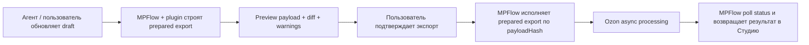
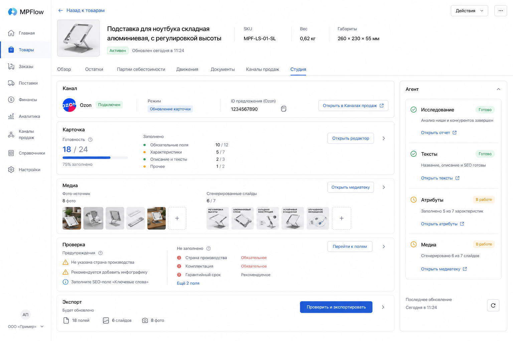
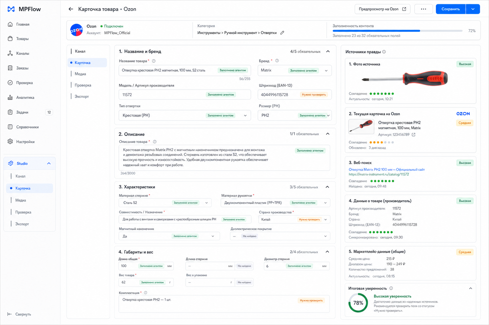
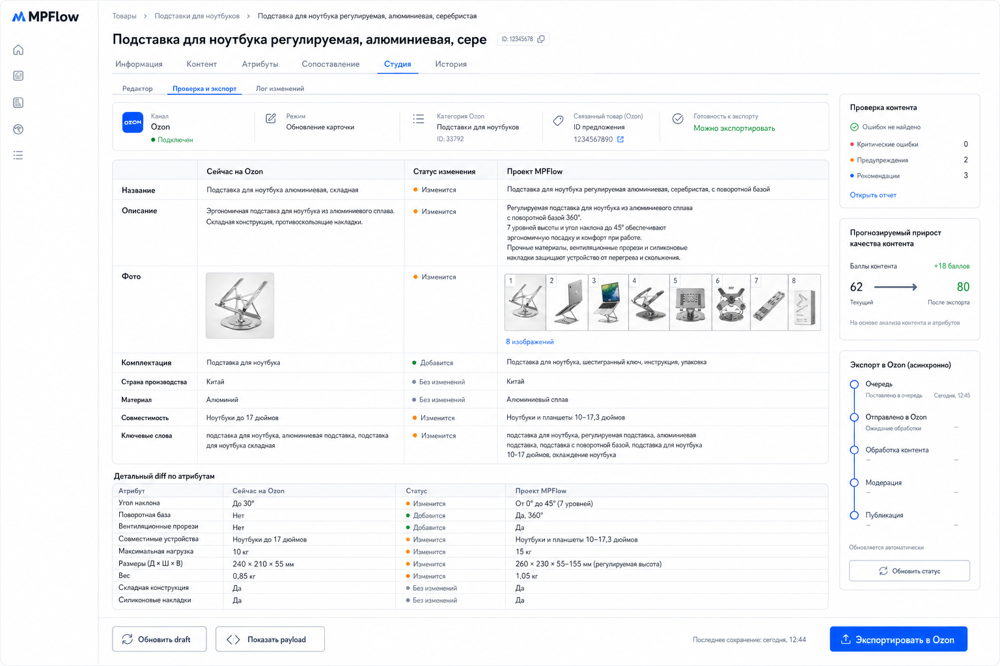

# Студия MPFlow: архитектурное видение

Проверено и собранo с опорой на текущую кодовую базу и актуальные публичные материалы Ozon Seller API по состоянию на **2 июня 2026 года**.

## Зачем менять текущую `Фотостудию`

Сейчас в MPFlow вкладка `Фотостудия` решает только один узкий сценарий:

- загрузка исходников;
- сохранение плана;
- прием готовых слайдов;
- передача задания агенту на генерацию изображений.

Этого недостаточно для реальной работы с карточкой канала продаж. Пользователю нужен не набор картинок, а результат:

```text
получить или обновить карточку на целевом канале
с корректными полями
с понятным ревью
и с экспортом из MPFlow
```

Поэтому правильная эволюция — превратить `Фотостудию` в **`Студию`**:

- фото становятся одним из блоков;
- тексты, атрибуты и медиа собираются в один draft;
- агент делает исследование и генерацию;
- платформа валидирует и экспортирует.

## Главный принцип

В MPFlow не должно быть захардкоженного списка полей вида:

```text
channel + category + mode -> fixed local form
```

Но и полностью свободный режим "агент сам как-нибудь поймет все поля" тоже плох:

- нет детерминированной проверки готовности;
- неясно, какие поля реально обязательны;
- трудно сделать корректный update существующей карточки;
- невозможно собрать надежный export payload.

Нужен гибрид:

```text
runtime-схему требований дает plugin канала,
агент сам добывает факты и предлагает значения,
платформа валидирует и экспортирует.
```

Это дает гибкость без хрупкости.

## Разделение ответственности

### `Каналы продаж`

Отвечают за интеграционный контур:

- подключен ли канал;
- есть ли доступы;
- какие внешние карточки уже связаны;
- какой `offer_id` / внешний SKU / внешний `product_id`;
- когда был последний sync;
- есть ли ошибки связи или экспорта.

Это реестр связей и состояния интеграции.

### `Студия`

Отвечает за редакторский и экспортный контур:

- подготовка карточки под конкретный канал;
- генерация и ревью текстов;
- заполнение атрибутов;
- подготовка медиа;
- preview и diff;
- запуск create/update экспорта.

Это рабочее пространство по карточке.

### Агент

Отвечает за недетерминированную часть:

- анализ товара;
- сбор фактов из источников правды;
- подготовка текста;
- генерация изображений;
- заполнение draft-полей;
- маркировка сомнительных мест и unknowns.

Агент не должен напрямую публиковать карточку на маркетплейсе.

### Платформа MPFlow

Отвечает за детерминированную часть:

- загрузка runtime-требований канала;
- хранение draft и evidence;
- валидация;
- diff/review;
- сбор export payload;
- вызов API маркетплейса;
- polling статуса;
- сохранение результата в linked channel state.

## Целевая модель данных

Нужен отдельный слой Студии поверх текущих `ExternalProduct` и `ProductExternalLink`.

### 1. Канально-нейтральные факты о товаре

```ts
interface ProductFactRecord {
  id: ID;
  productId: ID;
  key: string;
  value: unknown;
  unit?: string;
  sourceType:
    | "product_core"
    | "user_input"
    | "document"
    | "source_image"
    | "external_card"
    | "web_research"
    | "agent_inference";
  sourceRef?: string;
  confidence?: number;
  verifiedByHuman?: boolean;
  updatedAt: string;
}
```

Это не каталог озоновских полей. Это библиотека подтвержденных фактов о товаре:

- материал;
- размеры;
- совместимость;
- сценарии использования;
- комплектность;
- бренд;
- ограничения и предупреждения.

Именно из этих фактов потом собираются поля карточек разных каналов.

### 2. Проект Студии

```ts
interface StudioProject {
  id: ID;
  productId: ID;
  channelId: ID;
  marketplace: string;
  mode: "create" | "update";
  externalProductId?: ID;
  externalOfferId?: string;
  targetCategoryId?: string;
  status:
    | "draft"
    | "researching"
    | "awaiting_review"
    | "ready_to_export"
    | "exporting"
    | "waiting_marketplace"
    | "completed"
    | "failed";
  requirementsRevision: string;
  createdAt: string;
  updatedAt: string;
}
```

Один проект Студии — одна попытка подготовить карточку для одного канала.

### 3. Снимок требований канала

```ts
interface StudioRequirementsSnapshot {
  projectId: ID;
  marketplace: string;
  channelId: ID;
  operation: "create" | "update";
  categoryId?: string;
  revision: string;
  fetchedAt: string;
  fields: StudioFieldDefinition[];
  mediaRules: StudioMediaRules;
  moderationRules: string[];
}
```

`revision` нужен, чтобы понимать, с какой схемой работал агент и пользователь.

### 4. Поля draft-карточки

```ts
interface StudioDraftFieldValue {
  fieldKey: string;
  value: unknown;
  source:
    | "user"
    | "product_fact"
    | "external_snapshot"
    | "agent"
    | "agent_inference";
  evidenceRefs?: string[];
  confidence?: number;
  status:
    | "filled"
    | "missing"
    | "needs_review"
    | "invalid"
    | "readonly"
    | "not_applicable";
  notes?: string;
}
```

```ts
interface StudioDraft {
  projectId: ID;
  fieldValues: Record<string, StudioDraftFieldValue>;
  mediaAssetIds: ID[];
  agentSummary?: string;
  unknowns?: string[];
  validationIssues?: StudioValidationIssue[];
  updatedAt: string;
}
```

### 5. Снимок текущей внешней карточки

```ts
interface ExternalCardSnapshot {
  projectId: ID;
  externalProductId: ID;
  fetchedAt: string;
  payload: Record<string, unknown>;
  normalizedFields: Record<string, unknown>;
  media: Array<{ url: string; position: number; kind: "image" | "video" | "rich" }>;
}
```

Это нужно для update-режима и честного diff.

### 6. История экспорта

```ts
interface StudioExportRun {
  id: ID;
  projectId: ID;
  operation: "create" | "update";
  status:
    | "queued"
    | "submitting"
    | "submitted"
    | "processing"
    | "partial_failure"
    | "completed"
    | "failed";
  payload: Record<string, unknown>;
  providerResponse?: Record<string, unknown>;
  taskId?: string;
  errors?: Array<{ fieldKey?: string; code: string; message: string }>;
  startedAt: string;
  finishedAt?: string;
}
```

## Runtime-схема полей вместо захардкоженной формы

В ядре MPFlow нельзя хранить список атрибутов Ozon или WB. Но платформа должна в рантайме получать точную схему.

Для этого нужен общий контракт поля:

```ts
interface StudioFieldDefinition {
  key: string;
  label: string;
  type:
    | "text"
    | "long_text"
    | "number"
    | "boolean"
    | "enum"
    | "multi_enum"
    | "dimension"
    | "weight"
    | "date"
    | "media"
    | "rich_json";
  group: string;
  required: boolean;
  conditionallyRequired?: boolean;
  readonly?: boolean;
  createOnly?: boolean;
  updateOnly?: boolean;
  repeatable?: boolean;
  dictionaryRef?: {
    dictionaryId: string;
    valuesEndpoint?: string;
  };
  validation?: {
    min?: number;
    max?: number;
    maxLength?: number;
    regex?: string;
    allowedUnits?: string[];
  };
  remoteMeta?: Record<string, unknown>;
}
```

Это поле не описывает UI конкретного маркетплейса. Оно описывает, что нужно платформе для:

- построения интерфейса;
- подсчета готовности;
- показа missing fields;
- валидации значений;
- сборки payload.

## Новый plugin contract

Текущий `MarketplaceCardPlugin` слишком узкий: он отдает только `guidelines()`. Для `Студии` нужен полноценный контракт.

```ts
interface MarketplaceStudioPlugin {
  getEntryPoints(input: {
    productId: ID;
    channelId: ID;
  }): Promise<{
    canCreate: boolean;
    existingExternalCards: Array<{
      externalProductId: ID;
      offerId?: string;
      title?: string;
    }>;
  }>;

  resolveRequirements(input: {
    productId: ID;
    channelId: ID;
    mode: "create" | "update";
    categoryId?: string;
    externalProductId?: ID;
  }): Promise<StudioRequirementsSnapshot>;

  readExternalCard(input: {
    channelId: ID;
    externalProductId: ID;
  }): Promise<ExternalCardSnapshot>;

  validateDraft(input: {
    requirements: StudioRequirementsSnapshot;
    draft: StudioDraft;
  }): Promise<StudioValidationIssue[]>;

  buildExportPayload(input: {
    requirements: StudioRequirementsSnapshot;
    draft: StudioDraft;
    externalSnapshot?: ExternalCardSnapshot;
  }): Promise<{
    operation: "create" | "update";
    payload: Record<string, unknown>;
  }>;

  submitExport(input: {
    channelId: ID;
    operation: "create" | "update";
    payload: Record<string, unknown>;
    externalProductId?: ID;
  }): Promise<{
    accepted: boolean;
    taskId?: string;
    immediateErrors?: Array<{ code: string; message: string; fieldKey?: string }>;
  }>;

  pollExport(input: {
    channelId: ID;
    taskId: string;
  }): Promise<{
    status: "processing" | "completed" | "failed" | "partial_failure";
    errors?: Array<{ code: string; message: string; fieldKey?: string }>;
    externalProductId?: ID;
    externalOfferId?: string;
  }>;
}
```

Именно plugin знает, как разговаривать с конкретным маркетплейсом. Core знает только общий lifecycle.

## Тонкая прослойка между агентом и Ozon API

Здесь важна правильная граница. Пользователь прав в том, что intelligence и неопределенность должны жить на стороне агента, а ключ Ozon должен оставаться на стороне платформы.

Но это не означает, что агенту нужен raw-доступ вида:

```text
POST arbitrary_path with arbitrary_body using platform credential
```

Такой подход слишком хрупкий:

- пропадает стабильный plugin contract;
- трудно делать review и audit;
- нельзя гарантировать, что на экспорт уйдет именно просмотренный payload;
- слишком сильно протекает вендорская API-модель в пользователя и в core.

### Рекомендуемая модель

Правильнее строить **execution proxy**, а не raw HTTP proxy.

Граница должна быть такой:

### Агент управляет

- категоризацией и category hypothesis;
- заполнением draft-полей;
- выбором, что именно обновлять;
- порядком и составом медиа;
- текстами и rich content;
- формированием export intent;
- ревью изменений перед отправкой.

### Платформа управляет

- хранением Ozon credentials;
- rate limiting / retries / backoff;
- allowlist-ом допустимых операций;
- построением точных Ozon payloads;
- idempotency;
- audit trail;
- фактическим вызовом Ozon API;
- polling статуса асинхронного импорта.

### Ключевой принцип

Агент должен передавать не "произвольный HTTP-запрос", а **структурированный mutation intent**.

## Mutation intent и prepared export

Нужен отдельный слой перед фактическим вызовом Ozon API:

```ts
interface StudioMutationIntent {
  projectId: ID;
  mode: "create" | "update";
  target: {
    channelId: ID;
    externalProductId?: ID;
    offerId?: string;
  };
  categoryId?: string;
  applyFields: string[];
  applyMedia: boolean;
  notes?: string;
}
```

А затем сервер и plugin собирают из draft и intent детерминированный prepared export:

```ts
interface StudioPreparedExport {
  id: ID;
  projectId: ID;
  marketplace: "ozon";
  operation: "create" | "update";
  createdAt: string;
  payloadHash: string;
  requests: Array<{
    method: "POST";
    endpoint:
      | "/v2/product/import"
      | "/v1/product/pictures/import";
    purpose: "content" | "media";
    body: Record<string, unknown>;
  }>;
  warnings: string[];
  blockingIssues: StudioValidationIssue[];
}
```

Именно этот `prepared export`:

- показывается в preview;
- участвует в diff/review;
- подписывается `payloadHash`;
- только потом исполняется.

## Почему это лучше raw-proxy

Если агенту нужен контроль над параметрами, он получает его на уровне:

- draft fields;
- media order;
- operation mode;
- list of changed fields;
- category selection;
- export intent.

Но платформе не нужно открывать произвольный сетевой туннель в Ozon.

Это дает баланс:

```text
агент решает ЧТО отправить
платформа решает КАК это безопасно и воспроизводимо отправить
```

## Preview -> Execute модель

Рекомендуемый lifecycle такой:



### Что это решает

1. Пользователь видит, **что именно уйдет** в Ozon.
2. Можно показать `Показать payload` без раскрытия credentials.
3. Можно исполнять **только просмотренную** версию запроса.
4. Можно надежно логировать, что именно отправлялось.
5. Plugin остается стабильным, даже если Ozon меняет детали тел запросов.

## Какие tools нужны агенту

Если переносить это в MCP/agent-контур, то агенту нужны не raw Ozon methods, а studio-tools:

- `studio_get_working_package(projectId | productId, channelId)`
- `studio_save_draft(projectId, draftPatch)`
- `studio_preview_export(projectId, mutationIntent)`
- `studio_execute_export(preparedExportId)`
- `studio_poll_export(exportRunId)`

Дополнительно можно дать:

- `studio_show_prepared_payload(preparedExportId)`
- `studio_list_validation_issues(projectId)`

### Что важно

`studio_execute_export` должен принимать не свободное body, а идентификатор подготовленного экспорта.  
Это фиксирует связь:

```text
reviewed payload -> executed payload
```

И не дает тихо заменить запрос между preview и submit.

## Когда raw-proxy все же допустим

Иногда нужен техничный escape hatch для отладки. Например, внутренний tool:

- `ozon_debug_call(path, body)`

Но его стоит делать только:

- для администраторского режима;
- без пользовательского UI;
- без зависимости продуктового сценария от него;
- с полным audit log.

Это не должен быть основной контур Студии.

## Как это вырастает из текущей реализации MPFlow

Сейчас в коде уже есть рабочая Phase 1 база:

- `GET /api/products/:id/card`
- `GET /api/products/:id/card/brief`
- `PUT /api/products/:id/card/plan`
- медиа-upload flow
- MCP tools `card_studio_*`

Правильная эволюция — не выкинуть это, а расширить до общей Студии.

### Предлагаемый HTTP surface

```text
GET    /api/products/:id/studio
POST   /api/products/:id/studio/projects
GET    /api/studio/projects/:projectId
PUT    /api/studio/projects/:projectId/draft
POST   /api/studio/projects/:projectId/preview-export
POST   /api/studio/prepared-exports/:preparedExportId/execute
GET    /api/studio/export-runs/:exportRunId
```

Дополнительно:

```text
GET    /api/studio/projects/:projectId/requirements
GET    /api/studio/projects/:projectId/external-snapshot
GET    /api/studio/projects/:projectId/diff
```

### Предлагаемая эволюция MCP tools

Текущие `card_studio_*` стоит постепенно перевести в `studio_*`:

```text
card_studio_get_brief        -> studio_get_working_package
card_studio_save_plan        -> studio_save_project_notes
card_studio_list_assets      -> studio_list_assets
card_studio_create_upload    -> studio_create_upload
card_studio_confirm_asset    -> studio_confirm_asset
```

И добавить:

```text
studio_save_draft
studio_preview_export
studio_execute_export
studio_poll_export
studio_get_diff
```

### Что это дает

Phase 1 photo flow не теряется:

- source photos;
- generated slides;
- approved assets;
- Browser + ChatGPT generation через агента.

Он просто становится одной секцией внутри более общего studio workflow.

## Ozon-first без толстого Ozon-core

По актуальным публичным материалам Ozon Seller API, правильная логика для Ozon такая:

- категории берутся из дерева категорий;
- товары можно создавать только в leaf-категориях;
- набор обязательных атрибутов зависит от категории;
- часть атрибутов имеет словари;
- create/update товара асинхронны;
- результат нужно дочитывать отдельным запросом статуса;
- медиа лучше рассматривать как отдельный управляемый блок.

Это хорошо ложится на plugin-подход.

### Что должен делать Ozon plugin

1. Получать дерево категорий.
2. Получать атрибуты выбранной категории.
3. Для dictionary-атрибутов получать допустимые значения.
4. Читать текущую карточку и ее медиа для update-режима.
5. Строить payload на `create/update`.
6. Отдельно управлять изображениями.
7. Polling-ом дочитывать результат асинхронного импорта.
8. Возвращать field-level ошибки в Студию.

### Какие Ozon endpoints уже стоит заложить в дизайн

Ниже перечислены те методы, на которые стоит опираться в первой версии плагина:

- `POST /v2/category/tree` — дерево категорий; создание доступно только в конечных категориях.
- `POST /v3/category/attribute` — список атрибутов категории, включая `is_required`, `dictionary_id`, `type`.
- `POST /v2/category/attribute/values` — значения словаря для атрибута.
- `POST /v2/product/info` и `POST /v2/product/info/list` — текущий снимок карточки и порядок изображений.
- `POST /v2/product/import` — создать или обновить товар, включая атрибуты, размеры, цену и медиа-ссылки.
- `POST /v1/product/pictures/import` — отдельно загрузить или переупорядочить изображения карточки.
- `POST /v1/product/import/info` — получить статус асинхронного импорта и ошибки по полям.

Дополнительно полезны:

- `POST /v2/product/info/limit` — лимиты на загрузку/обновление;
- `POST /v1/product/rating-by-sku` — контентный рейтинг как метрика качества карточки.

## Что берем у зрелых сервисов

При проектировании `Студии` полезно явно зафиксировать, какие идеи берем из зрелых PIM/listing-систем и зачем.

### 1. Akeneo: completeness как first-class сущность

У Akeneo сильная идея в том, что completeness считается не "вообще", а в контексте канала и набора обязательных атрибутов. Также они хорошо показывают missing required fields по группам.

Что берем:

- completeness в header;
- missing required attributes panel;
- counters по группам полей;
- фокус на незаполненные обязательные поля;
- раздельное понятие `complete` и `ready for export`.

Что не берем:

- тяжелый PIM-жаргон;
- перегруженные семейства/локали в первом UI MPFlow.

### 2. ChannelEngine: category mapping + required/conditional/optional split

У ChannelEngine полезна другая идея: сначала категоризация, потом field mappings; плюс явное разделение на required, conditionally required и optional поля.

Что берем:

- отдельный шаг/секцию категоризации;
- required / conditionally required / optional counters;
- export blockers, если не закрыты обязательные поля;
- возможность принять agent recommendation, но вручную переопределить category;
- option mapping для dictionary fields.

Что не берем:

- spreadsheet-like grid на весь экран как основной режим работы;
- необходимость руками маппить все колонки к колонкам.

### 3. Ozon Seller UI: content score и async moderation feedback

У Ozon полезна идея "предварительной оценки" контента и того, что после сохранения карточка уходит в модерацию/обработку.

Что берем:

- прогнозируемый прирост качества контента;
- отдельный блок async export status;
- возврат field-level ошибок после обработки;
- distinction между `saved in MPFlow` и `accepted by marketplace`.

### 4. Общий вывод по UX

Если собрать эти принципы вместе, получается правильный интерфейс:

- слева — navigation по этапам Студии;
- в центре — grouped draft fields и diff;
- справа — evidence, warnings, completeness и export status;
- внизу — один явный CTA текущего этапа.

Это лучше, чем:

- отдельная фотостудия без связи с карточкой;
- или giant raw form Ozon API;
- или "магическая" кнопка публикации без review.

## Пайплайн работы агента

### Этап 1. Discovery

Студия открывается в контексте товара и выбранного канала.

Платформа:

- проверяет, подключен ли канал;
- есть ли уже link на внешнюю карточку;
- определяет mode: `create` или `update`;
- запрашивает runtime-требования через plugin.

### Этап 2. Evidence gathering

Агенту отдается единый working package:

- product core;
- текущие product facts;
- source images;
- существующие generated assets;
- linked external card snapshot, если он есть;
- runtime fields;
- channel rules;
- moderation hints;
- список полей, которые пустые или сомнительные.

Источники правды, которые агент должен уметь использовать:

- внутренний `Product`;
- описание и бренд;
- габариты и вес;
- текущие фото;
- существующая внешняя карточка;
- документы и заметки;
- web research по товару;
- пользовательские инструкции;
- уже сгенерированные слайды и media metadata.

### Этап 3. Генерация draft

Агент не пишет "готовую карточку одним текстом". Он возвращает structured draft:

- значения по полям;
- источник значения;
- evidence;
- confidence;
- список unknowns;
- список полей, требующих ручной проверки.

### Этап 4. Review

Платформа:

- считает completeness;
- валидирует типы и обязательность;
- показывает diff с текущей внешней карточкой;
- дает пользователю финально просмотреть изменения.

### Этап 5. Export

После подтверждения пользователя:

- plugin строит payload;
- MPFlow отправляет его в API канала;
- создает export run;
- показывает статусы;
- подтягивает ошибки модерации/импорта обратно в review.

## UX Студии

Вкладка на карточке товара должна называться **`Студия`**.

Внутри нее лучше не делать одну длинную страницу. Нужна последовательность рабочих секций:

1. `Канал`
2. `Карточка`
3. `Медиа`
4. `Проверка`
5. `Экспорт`

### Секция `Канал`

Показывает, куда вообще можно публиковать:

- Ozon подключен / не подключен;
- есть привязанная карточка / нет;
- режим `Создать новую` или `Обновить существующую`;
- если есть несколько внешних карточек, дает выбрать target.

Если канал не подключен, здесь должен быть понятный CTA перейти в `Каналы продаж`.

### Секция `Карточка`

Показывает draft полей по группам:

- название;
- бренд;
- описание;
- характеристики;
- комплектация;
- габариты и вес;
- rich content, если доступен каналом;
- служебные поля маркетплейса.

Важно: пользователь не должен видеть сырые API-поля без группировки и контекста.

Для каждой группы нужна индикация:

- сколько обязательных полей заполнено;
- сколько еще missing;
- какие заполнены агентом;
- какие требуют ручной проверки.

### Секция `Медиа`

Сохраняет текущую фотостудию, но как часть общей Студии:

- исходники;
- план;
- generated assets;
- approved assets;
- канал-зависимые требования к медиа;
- команда агенту на генерацию изображений через Browser + ChatGPT.

### Секция `Проверка`

Это ключевой экран.

Он должен объединять три уровня:

1. **Completeness**
   - `18/24 полей заполнено`
   - `4 обязательных поля еще пустые`
   - `3 поля требуют проверки`

2. **Validation**
   - типовые ошибки;
   - невалидные dictionary values;
   - недопустимые units;
   - попытки менять readonly fields;
   - missing media.

3. **Diff**
   - что уже есть на канале;
   - что предлагает MPFlow;
   - какое действие будет выполнено.

### Секция `Экспорт`

Показывает:

- режим `create` или `update`;
- краткий preview отправляемых изменений;
- предупреждения;
- статус отправки;
- task id;
- результат модерации/импорта;
- новые `offer_id` / `external_product_id`, если карточка создана впервые.

## UX для create и update

### Create mode

Сценарий:

1. Канал подключен, но link еще нет.
2. Пользователь выбирает `Создать карточку`.
3. Студия помогает определить категорию.
4. Плагин загружает runtime-схему.
5. Агент заполняет draft.
6. Пользователь ревьюит.
7. Платформа экспортирует.
8. После успеха создается `ProductExternalLink`.

### Update mode

Сценарий:

1. Link уже есть.
2. Студия читает свежий внешний snapshot.
3. Агент не переписывает все вслепую, а делает merge-предложение.
4. Пользователь видит diff.
5. Экспортируются только осознанные изменения.

Это важнее, чем попытка сделать "волшебную" кнопку обновления без ревью.

## Diff-модель для существующей карточки

Для update нельзя ограничиться текстом "будет обновлено". Нужен нормальный field-by-field diff:

```text
Поле            Сейчас на Ozon            Draft MPFlow           Действие
Название        Подставка для ноутбука    Подставка 360...       Изменить
Описание        пусто                     подготовлено агентом   Добавить
Фото            1 фото                    8 слайдов              Заменить
Материал        металл                    металл                 Без изменений
```

Также у поля должен быть `changeKind`:

- `add`
- `update`
- `remove`
- `unchanged`
- `blocked`

И `reason`, если change невозможен:

- поле read-only;
- канал не разрешает update;
- не хватает обязательного зависимого поля;
- значение не прошло dictionary validation.

## Agent UX внутри Студии

Для пользователя желательно один базовый сценарий:

### Кнопка `Подготовить карточку`

Она запускает агентный контур:

- собрать факты;
- изучить конкурентов;
- подготовить тексты;
- предложить атрибуты;
- обновить plan и media;
- сформировать structured draft.

### Кнопка `Проверить и экспортировать`

Она не запускает agent generation заново, а открывает review/export path.

Так пользователь не путается между "сгенерировать" и "отправить".

## Связь с вкладкой `Каналы продаж`

`Каналы продаж` и `Студия` должны быть связаны, но не дублировать друг друга.

### Что остается в `Каналах продаж`

- подключение аккаунта;
- список внешних карточек;
- состояние связей;
- ручная привязка;
- проблемы интеграции;
- last sync / last export.

### Что переходит в `Студию`

- подготовка draft для канала;
- категорийные требования;
- тексты;
- атрибуты;
- медиа;
- ревью;
- export.

### Прямая связь экранов

Из `Каналов продаж` должны быть CTA:

- `Открыть в Студии`
- `Создать карточку в Студии`
- `Проверить расхождения`

Из `Студии` — быстрый переход обратно к связи канала.

## Как считать готовность

Подсчет должен быть не общим "100%", а многослойным:

1. `Обязательные поля`
2. `Рекомендуемые поля`
3. `Медиа`
4. `Проверенные человеком поля`
5. `Контентный рейтинг` канала, если он доступен

Пример:

```text
Обязательные: 12/12
Рекомендуемые: 8/14
Медиа: 6/8
Поля с ручной проверкой: 3
Готовность к экспорту: Да
```

Это лучше, чем один процент без расшифровки.

## Тонкий платформенный слой для Ozon

Если держать платформу тонкой, то MPFlow не должен:

- хранить в core постоянный справочник атрибутов Ozon;
- реализовывать локальную бизнес-логику генерации названий для всех категорий;
- делать глубокую эвристику по категориям без участия plugin/agent;
- смешивать offer-level и content-level изменения без review.

MPFlow должен:

- читать runtime-схему;
- хранить draft и evidence;
- строить UX вокруг review и export;
- отправлять запросы в Ozon API;
- возвращать ошибки обратно в Студию.

## Rollout по этапам

### Phase 1. Rename + Studio shell

- переименовать вкладку `Фотостудия` в `Студия`;
- сохранить текущий photo flow как секцию `Медиа`;
- добавить секции `Канал`, `Карточка`, `Проверка`, `Экспорт`;
- без полноценного card export.

### Phase 2. Runtime draft engine

- добавить `StudioProject`, `StudioDraft`, `StudioRequirementsSnapshot`;
- расширить plugin contract;
- построить динамический field renderer;
- добавить completeness и validation.

### Phase 3. Ozon card export

- category tree;
- category attributes + dictionaries;
- external card snapshot;
- create/update payload builder;
- async export status polling;
- diff screen.

### Phase 4. Agent-first draft generation

- единый working package для агента;
- сохранение evidence и confidence;
- structured field generation;
- auto-suggestion для missing fields.

### Phase 5. Multi-channel scale

- подключение WB / Я.Маркет / других каналов через тот же plugin contract;
- channel-specific review;
- раздельные policies по медиа, rich content и update restrictions.

## Что это дает

Если сделать именно так, MPFlow получает:

- не фотостудию, а универсальную **Студию карточек**;
- гибкую архитектуру без Ozon-specific hardcode в core;
- agent-first создание контента;
- детерминированный экспорт и ревью;
- естественный масштаб на другие каналы;
- честный update существующих карточек, а не blind overwrite.

Это и есть нужная форма для цели:

```text
пользователь без лишних усилий получает корректную карточку
на целевом канале продаж
через агента, но под контролем платформы
```

## Концепт-рендеры

Ниже — три рабочие визуализации будущей `Студии` в текущем UI-тоне MPFlow.



### `renders/studio-vision/01-studio-overview.png`

Сценарий: пользователь открывает карточку товара и попадает во вкладку `Студия`, где сразу видит канал, готовность draft, медиа, предупреждения и экспортный CTA.



### `renders/studio-vision/02-studio-card-editor.png`

Сценарий: агент и пользователь работают с runtime-схемой полей для Ozon, grouped fields, evidence panel и статусами `Заполнено агентом` / `Нужно проверить`.



### `renders/studio-vision/03-studio-review-export.png`

Сценарий: update-режим для уже связанной карточки с diff `Сейчас на Ozon` vs `Проект MPFlow`, summary валидации и асинхронным экспортом.
